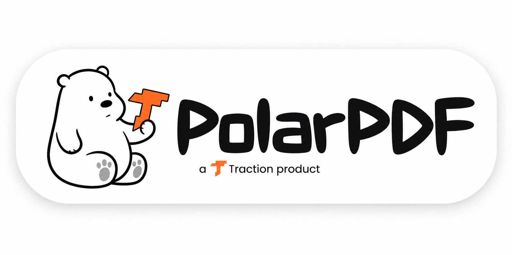

<div align="center">
  

  <br />
  <br />

  <p align="center">
    
    
    
    
    
    
    
    
    
    
  </p>
</div>

---

> **PolarPDF** is a deterministic, offline-first **PDF Question Bank Extractor** and exam intelligence studio. Powered by **FastAPI** and **PyMuPDF (`fitz`)**, it extracts questions, multiple-choice options, official answer keys, syllabus units, and embedded diagram figures from institutional curriculum PDFs with zero AI hallucinations and zero API tokens. It pairs this backend extraction engine with a high-performance **React 19** and **Tailwind CSS v4** Progressive Web App (PWA) dashboard featuring browser-native **IndexedDB** persistence, interactive self-quiz testing modes, in-place live editing, and a multimodal canvas-to-clipboard engine for instant 1-shot pasting into vision LLMs (ChatGPT and Claude).

## Features

| Module | What it does |
|--------|---------------|
| **Deterministic PDF Extraction Engine** | Utilizes PyMuPDF (`fitz`) table parsing heuristics to extract questions, options, answer keys, marks, and units from academic PDF question banks with zero AI hallucinations and zero API tokens. |
| **Spatial Diagram & Figure Crop Extraction** | Calculates bounding-box vertical coordinate intersections (`table_row.bbox`) against page image rects to isolate diagrams at 150 DPI and bind image paths directly to specific questions. |
| **Multi-Format Export Pipeline** | Automatically synchronizes parsed question data into four interoperable formats: hierarchical JSON, flat JSON, diagram-linked Markdown, and RFC 4180-compliant CSV. |
| **Offline-First PWA & IndexedDB Storage** | Persists imported question banks directly inside browser-native `IndexedDB` (`QuestionStudioDB`) with Service Worker asset caching for 100% offline access with no cloud database lock-in. |
| **Fine-Grained Reactive Stream Canvas** | Renders batched question cards through memoized `CardRow` wrappers with atomic Zustand slice subscriptions, isolating card interactions and preventing re-render churn across large question streams. |
| **Interactive Self-Quiz & Answer Shield** | Provides an active study environment with clickable option grading (green/red feedback), answer-hiding shields, and global/per-card reveal toggles. |
| **Inline Live Editing & Metric Recalculation** | Allows inline `contentEditable` corrections of question stems, option labels, and answer keys, instantly saving mutations to IndexedDB and re-indexing search tokens. |
| **Multimodal AI Clipboard Engine** | Renders high-DPI Retina (2x DPR) canvas composite PNG cards with question text, options, and diagram images alongside formatted reasoning prompts into the system clipboard for single-paste ingestion into vision LLMs. |
| **Instant Fuzzy Search & Command System** | Features `Ctrl+K` full-text search indexing across all questions, options, units, and projects, complemented by keyboard shortcuts (`Ctrl+E` edit, `Ctrl+B` sidebar, `Ctrl+A` select all, `Ctrl+C` AI copy). |
| **Marquee Rubberband Canvas Selection** | Enables intuitive desktop-style click-and-drag box selection across question cards for bulk operations and targeted AI prompt generation. |
| **Unified Full-Stack Server** | Packages the FastAPI backend and production React SPA into a single deployable service that handles `/api` endpoints, serves `/images` diagram crops, and resolves client-side SPA routing fallback. |

## Prerequisites

To run PolarPDF locally, verify that your environment satisfies the following requirements:

- **Node.js**: `v20.18.0` or higher (`v22+` recommended)
- **npm**: `v10.0.0` or higher (or `pnpm v9+`)
- **Python**: `3.11.0` or higher (verified on `3.11.9` and `3.13.x`)
- **pip**: Python package manager
- **Operating System**: Windows, macOS, or Linux

Verify toolchain installations with:

```bash
node -v
npm -v
python --version
pip --version
```

## Setup from scratch

### 1. Clone the repository

```bash
git clone https://github.com/ahmadsurti/PolarPDF-FastAPI-PyMuPDF-Based-PDF-Question-Bank-Extractor.git
cd PolarPDF-FastAPI-PyMuPDF-Based-PDF-Question-Bank-Extractor
```

### 2. Install frontend dependencies

Install the project dependencies using npm:

```bash
npm install
```

### 3. Set up the Python virtual environment & backend dependencies

Create and activate an isolated Python virtual environment, then install the server requirements:

**On Windows (PowerShell):**
```powershell
python -m venv venv
.\venv\Scripts\Activate.ps1
pip install -r server/requirements.txt
```

**On Linux / macOS:**
```bash
python3 -m venv venv
source venv/bin/activate
pip install -r server/requirements.txt
```

### 4. Configure environment variables

The project provides sane defaults for local execution. Copy the example file if custom port configuration is needed:

```bash
cp .env.example .env
```

### 5. Run the application in development mode

Running in development requires two terminal processes (or use `npm run server` and `npm run dev`):

**Terminal 1 — Python FastAPI Extractor Server:**
```bash
# Windows
.\venv\Scripts\activate
python server/server.py

# Linux/macOS
source venv/bin/activate
python server/server.py
```
*Starts the FastAPI backend at `http://localhost:5000` with `/api/health`, `/api/extract`, and static `/images` mounts.*

**Terminal 2 — React 19 + Vite Frontend:**
```bash
npm run dev
```
*Starts Vite HMR at `http://localhost:5173`. API and image requests are automatically reverse-proxied to port 5000 via `vite.config.ts`.*

Open your browser and navigate to `http://localhost:5173`.

### 6. Production build & standalone execution

To compile the production bundle and serve everything from the unified FastAPI process:

```bash
npm run build
python server/server.py
```

FastAPI detects `dist/index.html` and serves the production SPA and backend on `http://localhost:5000`.

## Configuration / Environment Variables

The server and frontend configuration are controlled through environment variables. Secrets must never be committed to source control; `.env` is ignored by `.gitignore`.

Example `.env` configuration:

```env
# Server Configuration (Optional - defaults to 5000 locally, 10000 on Render)
PORT=5000

# Optional: Python version specification for Render deployment
PYTHON_VERSION=3.11.9
```

## How to use

```
┌─────────────────┐       ┌─────────────────┐       ┌─────────────────┐
│ Upload PDF/JSON │ ────> │  Select Unit &  │ ────> │  Self-Quiz or   │
│ Question Bank   │       │  Filter Format  │       │  Study Answers  │
└─────────────────┘       └─────────────────┘       └─────────────────┘
         │                                                   │
         ▼                                                   ▼
┌─────────────────┐       ┌─────────────────┐       ┌─────────────────┐
│ Export Formats  │ <──── │ Multi-MIME Copy │ <──── │ Edit Inline or  │
│ (JSON/MD/CSV)   │       │  for Vision AI  │       │ Select Questions│
└─────────────────┘       └─────────────────┘       └─────────────────┘
```

1. **Access the Question Studio**: Launch the application. On initial launch, pre-seeded sample question banks (e.g., Computer Networks and Python Practice Books) load automatically from IndexedDB.
2. **Import New Question Banks**:
   - **Via PDF**: Drag and drop any institutional syllabus question bank PDF onto the sidebar upload zone. The backend extracts questions, options, answers, units, and diagrams in real-time.
   - **Via JSON**: Drop an existing structured JSON file to import question sets instantly client-side.
3. **Filter and Navigate**:
   - Use the unit selector in the sidebar to isolate specific syllabus units (`Unit-1`, `Unit-2`, etc.) or select **All Units**.
   - Use the subtoolbar chips to filter by question type: **All**, **MCQs**, **Short Answer**, or **Descriptive**.
4. **Self-Testing (Quiz Mode)**:
   - Click option choices (`A`, `B`, `C`, `D`) on any multiple-choice card. The UI provides immediate visual validation (green for correct, red for incorrect).
   - Click the eye icon on any card or use the **Show Answers** toggle in the subtoolbar to reveal official answer keys and rationales.
5. **Inline Live Editing**:
   - Press `Ctrl+E` (or `Cmd+E`) to enter Edit Mode.
   - Click directly into any question prompt, option text, or answer key to fix typographical errors. Changes persist automatically to IndexedDB and update project metrics.
6. **Search & Jump**:
   - Press `Ctrl+K` (or `Cmd+K`) to open the search modal. Type any keyword, formula, or question number to filter across all projects with live match counts. Press `Enter` to cycle matching cards.
7. **Select & AI Prompt Generation**:
   - Select questions individually by clicking card headers, using `Shift+ArrowDown`/`Up`, dragging a marquee selection box across cards, or pressing `Ctrl+A`.
   - Press `Ctrl+C` (or use the Floating Action Bar) to copy questions. PolarPDF compiles a structured prompt and generates an offscreen 2x Retina canvas composite card containing both the text and cropped diagrams, copying both `text/plain` and `image/png` to your system clipboard for instant 1-shot pasting into ChatGPT or Claude.
8. **Export Synchronized Data**:
   - Switch format tabs in the subtoolbar (**Structured JSON**, **Flat JSON**, **Markdown**, **CSV**) to view or download clean exports.

## Project structure

```
PolarPDF/
├── api/                                  # Vercel Serverless Function entrypoint
│   └── index.py                          # ASGI app export for Vercel Python runtime
├── public/                               # Static PWA assets & application icons
│   ├── icon.svg                          # Vector brand logo & maskable icon
│   ├── manifest.json                     # PWA Web App Manifest (standalone mode)
│   └── sw.js                             # Offline caching service worker
├── server/                               # Python FastAPI backend & extraction engine
│   ├── data/                             # Server-side upload staging & export cache
│   │   ├── exports/                      # Auto-synchronized JSON, CSV, MD exports
│   │   ├── images/                       # Extracted 150 DPI diagram crops
│   │   └── uploads/                      # Temporary PDF upload staging
│   ├── __init__.py                       # Python package marker
│   ├── extractor.py                      # Deterministic PyMuPDF table & diagram engine
│   ├── requirements.txt                  # Python dependencies (fastapi, uvicorn, pymupdf)
│   └── server.py                         # FastAPI server with API endpoints & SPA fallback
├── src/                                  # React 19 + TypeScript frontend application
│   ├── app/                              # Application bootstrap & routing
│   │   ├── providers.tsx                 # Context wrapper boundary
│   │   └── router.tsx                    # TanStack Router configuration
│   ├── components/                       # Shared UI components
│   │   ├── ui/                           # Primitive UI components (select, etc.)
│   │   └── PolarLogo.tsx                 # Custom SVG brand mark
│   ├── dashboard-shell/                  # Modular responsive layout framework
│   │   ├── components/                   # Layout, sidebar, header, sheet primitives
│   │   ├── context/                      # Layout and theme context providers
│   │   ├── hooks/                        # Layout viewport hooks (use-mobile, etc.)
│   │   └── styles/                       # Design system CSS tokens and theme rules
│   ├── features/                         # Domain features
│   │   └── question-studio/              # Main Question Studio feature module
│   │       ├── components/               # StreamView, QuestionCard, FloatingActionBar, Modals
│   │       ├── data/                     # Offline seed projects fallback
│   │       ├── hooks/                    # useMarqueeSelection hook
│   │       ├── services/                 # storage (IndexedDB), search, clipboard, format
│   │       ├── store/                    # useQuestionStudio (Zustand state store)
│   │       ├── styles/                   # Question studio CSS styles
│   │       ├── QuestionStudioPage.tsx    # Primary studio workspace view
│   │       └── types.ts                  # TypeScript domain models and interfaces
│   ├── lib/                              # Core utilities (clsx, tailwind-merge)
│   ├── App.tsx                           # Root React application component
│   ├── index.css                         # Tailwind CSS v4 entrypoint & custom theme tokens
│   └── main.tsx                          # DOM mount & Service Worker registration
├── .env.example                          # Environment variable template
├── .gitignore                            # Git ignore configuration
├── .oxlintrc.json                        # Oxlint static analysis rules
├── index.html                            # HTML entrypoint with font imports
├── package.json                          # Node.js project manifest & scripts
├── Procfile                              # Process file for Heroku/Render hosting
├── render.yaml                           # Render Blueprint deployment definition
├── requirements.txt                      # Root Python dependencies for Vercel detection
├── tsconfig.app.json                     # TypeScript application compiler options
├── tsconfig.json                         # TypeScript project references
├── vercel.json                           # Vercel deployment routing & build config
└── vite.config.ts                        # Vite configuration with Tailwind v4 & proxy rules
```

## Configuration reference

| Variable | Default | Description |
|----------|---------|-------------|
| `PORT` | `5000` | Port on which the FastAPI full-stack server listens (configured to `10000` on Render). |
| `PYTHON_VERSION` | `3.11.9` | Python runtime version specified in `render.yaml` for container build environments. |

## Deployment

PolarPDF supports dual deployment architectures: **Vercel** (Serverless Vite SPA + Python Serverless API) and **Render** (Unified single-process Web Service).

### Option A: Deploy to Vercel (Recommended)

The repository includes native Vercel configuration in [`vercel.json`](file:///c:/Users/ahmad/Downloads/polarpdf/vercel.json):

```json
{
  "$schema": "https://openapi.vercel.sh/vercel.json",
  "framework": "vite",
  "buildCommand": "npm run build",
  "outputDirectory": "dist",
  "rewrites": [
    {
      "source": "/api/(.*)",
      "destination": "/api/index.py"
    },
    {
      "source": "/images/(.*)",
      "destination": "/api/index.py"
    },
    {
      "source": "/(.*)",
      "destination": "/index.html"
    }
  ]
}
```

#### Step-by-Step Vercel Deployment

1. **Push to GitHub**: Push your repository to GitHub.
2. **Import Project**: In the [Vercel Dashboard](https://vercel.com/new), select **Add New Project** and import your GitHub repository.
3. **Automatic Detection**: Vercel automatically detects Vite, sets the build command to `npm run build`, and outputs to `dist`.
4. **Deploy**: Click **Deploy**. Vercel compiles the React SPA onto its global Edge CDN and provisions the Python backend via `api/index.py` as an on-demand serverless function.

### Option B: Deploy to Render (Single-Service)

The deployment configuration is codified in [`render.yaml`](file:///c:/Users/ahmad/Downloads/polarpdf/render.yaml):

```yaml
services:
  - type: web
    name: polarpdf
    runtime: python
    buildCommand: "npm install && npm run build && pip install -r server/requirements.txt"
    startCommand: "python server/server.py"
    envVars:
      - key: PORT
        value: 10000
      - key: PYTHON_VERSION
        value: 3.11.9
```

### Deployment Mechanism

1. **Unified Build**: During the build step, Render installs npm packages, compiles the React SPA via Vite into `dist/`, and installs Python requirements (`fastapi`, `uvicorn`, `python-multipart`, `pymupdf`).
2. **Single Process Runtime**: `python server/server.py` boots Uvicorn. The server detects that `dist/index.html` exists, automatically mounting `dist/assets` on `/assets` and serving the SPA on all client routes while maintaining `/api/*` endpoints and `/images/*` static diagram mounts on the same port.
3. **PWA Offline Execution**: Once a user loads the hosted URL, the service worker caches the application shell, enabling the client to function completely offline without continuous server connectivity.

## Troubleshooting

| Problem | Cause | Fix |
|---------|-------|-----|
| `ModuleNotFoundError: No module named 'fitz'` | PyMuPDF is not installed in the active Python environment. | Run `pip install pymupdf` inside your active virtual environment. |
| `POST /api/extract` returns `500 Internal Server Error` | The FastAPI server is not running or the PDF structure is unreadable. | Ensure `python server/server.py` is running on port 5000 and verify that the uploaded PDF is a standard table-formatted document. |
| Extractor returns `Only PDF files are supported` | Non-PDF file uploaded to the `/api/extract` endpoint. | Upload files with the `.pdf` extension for extraction, or use `.json` for direct client-side project imports. |
| Frontend displays `Cannot find module ...` during build | TypeScript compiler detected missing dependencies or incomplete source tree. | Run `npm install` and verify that `src/features/question-studio` is intact. Run `npx tsc -p tsconfig.app.json --noEmit` to verify type safety. |
| Vite dev server fails to proxy `/api` or `/images` | Port conflict or backend server not listening on `localhost:5000`. | Confirm `python server/server.py` is running and bound to port 5000, or verify the port configured in `vite.config.ts`. |
| Extracted diagrams are blank or displaced | PDF uses vector drawing paths instead of embedded raster image objects. | PyMuPDF extracts embedded raster image objects via `page.get_images()`. For vector-only diagrams, use screenshot import or manual diagram attachment. |
| Service worker fails to register during development | Service worker registration is intentionally scoped to production builds. | This is by design (`import.meta.env.PROD` in `main.tsx`) to prevent stale caching during Vite hot-module replacement. Build and preview (`npm run build && npm run preview`) to test service worker behavior. |

## What I learned from building this

Building PolarPDF required solving distinct architectural problems across low-level PDF document geometry, high-frequency React state reconciliation, and multi-MIME browser clipboard APIs:

### 1. Deterministic PDF Geometry vs. LLM Non-Determinism
Modern document processing frequently defaults to throwing raw PDF text into multimodal LLMs. For institutional question banks containing hundreds of tightly numbered multiple-choice questions, formulas, and diagrams, this approach fails on three axes: hallucinated option letters, skipped questions, and exorbitant API token costs. 

Using PyMuPDF's table abstraction (`page.find_tables()`) combined with spatial vertical-coordinate intersection (`table_row.bbox` vs. `image_rect.y_center`) proved that zero-AI deterministic parsing produces superior results. It extracts 800+ questions in under two seconds with 100% data integrity, isolates every diagram as a crisp 150 DPI crop, and associates images with their exact parent question row deterministically.

### 2. Fine-Grained Zustand Slice Selectors in High-Density Streams
Early iterations experienced UI lag when interacting with large question banks: clicking a single multiple-choice option or toggling an answer caused the entire stream of cards to re-render. Because the parent `StreamView` held broad state subscriptions, every user action triggered 35+ card reconciliations and recreated callback closures, defeating `React.memo`.

The solution was decoupling the list stream layout from individual card state. By creating an isolated `CardRow` wrapper that subscribes only to its own question's slice (`useQuestionStudio(s => s.selectedQuestions.has(srNo))` and `s => s.quizAttempts[srNo]`), clicking an option now re-renders exactly **one** card. The remaining cards bail out at the Zustand selector level before React even initiates a reconciliation pass. Combined with a 150ms debounce on search queries and immutable `patchQuestion` state updates, the canvas remains smooth even when scrolling hundreds of items.

### 3. Synthesizing Multi-MIME Payloads for Vision AI Models
LLMs like Claude 3.5 Sonnet and GPT-4o accept pasted images, but extracting text and manually screenshotting separate diagrams from a PDF creates significant friction. 

To solve this, PolarPDF implements an offscreen canvas rendering engine (`createCompositeCardBlob`). When a user presses `Ctrl+C`, the engine measures the question prompt, formats the options, and draws any associated diagram crops into an offscreen HTML5 canvas rendered at 2x Retina DPR (840px width). It then constructs a `ClipboardItem` containing both `text/plain` (markdown prompt instructions) and `image/png` (the composite card). Vision-capable AI chats immediately receive the complete visual card with diagrams intact, while text-based tools receive clean markdown prompts.

### 4. Convergence to a Zero-Cloud, Single-Process Architecture
Academic question banks often contain proprietary institution material or must be accessed in low-connectivity exam environments. Storing data on a remote cloud database added operational complexity and privacy concerns. 

Transitioning the storage engine to browser-native `IndexedDB` paired with a stale-while-revalidate Service Worker achieved complete offline autonomy. Furthermore, configuring FastAPI to dynamically serve compiled static assets (`dist/`) alongside REST endpoints converged the entire application into a single deployable Python binary, eliminating multi-container orchestration overhead while retaining full local PWA installation capabilities.

> **Biggest Takeaway:** True software efficiency comes from matching the right tool to the structural physics of the problem. Deterministic geometry solves PDF parsing better and cheaper than AI, granular atomic selectors solve frontend rendering lag better than blunt memoization, and client-side IndexedDB with PWA service workers provides a more reliable user experience than cloud databases for personal productivity tools.

## License

This project is licensed under the Apache License 2.0. See the [LICENSE](file:///c:/Users/ahmad/Downloads/polarpdf/LICENSE) file for details.

```
Copyright 2026 Ahmad

Licensed under the Apache License, Version 2.0 (the "License");
you may not use this file except in compliance with the License.
You may obtain a copy of the License at

    http://www.apache.org/licenses/LICENSE-2.0
```
