# Question Bank: PB_DE_SEM-III_2025.pdf

- **Total Questions**: 844
- **MCQs**: 373
- **Short Answers**: 36
- **Descriptive/Theory**: 435
- **Extracted Images**: 62
- **Chapters/Units**: 10

---

## Unit-1

*Total Questions in Chapter: 85*

### Q1. The given hexadecimal number (1E.53)16 is equivalent to . _______

- **Marks**: 1 | **Type**: MCQ | **Page**: 1

- **(A)** (35.684)8
- **(B)** (36.246)8 *(Correct)*
- **(C)** (34.340)8
- **(D)** (35.599)8

> **Answer**: **B** ((36.246)8)

---

### Q2. The octal number (651.124)8 is equivalent to . _______

- **Marks**: 1 | **Type**: MCQ | **Page**: 1

- **(A)** (1A9.2A)16 *(Correct)*
- **(B)** (1B0.10)16
- **(C)** (1A8.A3)16
- **(D)** (1B0.B0)16

> **Answer**: **A** ((1A9.2A)16)

---

### Q3. The octal equivalent of the decimal number (417)10 is . _______

- **Marks**: 1 | **Type**: MCQ | **Page**: 1

- **(A)** (641)8 *(Correct)*
- **(B)** (619)8
- **(C)** (640)8
- **(D)** (598)8

> **Answer**: **A** ((641)8)

---

### Q4. (170)10 is equivalent to . _______

- **Marks**: 1 | **Type**: MCQ | **Page**: 1

- **(A)** (FD)16
- **(B)** (DF)16
- **(C)** (AA)16 *(Correct)*
- **(D)** (AF)16

> **Answer**: **C** ((AA)16)

---

### Q5. Convert (214)8 into decimal.

- **Marks**: 1 | **Type**: MCQ | **Page**: 1

- **(A)** (140)10 *(Correct)*
- **(B)** (141)10
- **(C)** (142)10
- **(D)** (130)10

> **Answer**: **A** ((140)10)

---

### Q6. Convert (0.345)10 into an octal number.

- **Marks**: 1 | **Type**: MCQ | **Page**: 1

- **(A)** (0.16050)8
- **(B)** (0.26050)8 *(Correct)*
- **(C)** (0.19450)8
- **(D)** (0.24040)8

> **Answer**: **B** ((0.26050)8)

---

### Q7. Convert the binary number (01011.1011)2 into decimal.

- **Marks**: 1 | **Type**: MCQ | **Page**: 1

- **(A)** (11.6875)10 *(Correct)*
- **(B)** (11.5874)10
- **(C)** (10.9876)10
- **(D)** (10.7893)10

> **Answer**: **A** ((11.6875)10)

---

### Q8. Convert binary to octal: (110110001010)2 =?

- **Marks**: 1 | **Type**: MCQ | **Page**: 1

- **(A)** (5512)8
- **(B)** (6612)8 *(Correct)*
- **(C)** (4532)8
- **(D)** (6745)8

> **Answer**: **B** ((6612)8)

---

### Q9. Which of the following is not a positional number system?

- **Marks**: 1 | **Type**: MCQ | **Page**: 1

- **(A)** Roman Number System *(Correct)*
- **(B)** Octal Number System
- **(C)** Binary Number System
- **(D)** Hexadecimal Number System

> **Answer**: **A** (Roman Number System)

---

### Q10. The value of radix in binary number system is . _______

- **Marks**: 1 | **Type**: MCQ | **Page**: 1

- **(A)** 4
- **(B)** 1
- **(C)** 10
- **(D)** 2 *(Correct)*

> **Answer**: **D** (2)

---

### Q11. The binary equivalent of the decimal number 10 is . _______

- **Marks**: 1 | **Type**: MCQ | **Page**: 1

- **(A)** 10
- **(B)** 100
- **(C)** 1010 *(Correct)*
- **(D)** 101

> **Answer**: **C** (1010)

---

### Q12. The octal equivalent of 1100101.001010 is . _______

- **Marks**: 1 | **Type**: MCQ | **Page**: 1

- **(A)** 624.12
- **(B)** 145.12 *(Correct)*
- **(C)** 154.12
- **(D)** 145.21

> **Answer**: **B** (145.12)

---

### Q13. The hexadecimal number for (95.5)10 is . _______

- **Marks**: 1 | **Type**: SHORT_ANSWER | **Page**: 1

> **Solution / Key**: `(5F.8) 16`

---

### Q14. The hexadecimal number 'A0' has the decimal value equivalent to . _______

- **Marks**: 1 | **Type**: SHORT_ANSWER | **Page**: 1

> **Solution / Key**: `160`

---

### Q15. The decimal equivalent of hex number 1A53 is . _______

- **Marks**: 1 | **Type**: SHORT_ANSWER | **Page**: 1

> **Solution / Key**: `6739`

---

### Q16. be the decimal equivalent of 111011.10. _______

- **Marks**: 1 | **Type**: DESCRIPTIVE | **Page**: 1

*(Descriptive question - No answer key provided in source)*

---

### Q17. Given that (16)10 = (100)x, find the value of x.

- **Marks**: 2 | **Type**: MCQ | **Page**: 1

- **(A)** X=10
- **(B)** X=1
- **(C)** X=8
- **(D)** X=4 *(Correct)*

> **Answer**: **D** (X=4)

---

### Q18. (4433)5 = ( )10 = ( )2

- **Marks**: 2 | **Type**: DESCRIPTIVE | **Page**: 1

*(Descriptive question - No answer key provided in source)*

---

### Q19. 1) (673.124)8 = ( )2 2) (4522.25)10 = ( )2 3) (FACE)16 = ( )10 4) (10101010)2 = ( )8 = ( )16

- **Marks**: 4 | **Type**: DESCRIPTIVE | **Page**: 1

*(Descriptive question - No answer key provided in source)*

---

### Q20. Convert following Octal Number to Hexadecimal and Binary 414, 574,
725.25.

- **Marks**: 3 | **Type**: SHORT_ANSWER | **Page**: 1

> **Solution / Key**: `(10C,17C,1D5.54)16 , (100001100, 101111100,
111010101.010101)2`

---

### Q21. Convert the number (435)7into equivalent radix-10 and radix-4 number system.

- **Marks**: 3 | **Type**: DESCRIPTIVE | **Page**: 1

*(Descriptive question - No answer key provided in source)*

---

### Q22. Do as directed: (10110100)2= ( ?)gray = ( ? )XS-3 = ( ? )BCD

- **Marks**: 3 | **Type**: DESCRIPTIVE | **Page**: 1

*(Descriptive question - No answer key provided in source)*

---

### Q23. (i) Convert (75)10 = ( )2 _______ (ii) Convert (101011)2 = ( )10 _______ (iii)Convert (10101101)2 = ( )16 = ( )8 _______ _______

- **Marks**: 3 | **Type**: DESCRIPTIVE | **Page**: 1

*(Descriptive question - No answer key provided in source)*

---

### Q24. Convert the decimal number 225.225 to binary, octal and hexadecimal.

- **Marks**: 3 | **Type**: DESCRIPTIVE | **Page**: 1

*(Descriptive question - No answer key provided in source)*

---

### Q25. Convert following numbers.
(a)(4021.2)5 = ( )10
(b) (B65F)16= ( )10
(c) (630.4)8 = ( )10
(d) (41)10 = ( )8

- **Marks**: 2 | **Type**: DESCRIPTIVE | **Page**: 1

*(Descriptive question - No answer key provided in source)*

---

### Q26. Convert the following Hexadecimal numbers to Octal.
(a) 4F7.A8 (b) BC70.0E (c) 42FD

- **Marks**: 3 | **Type**: DESCRIPTIVE | **Page**: 1

*(Descriptive question - No answer key provided in source)*

---

### Q27. Convert following Hexadecimal Number to Decimal B28, FFF, F28

- **Marks**: 2 | **Type**: SHORT_ANSWER | **Page**: 1

> **Solution / Key**: `(2856,4095,3880)10`

---

### Q28. (1011011101101110)2 = ( )16

- **Marks**: 1 | **Type**: SHORT_ANSWER | **Page**: 1

> **Solution / Key**: `(B76E)16`

---

### Q29. Convert the decimal number 187 to 8-bit binary.

- **Marks**: 1 | **Type**: MCQ | **Page**: 1

- **(A)** (10111011)2 *(Correct)*
- **(B)** (11011101)2
- **(C)** (10111101)2
- **(D)** (10111100)2

> **Answer**: **A** ((10111011)2)

---

### Q30. Convert the decimal number 250.5 to base 3, base 4, base 7 and base 8 .

- **Marks**: 4 | **Type**: DESCRIPTIVE | **Page**: 1

*(Descriptive question - No answer key provided in source)*

---

### Q31. Convert (4BAC)16= ( )8 = ( )4 = ( )2 = ( )10. Show all steps of conversion.

- **Marks**: 2 | **Type**: DESCRIPTIVE | **Page**: 1

*(Descriptive question - No answer key provided in source)*

---

### Q32. Express decimal number 60.875 into binary form.

- **Marks**: 1 | **Type**: DESCRIPTIVE | **Page**: 1

*(Descriptive question - No answer key provided in source)*

---

### Q33. Convert the following numbers form given base to the base indicates.
1. (AEF2.B6)16 = ( )2 _______
2. (674.12)8 = ( )10 _______
3. (110110.1011)2 = ( )16 _______

- **Marks**: 2 | **Type**: DESCRIPTIVE | **Page**: 1

*(Descriptive question - No answer key provided in source)*

---

### Q34. Express decimal number 10.875 into binary form.

- **Marks**: 2 | **Type**: DESCRIPTIVE | **Page**: 1

*(Descriptive question - No answer key provided in source)*

---

### Q35. Convert the Decimal Number 412.5 to base 3, 4 and 7

- **Marks**: 3 | **Type**: DESCRIPTIVE | **Page**: 1

*(Descriptive question - No answer key provided in source)*

---

### Q36. Nibble means _______

- **Marks**: 1 | **Type**: MCQ | **Page**: 1

- **(A)** 2 bit
- **(B)** 4 bit *(Correct)*
- **(C)** 8 bit
- **(D)** 16 bit

> **Answer**: **B** (4 bit)

---

### Q37. Convert the binary number (1001.0010)2 to decimal.

- **Marks**: 2 | **Type**: MCQ | **Page**: 1

- **(A)** 90.125
- **(B)** 9.125 *(Correct)*
- **(C)** 125
- **(D)** 12.5

> **Answer**: **B** (9.125)

---

### Q38. i. Convert (FFFF)16=( )10. _______ ii. Convert (125.625)10=( )2. _______

- **Marks**: 2 | **Type**: DESCRIPTIVE | **Page**: 1

*(Descriptive question - No answer key provided in source)*

---

### Q39. (52)10 = ( )2

- **Marks**: 1 | **Type**: SHORT_ANSWER | **Page**: 1

> **Solution / Key**: `(110100)2`

---

### Q40. (436)8 = ( )16

- **Marks**: 1 | **Type**: DESCRIPTIVE | **Page**: 1

*(Descriptive question - No answer key provided in source)*

---

### Q41. (5C7)16 = ( )10

- **Marks**: 1 | **Type**: SHORT_ANSWER | **Page**: 1

> **Solution / Key**: `(1479)10`

---

### Q42. (11011.101)2 = ( )10

- **Marks**: 1 | **Type**: SHORT_ANSWER | **Page**: 1

> **Solution / Key**: `(27.625)10`

---

### Q43. Convert following 1. (4E7.2)16 = (?)8 2. (521.3)8 = (?)2

- **Marks**: 2 | **Type**: DESCRIPTIVE | **Page**: 1

*(Descriptive question - No answer key provided in source)*

---

### Q44. Convert (10101101)2 = ( )16 = ( )8 _______ _______

- **Marks**: 2 | **Type**: DESCRIPTIVE | **Page**: 1

*(Descriptive question - No answer key provided in source)*

---

### Q45. (734)8 = ( )16

- **Marks**: 1 | **Type**: MCQ | **Page**: 1

- **(A)** C1D
- **(B)** DC1
- **(C)** 1CD
- **(D)** 1DC *(Correct)*

> **Answer**: **D** (1DC)

---

### Q46. (1111.11)2 = ( ? )8 = ( ? )10

- **Marks**: 2 | **Type**: DESCRIPTIVE | **Page**: 1

*(Descriptive question - No answer key provided in source)*

---

### Q47. (AEF2.B6)16 = ( )2 _______

- **Marks**: 1 | **Type**: DESCRIPTIVE | **Page**: 1

*(Descriptive question - No answer key provided in source)*

---

### Q48. (674.12)8 = ( )10 _______

- **Marks**: 1 | **Type**: DESCRIPTIVE | **Page**: 1

*(Descriptive question - No answer key provided in source)*

---

### Q49. (110110.1011)2 = ( )16 _______

- **Marks**: 1 | **Type**: DESCRIPTIVE | **Page**: 1

*(Descriptive question - No answer key provided in source)*

---

### Q50. (101001011)2 = ( )10

- **Marks**: 1 | **Type**: DESCRIPTIVE | **Page**: 1

*(Descriptive question - No answer key provided in source)*

---

### Q51. (11101110)2 = ( )8

- **Marks**: 1 | **Type**: DESCRIPTIVE | **Page**: 1

*(Descriptive question - No answer key provided in source)*

---

### Q52. (68)10 = ( )16

- **Marks**: 1 | **Type**: DESCRIPTIVE | **Page**: 1

*(Descriptive question - No answer key provided in source)*

---

### Q53. Consider the equation (123)5 = (x8)y with x and y as unknown. The number of possible solutions is . _______

- **Marks**: 1 | **Type**: SHORT_ANSWER | **Page**: 1

> **Solution / Key**: `3`

---

### Q54. (1217)8 is equivalent to _______

- **Marks**: 1 | **Type**: MCQ | **Page**: 1

- **(A)** (1217)16
- **(B)** (2297)10
- **(C)** (028F)16 *(Correct)*
- **(D)** (0B17)16

> **Answer**: **C** ((028F)16)

---

### Q55. (73)x (in base x number system) is equal to (54)y (in base y number system), the possible values of x and y are

- **Marks**: 2 | **Type**: MCQ | **Page**: 1

- **(A)** 8,16
- **(B)** 8,10
- **(C)** 10,12
- **(D)** 8,11 *(Correct)*

> **Answer**: **D** (8,11)

---

### Q56. Which of the following number is not allowed in radix – 7 (base 7) system?

- **Marks**: 1 | **Type**: MCQ | **Page**: 1

- **(A)** 666
- **(B)** 739 *(Correct)*
- **(C)** 461
- **(D)** 124

> **Answer**: **B** (739)

---

### Q57. If (2.3)4 + (1.2)4 = y4, then value of y in base 4 system.

- **Marks**: 1 | **Type**: MCQ | **Page**: 1

- **(A)** 10.1 *(Correct)*
- **(B)** 10.01
- **(C)** 10.2
- **(D)** 1.02

> **Answer**: **A** (10.1)

---

### Q58. If (2.3)4 + (1.2)4 = Y10, then value of Y in base 10 system?

- **Marks**: 2 | **Type**: MCQ | **Page**: 1

- **(A)** 4.25 *(Correct)*
- **(B)** 10.1
- **(C)** 10.01
- **(D)** 3.5

> **Answer**: **A** (4.25)

---

### Q59. The Octal equivalent of hexadecimal number AB.CD is _______

- **Marks**: 1 | **Type**: MCQ | **Page**: 1

- **(A)** 253.632 *(Correct)*
- **(B)** 253.314
- **(C)** 526.314
- **(D)** 526.632

> **Answer**: **A** (253.632)

---

### Q60. Which number system has a base 16?

- **Marks**: 1 | **Type**: MCQ | **Page**: 1

- **(A)** Octal
- **(B)** Binary
- **(C)** Decimal
- **(D)** Hexadecimal *(Correct)*

> **Answer**: **D** (Hexadecimal)

---

### Q61. What is Digital Electronics?

- **Marks**: 1 | **Type**: MCQ | **Page**: 2

- **(A)** Engineering of devices that produce digital signal
- **(B)** Field of electronics involving the study of digital signal
- **(C)** Engineering of devices that accepts digital signals
- **(D)** All of the mentioned *(Correct)*

> **Answer**: **D** (All of the mentioned)

---

### Q62. Convert the following numbers as directed: (130)10= ( )2

- **Marks**: 1 | **Type**: MCQ | **Page**: 2

- **(A)** (10000011)2
- **(B)** (10000010)2 *(Correct)*
- **(C)** (10000111)2
- **(D)** (111001)2

> **Answer**: **B** ((10000010)2)

---

### Q63. Convert the following numbers as directed: (1011011)2= ( )10

- **Marks**: 1 | **Type**: MCQ | **Page**: 2

- **(A)** (91)8
- **(B)** (52)10
- **(C)** (41)10
- **(D)** (91)10 *(Correct)*

> **Answer**: **D** ((91)10)

---

### Q64. Convert (B65F)16 = ( )10.

- **Marks**: 1 | **Type**: MCQ | **Page**: 2

- **(A)** (44526)10
- **(B)** (78864)10
- **(C)** (46687)10 *(Correct)*
- **(D)** (48756)10

> **Answer**: **C** ((46687)10)

---

### Q65. Convert (41)10 = ( )2.

- **Marks**: 1 | **Type**: MCQ | **Page**: 2

- **(A)** (110011)2
- **(B)** (111000)2
- **(C)** (101010)2
- **(D)** (101001)2 *(Correct)*

> **Answer**: **D** ((101001)2)

---

### Q66. Convert decimal number (43)10 to binary.

- **Marks**: 1 | **Type**: MCQ | **Page**: 2

- **(A)** (110110)2
- **(B)** (101010)2
- **(C)** (101011)2 *(Correct)*
- **(D)** (111001)2

> **Answer**: **C** ((101011)2)

---

### Q67. Convert octal number (234)8 to hexadecimal.

- **Marks**: 1 | **Type**: MCQ | **Page**: 2

- **(A)** (9C)16 *(Correct)*
- **(B)** (8C)16
- **(C)** (9C)8
- **(D)** (9C)2

> **Answer**: **A** ((9C)16)

---

### Q68. Convert decimal number (0.252)10 to binary.

- **Marks**: 1 | **Type**: MCQ | **Page**: 2

- **(A)** (0.00001)2
- **(B)** (0.010000)2 *(Correct)*
- **(C)** (1.010000)2
- **(D)** (10.00100)2

> **Answer**: **B** ((0.010000)2)

---

### Q69. Convert the Hexadecimal numbers to Octal: 4F7.A8

- **Marks**: 2 | **Type**: DESCRIPTIVE | **Page**: 2

*(Descriptive question - No answer key provided in source)*

---

### Q70. Convert the Hexadecimal numbers to Octal: BC70.0E

- **Marks**: 2 | **Type**: DESCRIPTIVE | **Page**: 2

*(Descriptive question - No answer key provided in source)*

---

### Q71. A number (1217)8 can be represented as _______

- **Marks**: 1 | **Type**: MCQ | **Page**: 2

- **(A)** (656) 10
- **(B)** (01010001111) 2
- **(C)** (28F) 16
- **(D)** Both B and C *(Correct)*

> **Answer**: **D** (Both B and C)

---

### Q72. The number (100000)2 would appear just immediately after –

- **Marks**: 1 | **Type**: MCQ | **Page**: 2

- **(A)** (37) 8
- **(B)** (1F)16
- **(C)** (11111)2
- **(D)** All A,B and C *(Correct)*

> **Answer**: **D** (All A,B and C)

---

### Q73. (F23.23) = ( ? ) = ( ? ) 16 8 2

- **Marks**: 1 | **Type**: MCQ | **Page**: 2

- **(A)** 7442.106,
111100100011.00100 011
- **(B)** 7442.106,
111110100011.0010 0011
- **(C)** 7443.106,
111100100011.00100011 *(Correct)*
- **(D)** 7443.106,
111100000001.00100 011

> **Answer**: **C** (7443.106,
111100100011.00100011)

---

### Q74. If (154) / (14) = (8) then what is the value of radix 'b' ? b b 10

- **Marks**: 1 | **Type**: MCQ | **Page**: 2

- **(A)** 10
- **(B)** 7 *(Correct)*
- **(C)** 12
- **(D)** 8

> **Answer**: **B** (7)

---

### Q75. How many number of '1' would be appeared in binary representation of - 3×512+5×64+7×8+3 ?

- **Marks**: 1 | **Type**: MCQ | **Page**: 2

- **(A)** 7
- **(B)** 5
- **(C)** 6
- **(D)** 9 *(Correct)*

> **Answer**: **D** (9)

---

### Q76. Convert (DEAD)16 into equivalent radix-10 and radix-8 number system.

- **Marks**: 2 | **Type**: DESCRIPTIVE | **Page**: 2

*(Descriptive question - No answer key provided in source)*

---

### Q77. Consider the equation (129)5 = (x9)y with x and y as unknown. The number of possible solutions is . _______

- **Marks**: 1 | **Type**: MCQ | **Page**: 2

- **(A)** not possible *(Correct)*
- **(B)** 5
- **(C)** 3
- **(D)** 4

> **Answer**: **A** (not possible)

---

### Q78. convert (FFFF)16 to decimal & octal numbers respectively.

- **Marks**: 1 | **Type**: MCQ | **Page**: 2

- **(A)** a) 65235 &177787
- **(B)** b)62325 & 177878
- **(C)** c)65335 & 177878
- **(D)** d)65535 &177777 *(Correct)*

> **Answer**: **D** (d)65535 &177777)

---

### Q79. The binary equivalent of (11.6275)10 is equals to . _______

- **Marks**: 1 | **Type**: MCQ | **Page**: 2

- **(A)** a)101.11011
- **(B)** b)1011.1001
- **(C)** c)101.0011
- **(D)** d)1011.1010 *(Correct)*

> **Answer**: **D** (d)1011.1010)

---

### Q80. Convert the hexadecimal number (9999.9999) to octal number.

- **Marks**: 1 | **Type**: MCQ | **Page**: 2

- **(A)** a) 1414631.463144
- **(B)** b) 463144.114631
- **(C)** c) 141361.114631
- **(D)** d) 114631.463144 *(Correct)*

> **Answer**: **D** (d) 114631.463144)

---

### Q81. Which of the following is equivalent to decimal number of (BFA0) hexadecimal number ?

- **Marks**: 1 | **Type**: MCQ | **Page**: 2

- **(A)** a) 90456
- **(B)** b) 40956
- **(C)** c) 49056 *(Correct)*
- **(D)** d) 56049

> **Answer**: **C** (c) 49056)

---

### Q82. Consider the following statements i) octal number is 1/4th the length of corresponding binary number ii) Hexadecimal is 1/3rd length of corresponding binary number iii) In 10 bit binary number, 512 is the weight of 2nd digit from MSB.Which of statement/s is/are not correct from above ?

- **Marks**: 1 | **Type**: MCQ | **Page**: 2

- **(A)** a) i,ii,iii *(Correct)*
- **(B)** b) i, ii only
- **(C)** c) i, iii only
- **(D)** d) ii, iii only

> **Answer**: **A** (a) i,ii,iii)

---

### Q83. Convert the following numbers as per required:
(i) (965.198)10 = ( ? )16 (ii) (3B.4)16 = ( ? )8 (iii) (1110011100.110001)2 = ( ? )10 = ( ? )16

- **Marks**: 3 | **Type**: DESCRIPTIVE | **Page**: 2

*(Descriptive question - No answer key provided in source)*

---

### Q84. Convert the decimal number 279.5 to base 3 and 7.

- **Marks**: 2 | **Type**: DESCRIPTIVE | **Page**: 2

*(Descriptive question - No answer key provided in source)*

---

### Q85. The hexadecimal equivalent of largest binary number with 14-bits is?

- **Marks**: 1 | **Type**: MCQ | **Page**: 2

- **(A)** 3FFF *(Correct)*
- **(B)** 7FFF
- **(C)** 8FFF
- **(D)** None of Above

> **Answer**: **A** (3FFF)

---

## Unit-2

*Total Questions in Chapter: 117*

### Q86. The 2's complement of the number 1101101 is . _______

- **Marks**: 1 | **Type**: SHORT_ANSWER | **Page**: 2

> **Solution / Key**: `10011`

---

### Q87. 2's complement of any binary number can be calculated by adding 1's complement twice.

- **Marks**: 1 | **Type**: SHORT_ANSWER | **Page**: 2

> **Solution / Key**: `False`

---

### Q88. The 2's complement of the number 1101110 is . _______

- **Marks**: 1 | **Type**: SHORT_ANSWER | **Page**: 2

> **Solution / Key**: `0010010`

---

### Q89. 𝑆𝑢𝑏𝑠𝑡𝑟𝑎𝑐𝑡 (45) from (66) using 2's complement method. 8 8

- **Marks**: 2 | **Type**: DESCRIPTIVE | **Page**: 2

*(Descriptive question - No answer key provided in source)*

---

### Q90. 𝑆 𝑢 𝑏 𝑠 𝑡 𝑟 𝑎 𝑐 𝑡 ( 4 5 ) f r o m ( 9 3 ) using 1's Complement Method. 1 0 1 0

- **Marks**: 2 | **Type**: SHORT_ANSWER | **Page**: 2

> **Solution / Key**: `(48)10`

---

### Q91. Subtract using 2's complement method. (10010 −10011) 2

- **Marks**: 2 | **Type**: DESCRIPTIVE | **Page**: 2

*(Descriptive question - No answer key provided in source)*

---

### Q92. Perform subtraction of ( 7 8 − 5 8 ) using 2's complement method. 10

- **Marks**: 2 | **Type**: DESCRIPTIVE | **Page**: 2

*(Descriptive question - No answer key provided in source)*

---

### Q93. Using 10's complement, subtract : (72532-3250) 10

- **Marks**: 2 | **Type**: DESCRIPTIVE | **Page**: 2

*(Descriptive question - No answer key provided in source)*

---

### Q94. Using 2's complement, subtract : (1010100 −1000100) 2

- **Marks**: 2 | **Type**: DESCRIPTIVE | **Page**: 2

*(Descriptive question - No answer key provided in source)*

---

### Q95. Perform the subtraction with the following numbers using 1's complement and 2's complements: (a) 11010-1101, (b) 10010-10011

- **Marks**: 4 | **Type**: DESCRIPTIVE | **Page**: 2

*(Descriptive question - No answer key provided in source)*

---

### Q96. Perform the operation of subtractions with the following binary number using 2's complement (i) 10010 – 10011 (ii) 100 – 110000 (iii) 11010 – 10000

- **Marks**: 6 | **Type**: DESCRIPTIVE | **Page**: 2

*(Descriptive question - No answer key provided in source)*

---

### Q97. Find the 10's complement of the following: (1) ( 6 1 0 6 ) (2) 10 (935) 10

- **Marks**: 4 | **Type**: DESCRIPTIVE | **Page**: 2

*(Descriptive question - No answer key provided in source)*

---

### Q98. Perform following subtraction using 2's complement method. (11010)2 – (10000)2

- **Marks**: 2 | **Type**: DESCRIPTIVE | **Page**: 2

*(Descriptive question - No answer key provided in source)*

---

### Q99. Subtract (32)10 from (58)10 using 8-bit 2's complement arithmetic.

- **Marks**: 2 | **Type**: DESCRIPTIVE | **Page**: 2

*(Descriptive question - No answer key provided in source)*

---

### Q100. Substract 14 from 46 using 8-bit 2's complement arithmetic.

- **Marks**: 2 | **Type**: DESCRIPTIVE | **Page**: 2

*(Descriptive question - No answer key provided in source)*

---

### Q101. Substract 27.50 from 68.75 using 12-bit 1's complement arithmetic.

- **Marks**: 2 | **Type**: DESCRIPTIVE | **Page**: 2

*(Descriptive question - No answer key provided in source)*

---

### Q102. Add the following binary numbers:
1. 11011 + 1101
2. 1010.11 + 1101.0 + 1001.11+1111.11

- **Marks**: 2 | **Type**: DESCRIPTIVE | **Page**: 2

*(Descriptive question - No answer key provided in source)*

---

### Q103. Substract the following binary numbers.
1. 1100.10-111.01 2. 10110-1011

- **Marks**: 2 | **Type**: DESCRIPTIVE | **Page**: 2

*(Descriptive question - No answer key provided in source)*

---

### Q104. The addition of these binary numbers 101001+ 010011 would generate:

- **Marks**: 1 | **Type**: MCQ | **Page**: 2

- **(A)** 101110
- **(B)** 000111
- **(C)** 111100 *(Correct)*
- **(D)** 010100

> **Answer**: **C** (111100)

---

### Q105. The 1's complement of a binary number is obtained by changing _______

- **Marks**: 1 | **Type**: MCQ | **Page**: 2

- **(A)** Each 1 to a 0
- **(B)** Each 0 to 1
- **(C)** Each 1 to 0 and each 0 to 1 *(Correct)*
- **(D)** None of Above

> **Answer**: **C** (Each 1 to 0 and each 0 to 1)

---

### Q106. Substract the following hexadecimal numbers using the 1's complement arithmetic.
(i) 48 −26 (ii) 45 −74 16 16 16 16

- **Marks**: 4 | **Type**: DESCRIPTIVE | **Page**: 2

*(Descriptive question - No answer key provided in source)*

---

### Q107. Substract the following hexadecimal numbers using the 2's complement arithmetic.
(i) 69 −43 (ii) 27 −73 16 16 16 16

- **Marks**: 4 | **Type**: DESCRIPTIVE | **Page**: 2

*(Descriptive question - No answer key provided in source)*

---

### Q108. Substract the following decimal numbers using the 9's and 10's complement arithmetic.
(i) 274 −86 (ii) 376.3 −765.6 10 10 10 10

- **Marks**: 4 | **Type**: DESCRIPTIVE | **Page**: 2

*(Descriptive question - No answer key provided in source)*

---

### Q109. Substract the following decimal numbers using 2's complement arithmetic:
1. 46 - 19 2. 36.75 - 89.5

- **Marks**: 4 | **Type**: DESCRIPTIVE | **Page**: 3

*(Descriptive question - No answer key provided in source)*

---

### Q110. Substract the following numbers using 9's complement: 745.81 - 436.62

- **Marks**: 2 | **Type**: DESCRIPTIVE | **Page**: 3

*(Descriptive question - No answer key provided in source)*

---

### Q111. Substract the following numbers using 10's complement: 416.73 - 2928.54

- **Marks**: 2 | **Type**: DESCRIPTIVE | **Page**: 3

*(Descriptive question - No answer key provided in source)*

---

### Q112. Express -45 and -73.75 in 2's complement form.

- **Marks**: 2 | **Type**: DESCRIPTIVE | **Page**: 3

*(Descriptive question - No answer key provided in source)*

---

### Q113. Add 47.25 to 55.75 using binary arithmetic.

- **Marks**: 2 | **Type**: DESCRIPTIVE | **Page**: 3

*(Descriptive question - No answer key provided in source)*

---

### Q114. Add -75 to +26 using 8 bit 2's complement arithmetic.

- **Marks**: 2 | **Type**: DESCRIPTIVE | **Page**: 3

*(Descriptive question - No answer key provided in source)*

---

### Q115. Substract the following decimal numbers using 1's complement arithmetic:
1. 46-84 2. 63.75-17.5

- **Marks**: 4 | **Type**: DESCRIPTIVE | **Page**: 3

*(Descriptive question - No answer key provided in source)*

---

### Q116. Find out Y, if B = 1 and A = square wave

- **Marks**: 1 | **Type**: DESCRIPTIVE | **Page**: 3

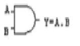

*(Descriptive question - No answer key provided in source)*

---

### Q117. Which gate is equivalent to bubbled OR gate?

- **Marks**: 1 | **Type**: MCQ | **Page**: 3

- **(A)** AND
- **(B)** XOR
- **(C)** NOT
- **(D)** NAND *(Correct)*

> **Answer**: **D** (NAND)

---

### Q118. A NOT gate has…

- **Marks**: 1 | **Type**: MCQ | **Page**: 3

- **(A)** 1 input and 1 output *(Correct)*
- **(B)** 2 input 1 output
- **(C)** 1 input 2 output
- **(D)** none of above

> **Answer**: **A** (1 input and 1 output)

---

### Q119. If a 3-input NOR gate has eight input possibilities, how many of those possibilities will result in a HIGH output

- **Marks**: 1 | **Type**: MCQ | **Page**: 3

- **(A)** 2
- **(B)** 1 *(Correct)*
- **(C)** 7
- **(D)** 8

> **Answer**: **B** (1)

---

### Q120. If a signal passing through a gate is inhibited by sending a LOW into one of the inputs, and the output is HIGH, the gate is a(n):

- **Marks**: 1 | **Type**: MCQ | **Page**: 3

- **(A)** AND
- **(B)** NAND *(Correct)*
- **(C)** NOR
- **(D)** OR

> **Answer**: **B** (NAND)

---

### Q121. Implement Boolean expression for Ex-OR gate using NAND gates only.

- **Marks**: 3 | **Type**: DESCRIPTIVE | **Page**: 3

*(Descriptive question - No answer key provided in source)*

---

### Q122. The output of a gate is only 1 when all of its inputs are 1.

- **Marks**: 1 | **Type**: MCQ | **Page**: 3

- **(A)** OR
- **(B)** NOT
- **(C)** AND *(Correct)*
- **(D)** EXOR

> **Answer**: **C** (AND)

---

### Q123. The inputs of a NAND gate are connected together. The resulting circuit is …………

- **Marks**: 1 | **Type**: MCQ | **Page**: 3

- **(A)** OR
- **(B)** AND
- **(C)** NOT *(Correct)*
- **(D)** NONE OF ABOVE

> **Answer**: **C** (NOT)

---

### Q124. The NOR gate is OR gate followed by ………………

- **Marks**: 1 | **Type**: MCQ | **Page**: 3

- **(A)** AND
- **(B)** NAND
- **(C)** NOT *(Correct)*
- **(D)** NONE OF ABOVE

> **Answer**: **C** (NOT)

---

### Q125. The NAND gate is AND gate followed by …………………

- **Marks**: 1 | **Type**: MCQ | **Page**: 3

- **(A)** NOT *(Correct)*
- **(B)** OR
- **(C)** NOR
- **(D)** NONE OF ABOVE

> **Answer**: **A** (NOT)

---

### Q126. Exclusive-OR (XOR) logic gates can be constructed from ………..logic gates.

- **Marks**: 1 | **Type**: MCQ | **Page**: 3

- **(A)** OR GATES ONLY
- **(B)** AND gates and NOT gates
- **(C)** AND, OR, NOT Gates *(Correct)*
- **(D)** OR gates and NOT gates

> **Answer**: **C** (AND, OR, NOT Gates)

---

### Q127. The basic logic gate whose output is the complement of the input is ………….

- **Marks**: 1 | **Type**: MCQ | **Page**: 3

- **(A)** OR
- **(B)** AND
- **(C)** INVERTER *(Correct)*
- **(D)** NONE OF ABOVE

> **Answer**: **C** (INVERTER)

---

### Q128. The universal gate is ………………

- **Marks**: 1 | **Type**: MCQ | **Page**: 3

- **(A)** EXOR
- **(B)** NAND
- **(C)** NOR
- **(D)** BOTH (B) AND (C) *(Correct)*

> **Answer**: **D** (BOTH (B) AND (C))

---

### Q129. The NAND gate output will be low if the two inputs are .

- **Marks**: 1 | **Type**: SHORT_ANSWER | **Page**: 3

> **Solution / Key**: `1&1`

---

### Q130. The output of a logic gate is 1 when all its inputs are at logic 0. the gate is either . _______

- **Marks**: 1 | **Type**: SHORT_ANSWER | **Page**: 3

> **Solution / Key**: `(a NOR or an EX- NOR)`

---

### Q131. AND gates are required to realize Y = CD+EF+G _______

- **Marks**: 1 | **Type**: MCQ | **Page**: 3

- **(A)** 1
- **(B)** 2 *(Correct)*
- **(C)** 3
- **(D)** 4

> **Answer**: **B** (2)

---

### Q132. The following waveform pattern is for _______

- **Marks**: 1 | **Type**: SHORT_ANSWER | **Page**: 3

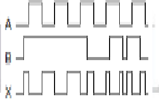

> **Solution / Key**: `EXOR GATE`

---

### Q133. The following waveform pattern is for _______

- **Marks**: 1 | **Type**: SHORT_ANSWER | **Page**: 3

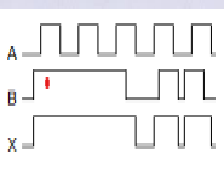

> **Solution / Key**: `OR GATE`

---

### Q134. The 8-input XOR circuit shown has an output of Y = 1. Correct input combination below (ordered A – H) is . _______

- **Marks**: 1 | **Type**: DESCRIPTIVE | **Page**: 3

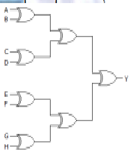

*(Descriptive question - No answer key provided in source)*

---

### Q135. Find the logic required at R input.

- **Marks**: 1 | **Type**: SHORT_ANSWER | **Page**: 3

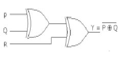

> **Solution / Key**: `R=1`

---

### Q136. For a given logic circuit, if A=B=1, and C=D=0. Find output Y

- **Marks**: 1 | **Type**: SHORT_ANSWER | **Page**: 3

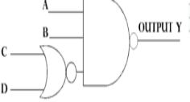

> **Solution / Key**: `0`

---

### Q137. Show that 𝐴 ⊕ 𝐵 = 𝐴 𝐵 ′ + 𝐴 ′ 𝐵 and construct the corresponding logic diagrams using truth table

- **Marks**: 3 | **Type**: DESCRIPTIVE | **Page**: 3

*(Descriptive question - No answer key provided in source)*

---

### Q138. Show that 𝐴 ⊙ 𝐵 = 𝐴 𝐵 + 𝐴 ′ 𝐵 ' = ( A ⊕ B ) ' = ( A B ' + A ' B ) ' and construct the corresponding logic diagrams using truth table

- **Marks**: 3 | **Type**: DESCRIPTIVE | **Page**: 4

*(Descriptive question - No answer key provided in source)*

---

### Q139. Show that (A+B)(AB)' is equivalent to 𝐴 ⊕ 𝐵 using truth table

- **Marks**: 3 | **Type**: DESCRIPTIVE | **Page**: 4

*(Descriptive question - No answer key provided in source)*

---

### Q140. Derive that logic expression that equals to 1 only when the two bit binary numbers A and B have the same value. Draw the logic diagram and construct the truth table to verify the logic.

- **Marks**: 3 | **Type**: DESCRIPTIVE | **Page**: 4

*(Descriptive question - No answer key provided in source)*

---

### Q141. Show that AB + (A+B)' is equivalent to 𝐴 ⊙ 𝐵 using truth table

- **Marks**: 3 | **Type**: DESCRIPTIVE | **Page**: 4

*(Descriptive question - No answer key provided in source)*

---

### Q142. Find the logical equivalent of the following expression:
(a) 𝐴 ⊕ 0 (b) 𝐴⊕1 (c ) 𝐴⊙0 (d) 𝐴⊙1 (e ) 0 ⊕𝐴′

- **Marks**: 5 | **Type**: DESCRIPTIVE | **Page**: 4

*(Descriptive question - No answer key provided in source)*

---

### Q143. Draw the logic diagram and construct the truth table for following expression: X= A+B+ (CD)'

- **Marks**: 3 | **Type**: DESCRIPTIVE | **Page**: 4

*(Descriptive question - No answer key provided in source)*

---

### Q144. Draw the logic diagram and construct the truth table for following expression: Y= (AB) (A+B)' + (EF)'

- **Marks**: 3 | **Type**: DESCRIPTIVE | **Page**: 4

*(Descriptive question - No answer key provided in source)*

---

### Q145. Draw the logic diagram and construct the truth table for following expression: Z = (A'B+CD'+ABC)'

- **Marks**: 3 | **Type**: DESCRIPTIVE | **Page**: 4

*(Descriptive question - No answer key provided in source)*

---

### Q146. A calculator performs the binary addition where the 2's complement binary number 1101100 is obtained with no carry , convert the same into BCD

- **Marks**: 1 | **Type**: MCQ | **Page**: 4

- **(A)** 11000011
- **(B)** 00110100
- **(C)** 00100000 *(Correct)*
- **(D)** 00110011

> **Answer**: **C** (00100000)

---

### Q147. Excess-3 is also known as _______

- **Marks**: 1 | **Type**: MCQ | **Page**: 4

- **(A)** Positive weighted code
- **(B)** Negative weighted code
- **(C)** Cyclic code
- **(D)** Self Complementing Code *(Correct)*

> **Answer**: **D** (Self Complementing Code)

---

### Q148. Solve: (11000111) 𝑋𝑆−3= (? ) 𝐺𝑅𝐴𝑌

- **Marks**: 2 | **Type**: DESCRIPTIVE | **Page**: 4

*(Descriptive question - No answer key provided in source)*

---

### Q149. The specific non-weighted code is used in shaft encoder for the process based instrumentation and data acquistion system that initiates encoder sequence with 01111 to the second sequence as 11111 then evaluate would be the equivalent binary number as per sequence?

- **Marks**: 1 | **Type**: MCQ | **Page**: 4

- **(A)** 01010 to 10101 *(Correct)*
- **(B)** 01111 to 11111
- **(C)** 10000 to 100000
- **(D)** 01011 to 10111

> **Answer**: **A** (01010 to 10101)

---

### Q150. The transmitter transmits the 8-bit of information in form of data packet as D0 (LSB) to D7 (MSB) where D0 defines the odd parity bit, D1 as start bit ='1', D2 to D5 as data bits = (8) number and D6 and D7 as stop bits='01' 2421 respectively in a transreceiver digital communication system. Evaluate D0

- **Marks**: 1 | **Type**: MCQ | **Page**: 4

- **(A)** 1
- **(B)** 0 *(Correct)*
- **(C)** 01
- **(D)** don'tcare

> **Answer**: **B** (0)

---

### Q151. Which of the following is true?
1. (A+B).(AB)' = A XOR B
2. AB+(A+B)' = A XNOR B
3. A XOR B' = A XNOR B

- **Marks**: 1 | **Type**: MCQ | **Page**: 4

- **(A)** ONLY 1
- **(B)** ONLY 2
- **(C)** ONLY 3
- **(D)** ALL OF THE ABOVE *(Correct)*

> **Answer**: **D** (ALL OF THE ABOVE)

---

### Q152. (000100100011) = () 𝐵𝐶𝐷 2

- **Marks**: 1 | **Type**: SHORT_ANSWER | **Page**: 4

> **Solution / Key**: `1111011`

---

### Q153. Which of the following statements are true?
1. The codes 8421,2421,5211,3321,4311 are some of the positively weighted codes.
2. The codes 642-3, 631-1, 84-2-1, 74-2-1 are some of the negatively weighted codes.
3. Non-weighted codes do not obey the position-weighting principle.

- **Marks**: 1 | **Type**: MCQ | **Page**: 4

- **(A)** Both 1 and 2
- **(B)** both 2 and 3
- **(C)** all are true *(Correct)*
- **(D)** all are false

> **Answer**: **C** (all are true)

---

### Q154. The specific non-weighted code is used in shaft encoder for the process based instrumentation and data acquistion system that initiates encoder sequence with 10101 to the second sequence as 10111 then evaluate would be the equivalent binary number as per sequence?

- **Marks**: 1 | **Type**: MCQ | **Page**: 4

- **(A)** 10101 to 10111
- **(B)** 00000 to 11111
- **(C)** 11001 to 11010 *(Correct)*
- **(D)** 11010 to 11011

> **Answer**: **C** (11001 to 11010)

---

### Q155. Which of the following statements are true?
1. An XOR gate produces an output 1 only when the inputs are not equal.
2. An XNOR gate produces an output 1 only when the inputs are equal.
3. An XOR is also called anti-coincidence gate.
4. An XNOR is also called coincidence gate.

- **Marks**: 1 | **Type**: MCQ | **Page**: 4

- **(A)** Both 1 and 2
- **(B)** both 2 and 3
- **(C)** all are true *(Correct)*
- **(D)** all are false

> **Answer**: **C** (all are true)

---

### Q156. The excess-3 code of decimal 7 is represented by . _______

- **Marks**: 1 | **Type**: MCQ | **Page**: 4

- **(A)** 0111
- **(B)** 1010 *(Correct)*
- **(C)** 0011
- **(D)** 0100

> **Answer**: **B** (1010)

---

### Q157. Covert the Gray code 1101 to binary

- **Marks**: 1 | **Type**: SHORT_ANSWER | **Page**: 4

> **Solution / Key**: `1001`

---

### Q158. Do as directed:
1. Convert the gray code 11011 into decimal.

- **Marks**: 4 | **Type**: DESCRIPTIVE | **Page**: 4

*(Descriptive question - No answer key provided in source)*

---

### Q159. Convert decimal 86 into BCD, excess-3 and Gray code. (10101101) = () = () 2 𝐵𝐶𝐷 𝐺𝑅𝐴𝑌

- **Marks**: 3 | **Type**: DESCRIPTIVE | **Page**: 4

*(Descriptive question - No answer key provided in source)*

---

### Q160. Convert ( 9 6 ) to its equivalent Gray code and EX-3 code 10

- **Marks**: 4 | **Type**: DESCRIPTIVE | **Page**: 4

*(Descriptive question - No answer key provided in source)*

---

### Q161. Convert ( 1 0 0 0 0 1 1 0 ) 𝐵 𝐶 𝐷 to decimal, binary & octal.

- **Marks**: 3 | **Type**: DESCRIPTIVE | **Page**: 4

*(Descriptive question - No answer key provided in source)*

---

### Q162. (396) = () = () = () 10 𝐵𝐶𝐷 𝐺𝑅𝐴𝑌 𝑋𝑆−3

- **Marks**: 3 | **Type**: DESCRIPTIVE | **Page**: 4

*(Descriptive question - No answer key provided in source)*

---

### Q163. Decimal 43 in Hexadecimal and BCD number system is respectively _______

- **Marks**: 1 | **Type**: MCQ | **Page**: 4

- **(A)** B2, 0100 0011
- **(B)** 2B, 0100 0011 *(Correct)*
- **(C)** 2B, 0011 0100
- **(D)** B2, 0100 0100

> **Answer**: **B** (2B, 0100 0011)

---

### Q164. Solve: (101011) 2+ (001111) 2= ( ) = ( ) 10 16

- **Marks**: 2 | **Type**: DESCRIPTIVE | **Page**: 4

*(Descriptive question - No answer key provided in source)*

---

### Q165. The 2's complement of the binary number 1001001 in XS-3 is _______

- **Marks**: 1 | **Type**: DESCRIPTIVE | **Page**: 4

*(Descriptive question - No answer key provided in source)*

---

### Q166. Given A = P XOR Q, B= P XOR Q' and C= PQ, find output Y = A OR B OR C as per data.

- **Marks**: 2 | **Type**: DESCRIPTIVE | **Page**: 4

*(Descriptive question - No answer key provided in source)*

---

### Q167. Solve: (10100101) 𝑋𝑆−3= () 𝐺𝑅𝐴𝑌

- **Marks**: 2 | **Type**: DESCRIPTIVE | **Page**: 4

*(Descriptive question - No answer key provided in source)*

---

### Q168. A processor started the operation with reflected code as one bit of change at a time when code is moving from one state to another. The obtained code in one state as 111011 and went to 111001. Convert corresponding code into binary equivalent.

- **Marks**: 1 | **Type**: DESCRIPTIVE | **Page**: 4

*(Descriptive question - No answer key provided in source)*

---

### Q169. The transmitter transmits the 8-bit of information in form of data packet as D0 (LSB) to D7 (MSB) where D0 defines the odd parity bit, D1 as start bit ='1', D2 to D5 as data bits = (F) number and D6 and D7 as stop bits='01' 16 respectively in a transreceiver digital communication system. Evaluate D0

- **Marks**: 1 | **Type**: MCQ | **Page**: 4

- **(A)** 1 *(Correct)*
- **(B)** 0
- **(C)** 01
- **(D)** don'tcare

> **Answer**: **A** (1)

---

### Q170. Subtract 745.81 from 436.62 given in decimal using 9's complement method.

- **Marks**: 2 | **Type**: DESCRIPTIVE | **Page**: 4

*(Descriptive question - No answer key provided in source)*

---

### Q171. Solve: (101011)2 - (001111)2 = (? )10 = (? )16

- **Marks**: 2 | **Type**: DESCRIPTIVE | **Page**: 5

*(Descriptive question - No answer key provided in source)*

---

### Q172. The quantity (337)10 can be represented in Excess-3 code as:

- **Marks**: 1 | **Type**: MCQ | **Page**: 5

- **(A)** 100000011001
- **(B)** 11000110111
- **(C)** 11000111010
- **(D)** 11001101010 *(Correct)*

> **Answer**: **D** (11001101010)

---

### Q173. Which of the following statements is/are correct for Excess-3 code?
1. It is a self-complementing code.
2. The binary sum of a code and its 1's complement is equal to 1111.
3. It is a weighted code.
4. The binary sum of a code and its 2's complement is equal to 1111.
5. Complement can be generated by inverting each bit pattern.

- **Marks**: 1 | **Type**: MCQ | **Page**: 5

- **(A)** all 1, 4, 5
- **(B)** only 1 & 4
- **(C)** all 1, 2 ,5 *(Correct)*
- **(D)** only 2 & 3

> **Answer**: **C** (all 1, 2 ,5)

---

### Q174. The given logic circuit represents -

- **Marks**: 1 | **Type**: MCQ | **Page**: 5

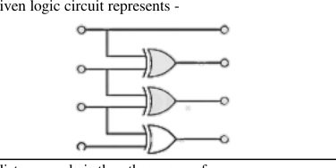

- **(A)** 4-bit binary to decimal converter
- **(B)** 4-bit gray to binary converter
- **(C)** 4-bit binary to gray converter *(Correct)*
- **(D)** 4-bit XS-3 to decimal converter

> **Answer**: **C** (4-bit binary to gray converter)

---

### Q175. Unit distance code is the other name of -

- **Marks**: 1 | **Type**: MCQ | **Page**: 5

- **(A)** Sequential code
- **(B)** Cyclic Code *(Correct)*
- **(C)** Self complementing code
- **(D)** 2421 BCD code

> **Answer**: **B** (Cyclic Code)

---

### Q176. Which of the following number/s is/are in invalid format?

- **Marks**: 1 | **Type**: MCQ | **Page**: 5

- **(A)** (CAFE) 16
- **(B)** (5208) 8
- **(C)** (110000101101) XS-3
- **(D)** Both B and C *(Correct)*

> **Answer**: **D** (Both B and C)

---

### Q177. Which of the following is not an invalid BCD code?

- **Marks**: 1 | **Type**: MCQ | **Page**: 5

- **(A)** 1011
- **(B)** 1010
- **(C)** 1001 *(Correct)*
- **(D)** 1100

> **Answer**: **C** (1001)

---

### Q178. An Excess-3 code for the number (FD) is given by 16 _______

- **Marks**: 1 | **Type**: MCQ | **Page**: 5

- **(A)** 0010 0101 0011
- **(B)** 0011 0010 1000
- **(C)** 0101 1000 0110 *(Correct)*
- **(D)** 0101 1001 0110

> **Answer**: **C** (0101 1000 0110)

---

### Q179. Subtract (3250) from (72532) using 10's complement method. 10 10

- **Marks**: 2 | **Type**: DESCRIPTIVE | **Page**: 5

*(Descriptive question - No answer key provided in source)*

---

### Q180. If a 3-input NAND gate has eight input possibilities, how many of those possibilities will result in a HIGH output?

- **Marks**: 1 | **Type**: MCQ | **Page**: 5

- **(A)** 7 *(Correct)*
- **(B)** 1
- **(C)** 3
- **(D)** 4

> **Answer**: **A** (7)

---

### Q181. The 2421 and Excess-3 code of decimal 6 is represented by . _______

- **Marks**: 1 | **Type**: MCQ | **Page**: 5

- **(A)** 1100 and 1001 *(Correct)*
- **(B)** 1100 and 1100
- **(C)** 0110 and 1001
- **(D)** 1100 and 0110

> **Answer**: **A** (1100 and 1001)

---

### Q182. The transmitter transmits the 8-bit of information in form of data packet as D0 (LSB) to D7 (MSB) where D0 defines the even parity bit, D1 as start bit ='1', D2 to D5 as data bits = (5)10 in 84-2-1 code and D6 and D7 as stop bits='10' respectively in a transreceiver digital communication system. Evaluate D0.

- **Marks**: 1 | **Type**: MCQ | **Page**: 5

- **(A)** 8
- **(B)** 2
- **(C)** 0
- **(D)** 1 *(Correct)*

> **Answer**: **D** (1)

---

### Q183. Which Logic operation should be performed between A and B for a given output X?

- **Marks**: 1 | **Type**: MCQ | **Page**: 5

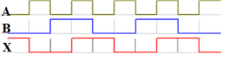

- **(A)** XNOR *(Correct)*
- **(B)** XOR
- **(C)** OR
- **(D)** NAND

> **Answer**: **A** (XNOR)

---

### Q184. Substract 75.125 from 84.625 using 12-bit 1's complement arithmetic.

- **Marks**: 2 | **Type**: DESCRIPTIVE | **Page**: 5

*(Descriptive question - No answer key provided in source)*

---

### Q185. BCD equivalent code of octal number (1431)8 is

- **Marks**: 1 | **Type**: MCQ | **Page**: 5

- **(A)** 1.00101E+11
- **(B)** 11100000010
- **(C)** 1.001E+11
- **(D)** 11110010011 *(Correct)*

> **Answer**: **D** (11110010011)

---

### Q186. Convert XS-3 number (11000111) into gray code

- **Marks**: 1 | **Type**: MCQ | **Page**: 5

- **(A)** 1110011
- **(B)** 110110
- **(C)** 1100111
- **(D)** 1110001 *(Correct)*

> **Answer**: **D** (1110001)

---

### Q187. Subtract (741.41)16 from (436.6)16 by using decimal (r-1) complement method.

- **Marks**: 3 | **Type**: DESCRIPTIVE | **Page**: 5

*(Descriptive question - No answer key provided in source)*

---

### Q188. Perform substraction of A – B using binary diminished radix complement , where A is octal number (75) & B is octal number (53).

- **Marks**: 3 | **Type**: DESCRIPTIVE | **Page**: 5

*(Descriptive question - No answer key provided in source)*

---

### Q189. Do as directed: a) Convert the gray code 11011 into decimal. b) Convert the decimal 2493 into XS-3 code

- **Marks**: 2 | **Type**: DESCRIPTIVE | **Page**: 5

*(Descriptive question - No answer key provided in source)*

---

### Q190. Do as directed : a)Convert the decimal 1525 into gray code. b) convert (10101101)2 to 8421 code & gray code

- **Marks**: 2 | **Type**: DESCRIPTIVE | **Page**: 5

*(Descriptive question - No answer key provided in source)*

---

### Q191. A processor started the operation with reflected code as one bit of change at a time when code is moving from one state to another. The obtained code in one state as 110001 and went to 101111. Convert corresponding code into binary equivalent?

- **Marks**: 1 | **Type**: MCQ | **Page**: 5

- **(A)** 100001 to 110101 *(Correct)*
- **(B)** 101110 to 110101
- **(C)** 111111 to 110101
- **(D)** 0001 to 111111

> **Answer**: **A** (100001 to 110101)

---

### Q192. Convert (19) into XS-3 code and gray code. 10

- **Marks**: 1 | **Type**: MCQ | **Page**: 5

- **(A)** a) (01010000) xs-3 & 11010
- **(B)** b) (01001100) xs-3 & 11010 *(Correct)*
- **(C)** c) (01001101) xs-3 & 11000
- **(D)** d) (01001110) xs-3 & 10010

> **Answer**: **B** (b) (01001100) xs-3 & 11010)

---

### Q193. The decimal equivalent of the excess-3 number 110010100011.01110101 is . _______

- **Marks**: 1 | **Type**: MCQ | **Page**: 5

- **(A)** 1253.75
- **(B)** 861.75
- **(C)** 970.42 *(Correct)*
- **(D)** 1132.87

> **Answer**: **C** (970.42)

---

### Q194. The 10's complement of (715) is 8 _______

- **Marks**: 1 | **Type**: MCQ | **Page**: 5

- **(A)** 359
- **(B)** 953
- **(C)** 540
- **(D)** 539 *(Correct)*

> **Answer**: **D** (539)

---

### Q195. (98.75) is equivalent to 10 _______

- **Marks**: 1 | **Type**: MCQ | **Page**: 5

- **(A)** (142.6) 8
- **(B)** (62.C) 16
- **(C)** (10011000.01110101) BCD
- **(D)** All of above *(Correct)*

> **Answer**: **D** (All of above)

---

### Q196. Assign the proper odd parity bit to the code 111001.

- **Marks**: 1 | **Type**: MCQ | **Page**: 5

- **(A)** 1111011
- **(B)** 1111001 *(Correct)*
- **(C)** 111111
- **(D)** 0111011

> **Answer**: **B** (1111001)

---

### Q197. Which of the following is false? I. A 1-bit gray code has two code words 0 and 1 representing decimal numbers 0 and 1. respectively. II. 2's complement of a 2's complement of a number is the number itself. III. Excess-3 code for 369 is 011110011100.

- **Marks**: 1 | **Type**: MCQ | **Page**: 5

- **(A)** Only 1
- **(B)** Only 2
- **(C)** Only 3 *(Correct)*
- **(D)** All are false

> **Answer**: **C** (Only 3)

---

### Q198. The 2's complement of the decimal number (-541) in hexadecimal is 10 . _______

- **Marks**: 1 | **Type**: MCQ | **Page**: 5

- **(A)** DEE
- **(B)** DDD
- **(C)** DE3 *(Correct)*
- **(D)** DED

> **Answer**: **C** (DE3)

---

### Q199. (1111011) = ( ) GRAY XS-3

- **Marks**: 1 | **Type**: MCQ | **Page**: 5

- **(A)** 10110101 *(Correct)*
- **(B)** 11111111
- **(C)** 10111100
- **(D)** 10100101

> **Answer**: **A** (10110101)

---

### Q200. Which gates are called universal gates? Design exclusive-OR gate having minimum gates using one of the universal gates.

- **Marks**: 3 | **Type**: DESCRIPTIVE | **Page**: 5

*(Descriptive question - No answer key provided in source)*

---

### Q201. The transmitter transmits the 8-bit of information in form of data packet as D0 (LSB) to D7 (MSB) where D0 defines the even parity bit, D1 as start bit ='1', D2 to D5 as data bits = (9)10 in 84-2-1 code and D6 and D7 as stop bits='10' respectively in a trans receiver digital communication system. Evaluate D0

- **Marks**: 1 | **Type**: MCQ | **Page**: 6

- **(A)** 1
- **(B)** 0 *(Correct)*
- **(C)** 11
- **(D)** 111

> **Answer**: **B** (0)

---

### Q202. Consider P = (49.75) and Q = (55.50) . Subtract Q from P using 12-bit 2's 10 10 complement arithmetic. Express the answer in radix-10 number system.

- **Marks**: 3 | **Type**: DESCRIPTIVE | **Page**: 6

*(Descriptive question - No answer key provided in source)*

---

## Unit-3

*Total Questions in Chapter: 128*

### Q203. What is the use of boolean identities?

- **Marks**: 1 | **Type**: MCQ | **Page**: 6

- **(A)** Minimizing the boolean expression *(Correct)*
- **(B)** Maximizing the boolean expression
- **(C)** To evaluate logical identity
- **(D)** Searching of logical expression

> **Answer**: **A** (Minimizing the boolean expression)

---

### Q204. _______ is used to implement boolean function.

- **Marks**: 1 | **Type**: MCQ | **Page**: 6

- **(A)** Logical notation
- **(B)** Arithmetic logic
- **(C)** Logic gates *(Correct)*
- **(D)** expressions

> **Answer**: **C** (Logic gates)

---

### Q205. The boolean function A + BC is a reduced form of _______

- **Marks**: 1 | **Type**: MCQ | **Page**: 6

- **(A)** AB + BC
- **(B)** (A + B)(A + C) *(Correct)*
- **(C)** A'B + AB'C
- **(D)** (A + C)B

> **Answer**: **B** ((A + B)(A + C))

---

### Q206. Simplify Y = AB' + (A' + B)C.

- **Marks**: 1 | **Type**: MCQ | **Page**: 6

- **(A)** AB' + C *(Correct)*
- **(B)** AB + AC
- **(C)** A'B + AC'
- **(D)** AB + A

> **Answer**: **A** (AB' + C)

---

### Q207. Complement of the expression A'B + CD' is _______

- **Marks**: 1 | **Type**: MCQ | **Page**: 6

- **(A)** (A' + B)(C' + D')
- **(B)** (A + B')(C' + D) *(Correct)*
- **(C)** (A' + B)(C' + D)
- **(D)** (A + B')(C + D')

> **Answer**: **B** ((A + B')(C' + D))

---

### Q208. (A + B)(A' B') = ?

- **Marks**: 1 | **Type**: MCQ | **Page**: 6

- **(A)** 0 *(Correct)*
- **(B)** 1
- **(C)** AB
- **(D)** AB'

> **Answer**: **A** (0)

---

### Q209. DeMorgan's theorem states that _______

- **Marks**: 1 | **Type**: MCQ | **Page**: 6

- **(A)** (AB)' = A' + B' *(Correct)*
- **(B)** (A + B)' = A' * B
- **(C)** A' + B' = A'B'
- **(D)** (AB)' = A' + B

> **Answer**: **A** ((AB)' = A' + B')

---

### Q210. In boolean algebra, the OR operation is performed by which properties?

- **Marks**: 1 | **Type**: MCQ | **Page**: 6

- **(A)** Associative properties
- **(B)** Commutative properties
- **(C)** Distributive properties
- **(D)** All of the Mentioned *(Correct)*

> **Answer**: **D** (All of the Mentioned)

---

### Q211. The expression for Absorption law is given by _______

- **Marks**: 1 | **Type**: MCQ | **Page**: 6

- **(A)** A + AB = A *(Correct)*
- **(B)** A + AB = B
- **(C)** AB + AA' = A
- **(D)** A + B = B + A

> **Answer**: **A** (A + AB = A)

---

### Q212. According to boolean law: A + 1 = ?

- **Marks**: 1 | **Type**: MCQ | **Page**: 6

- **(A)** 1 *(Correct)*
- **(B)** A
- **(C)** 0
- **(D)** A'

> **Answer**: **A** (1)

---

### Q213. The involution of A is equal to _______

- **Marks**: 1 | **Type**: MCQ | **Page**: 6

- **(A)** A *(Correct)*
- **(B)** A'
- **(C)** 1
- **(D)** 0

> **Answer**: **A** (A)

---

### Q214. A(A + B) = ?

- **Marks**: 1 | **Type**: MCQ | **Page**: 6

- **(A)** AB
- **(B)** 1
- **(C)** 0
- **(D)** A *(Correct)*

> **Answer**: **D** (A)

---

### Q215. Find the simplified expression A'BC'+AC'.

- **Marks**: 1 | **Type**: MCQ | **Page**: 6

- **(A)** B
- **(B)** A+C
- **(C)** (A+B)C' *(Correct)*
- **(D)** AB

> **Answer**: **C** ((A+B)C')

---

### Q216. (X + Z)(X + XZ') + XY + Y = ?.

- **Marks**: 1 | **Type**: MCQ | **Page**: 6

- **(A)** XY+Z'
- **(B)** Y+XZ'+Y'Z
- **(C)** X'Z+Y
- **(D)** X+Y *(Correct)*

> **Answer**: **D** (X+Y)

---

### Q217. A'(A + BC) + (AC + B'C) = ?.

- **Marks**: 1 | **Type**: MCQ | **Page**: 6

- **(A)** (AB'C+BC')
- **(B)** (A'B+C')
- **(C)** (A+ BC)
- **(D)** C *(Correct)*

> **Answer**: **D** (C)

---

### Q218. Simplify the expression XZ' + (Y + Y'Z) + XY.

- **Marks**: 1 | **Type**: MCQ | **Page**: 6

- **(A)** (1+XY')
- **(B)** YZ + XY' + Z'
- **(C)** (X + Y +Z) *(Correct)*
- **(D)** XY'+ Z'

> **Answer**: **C** ((X + Y +Z))

---

### Q219. Y' (X' + Y') (X + X'Y) = ?

- **Marks**: 1 | **Type**: MCQ | **Page**: 6

- **(A)** XY' *(Correct)*
- **(B)** X'Y
- **(C)** X + Y
- **(D)** X'Y'

> **Answer**: **A** (XY')

---

### Q220. If an expression is given that x+x'y'z=x+y'z, find the minimal expression of the function F(x,y,z) = x+x'y'z+yz?

- **Marks**: 1 | **Type**: MCQ | **Page**: 6

- **(A)** y' + z
- **(B)** xz + y'
- **(C)** x + z *(Correct)*
- **(D)** x' + y

> **Answer**: **C** (x + z)

---

### Q221. Simplify XY' + X' + Y'X'.

- **Marks**: 1 | **Type**: MCQ | **Page**: 6

- **(A)** X' + Y
- **(B)** XY'
- **(C)** (XY)' *(Correct)*
- **(D)** Y' + X

> **Answer**: **C** ((XY)')

---

### Q222. Minimize the following Boolean expression using Boolean identities.F(A,B,C) = (A+BC')(AB'+C)

- **Marks**: 1 | **Type**: MCQ | **Page**: 6

- **(A)** A + B + C'
- **(B)** AC' + B
- **(C)** B + AC
- **(D)** A(B' + C) *(Correct)*

> **Answer**: **D** (A(B' + C))

---

### Q223. Minimization of function F(A,B,C) = AB(B+C) is _______

- **Marks**: 1 | **Type**: MCQ | **Page**: 6

- **(A)** AC
- **(B)** B+C
- **(C)** B`
- **(D)** AB *(Correct)*

> **Answer**: **D** (AB)

---

### Q224. Algebra of logic is termed as _______

- **Marks**: 1 | **Type**: MCQ | **Page**: 6

- **(A)** Numerical logic
- **(B)** Boolean algebra *(Correct)*
- **(C)** Arithmetic logic
- **(D)** Boolean number

> **Answer**: **B** (Boolean algebra)

---

### Q225. Boolean algebra can be used _______

- **Marks**: 1 | **Type**: MCQ | **Page**: 6

- **(A)** For designing of the digital computers *(Correct)*
- **(B)** In building logic symbols
- **(C)** Circuit theory
- **(D)** Building algebraic functions

> **Answer**: **A** (For designing of the digital computers)

---

### Q226. A value is represented by a Boolean expression. _______

- **Marks**: 1 | **Type**: MCQ | **Page**: 6

- **(A)** Positive
- **(B)** Recursive
- **(C)** Negative
- **(D)** Boolean *(Correct)*

> **Answer**: **D** (Boolean)

---

### Q227. A + AB + ABC + ABCD + ABCDE + …. = _______

- **Marks**: 1 | **Type**: MCQ | **Page**: 6

- **(A)** 1
- **(B)** A *(Correct)*
- **(C)** A+AB
- **(D)** AB

> **Answer**: **B** (A)

---

### Q228. The minimum number of literal obtained on simplifying the expression ABC + A'C + AB'C + A'BC are . _______

- **Marks**: 1 | **Type**: MCQ | **Page**: 6

- **(A)** A'C+BC
- **(B)** A(A+B')
- **(C)** C *(Correct)*
- **(D)** A'B+AC'

> **Answer**: **C** (C)

---

### Q229. Reduce the expression: A+B (AC+(B+C')D)

- **Marks**: 2 | **Type**: DESCRIPTIVE | **Page**: 6

*(Descriptive question - No answer key provided in source)*

---

### Q230. Reduce the expression: (A+(BC)')'(AB'+ABC)

- **Marks**: 3 | **Type**: DESCRIPTIVE | **Page**: 6

*(Descriptive question - No answer key provided in source)*

---

### Q231. Minimize the Boolean expressions: X = ( (A'B'C')' + (A'B)' )'.

- **Marks**: 2 | **Type**: DESCRIPTIVE | **Page**: 6

*(Descriptive question - No answer key provided in source)*

---

### Q232. Find the complement of the following boolean function and reduce to a minimum numbers of literals: B'D + A'BC' +ACD + A'BC

- **Marks**: 3 | **Type**: DESCRIPTIVE | **Page**: 6

*(Descriptive question - No answer key provided in source)*

---

### Q233. Draw the logic diagram of the following function. Use one OR gate and one AND gate only. Y = (A+B)(A+C)

- **Marks**: 3 | **Type**: DESCRIPTIVE | **Page**: 6

*(Descriptive question - No answer key provided in source)*

---

### Q234. Given boolean function F = XY + X'Y'+Y'Z. Implement it with only OR and NOT gates.

- **Marks**: 4 | **Type**: DESCRIPTIVE | **Page**: 6

*(Descriptive question - No answer key provided in source)*

---

### Q235. Prove that a dual of Ex-OR is also its complement.

- **Marks**: 4 | **Type**: DESCRIPTIVE | **Page**: 6

*(Descriptive question - No answer key provided in source)*

---

### Q236. The logic expression (A'+B) (A+B') can be implemented by giving the inputs A and B to a two input _______

- **Marks**: 1 | **Type**: MCQ | **Page**: 6

- **(A)** NOR Gate
- **(B)** NAND Gate
- **(C)** XOR Gate
- **(D)** XNOR Gate *(Correct)*

> **Answer**: **D** (XNOR Gate)

---

### Q237. Which of the given boolean expression is incorrect?

- **Marks**: 1 | **Type**: MCQ | **Page**: 6

- **(A)** A + A'B = A + B
- **(B)** A + AB = B *(Correct)*
- **(C)** (A+B)(A+C)=A+BC
- **(D)** (A+B')(A+B)=A

> **Answer**: **B** (A + AB = B)

---

### Q238. The simplified form of boolean expression (X+Y+XY)(X+Z) is

- **Marks**: 1 | **Type**: MCQ | **Page**: 6

- **(A)** X+Y+Z
- **(B)** XY+YZ
- **(C)** X+YZ *(Correct)*
- **(D)** XZ+Y

> **Answer**: **C** (X+YZ)

---

### Q239. AB + A'C + BC = AB + A'C represents which theorem?

- **Marks**: 1 | **Type**: MCQ | **Page**: 6

- **(A)** Consensus *(Correct)*
- **(B)** Transposition
- **(C)** De Morgan's
- **(D)** None

> **Answer**: **A** (Consensus)

---

### Q240. The simplified form of boolean expression (A'BC+D)(A'D+B'C') can be written as

- **Marks**: 1 | **Type**: MCQ | **Page**: 6

- **(A)** A'D+B'C'D *(Correct)*
- **(B)** AD+BC'D
- **(C)** (A'+D)(B'C+D')
- **(D)** AD'+BCD'

> **Answer**: **A** (A'D+B'C'D)

---

### Q241. Determine the output X of a logic circuit shown in figure. Simplify the output expression using boolean laws and theorems. Redraw the logic circuit with the simplified expression.

- **Marks**: 3 | **Type**: SHORT_ANSWER | **Page**: 6

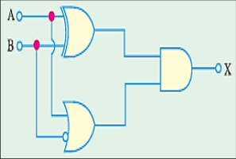

> **Solution / Key**: `Simplified Expression is: AB'`

---

### Q242. Consider the following boolean expressions: I: x.y + x'y' II: XOR (x', y') III: XOR (x', y) Which of the above expressions represents exclusive NOR operation?

- **Marks**: 1 | **Type**: MCQ | **Page**: 6

- **(A)** I and II
- **(B)** I, II and III
- **(C)** I and III *(Correct)*
- **(D)** II and III

> **Answer**: **C** (I and III)

---

### Q243. Consider the boolean function: f = (a+bc)(pq+r). Complement (f)' of a function f is -

- **Marks**: 1 | **Type**: MCQ | **Page**: 6

- **(A)** (a'+b'c')(pq'+r')
- **(B)** a'(b'+c')+(p'+q')r' *(Correct)*
- **(C)** (a'+b'c')+(p'q'+r')
- **(D)** a'b'c'+p'q'r'

> **Answer**: **B** (a'(b'+c')+(p'+q')r')

---

### Q244. Derive the logic expression for the given logic diagram

- **Marks**: 1 | **Type**: MCQ | **Page**: 7

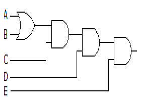

- **(A)** C(A + B)DE *(Correct)*
- **(B)** [C(A + B)D + E']
- **(C)** [[C(A + B)D]E']
- **(D)** ABCDE

> **Answer**: **A** (C(A + B)DE)

---

### Q245. Most Boolean reductions result in an equation in only one form.

- **Marks**: 1 | **Type**: MCQ | **Page**: 7

- **(A)** TRUE *(Correct)*
- **(B)** FALSE
- **(C)** 
- **(D)** 

> **Answer**: **A** (TRUE)

---

### Q246. According to property of Commutative law, the order of combining terms does not affect _______

- **Marks**: 1 | **Type**: MCQ | **Page**: 7

- **(A)** initial result of combination
- **(B)** final result of combination *(Correct)*
- **(C)** mid-term result of combination
- **(D)** None

> **Answer**: **B** (final result of combination)

---

### Q247. According to boolean algebra which of the following relation is not valid?

- **Marks**: 1 | **Type**: MCQ | **Page**: 7

- **(A)** X(YZ) = (XY)Z
- **(B)** X(Y+Z) = XY + XZ
- **(C)** X+XZ = X
- **(D)** X(X+Y)=1 *(Correct)*

> **Answer**: **D** (X(X+Y)=1)

---

### Q248. Simplify the following expression: F = AB'C + AB'C'+ABC

- **Marks**: 1 | **Type**: MCQ | **Page**: 7

- **(A)** F = AC + AB' *(Correct)*
- **(B)** F = A'C + AB
- **(C)** F = AC' + AB
- **(D)** F = AC' + AB'

> **Answer**: **A** (F = AC + AB')

---

### Q249. Which of the following options correctly represents the consensus law of Digital Circuits?

- **Marks**: 1 | **Type**: MCQ | **Page**: 7

- **(A)** AB + A'C + BC = AB + A'C *(Correct)*
- **(B)** A'B + A'C + BC = AB + A'C
- **(C)** AB + A'C + BC = AB + (AC)'
- **(D)** A'B + A'C + BC = AB + (AC)'

> **Answer**: **A** (AB + A'C + BC = AB + A'C)

---

### Q250. Verify the equation by using boolean algebra: AB + AC + BC' = AC + BC'

- **Marks**: 4 | **Type**: DESCRIPTIVE | **Page**: 7

*(Descriptive question - No answer key provided in source)*

---

### Q251. Find out the minimized form of a logical expression (A'B'C' + A'BC' + A'BC + ABC').

- **Marks**: 3 | **Type**: DESCRIPTIVE | **Page**: 7

*(Descriptive question - No answer key provided in source)*

---

### Q252. The boolean expression (X+Y)(X+Y')+(X'Y'+X')' simplifies to

- **Marks**: 1 | **Type**: MCQ | **Page**: 7

- **(A)** X *(Correct)*
- **(B)** Y
- **(C)** XY
- **(D)** X+Y

> **Answer**: **A** (X)

---

### Q253. Simplify the following boolean expression to four literals: F = A'C + C'D + B'C + AB

- **Marks**: 3 | **Type**: SHORT_ANSWER | **Page**: 7

> **Solution / Key**: `AB+C+D`

---

### Q254. The reduced form of complement of equation f = [(ab)'a][(ab)'b]

- **Marks**: 1 | **Type**: MCQ | **Page**: 7

- **(A)** 0
- **(B)** 1 *(Correct)*
- **(C)** a'b+ab'
- **(D)** a'b'

> **Answer**: **B** (1)

---

### Q255. The reduced form of dual of equation f = [(ab)'a][(ab)'b]

- **Marks**: 1 | **Type**: MCQ | **Page**: 7

- **(A)** 0
- **(B)** 1 *(Correct)*
- **(C)** a'b+ab'
- **(D)** a'b'

> **Answer**: **B** (1)

---

### Q256. Which of the given boolean expression is incorrect?

- **Marks**: 1 | **Type**: MCQ | **Page**: 7

- **(A)** (A'+B')' = AB
- **(B)** (A+ (B')')' = A' B'
- **(C)** (A'B')' = A+B
- **(D)** (A'B'')' = A'+B *(Correct)*

> **Answer**: **D** ((A'B'')' = A'+B)

---

### Q257. The boolean equation x = [(A+B')(B+C)]B can be simplified to -

- **Marks**: 1 | **Type**: MCQ | **Page**: 7

- **(A)** X = A'B
- **(B)** X = AB'
- **(C)** X = AB *(Correct)*
- **(D)** X = A'B'

> **Answer**: **C** (X = AB)

---

### Q258. Find the output boolean function for the given logic circuit.

- **Marks**: 1 | **Type**: MCQ | **Page**: 7

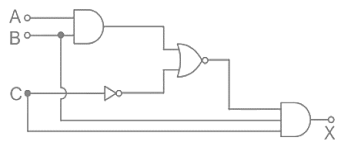

- **(A)** X = A'BC *(Correct)*
- **(B)** X = AB'C
- **(C)** X = ABC
- **(D)** X = A'B'C

> **Answer**: **A** (X = A'BC)

---

### Q259. The output Y of the logic circuit is -

- **Marks**: 1 | **Type**: MCQ | **Page**: 7

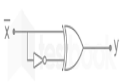

- **(A)** 1 *(Correct)*
- **(B)** 0
- **(C)** X
- **(D)** X'

> **Answer**: **A** (1)

---

### Q260. Simplify the following boolean expression and realize it using NOR gates only: 𝑌= 𝐴𝐵ത+ 𝐴𝐵𝐶ҧ+ 𝐴𝐵𝐶𝐷+ 𝐴𝐵𝐶𝐷ഥ

- **Marks**: 3 | **Type**: DESCRIPTIVE | **Page**: 7

*(Descriptive question - No answer key provided in source)*

---

### Q261. Simplify the following boolean expression and realize it using NAND gates only: 𝐴𝐵𝐶[𝐴𝐵+𝐶ҧ 𝐵𝐶+ 𝐴𝐶 ]

- **Marks**: 3 | **Type**: DESCRIPTIVE | **Page**: 7

*(Descriptive question - No answer key provided in source)*

---

### Q262. Match the appropriate pairs: (1) x+(y+z)=(x+y)+z (A) Commutative Law (2) x+y=y+x (B) Absorption Law (3) x+xy=x (C) Complementation law (4) (x')'=x (D) Associative Law

- **Marks**: 1 | **Type**: MCQ | **Page**: 7

- **(A)** 1-B, 2-A, 3-D, 4-C
- **(B)** 1-D, 2-A, 3-C, 4-B
- **(C)** 1-D, 2-A, 3-B, 4-C *(Correct)*
- **(D)** 1-C, 2-A, 3-D, 4-B

> **Answer**: **C** (1-D, 2-A, 3-B, 4-C)

---

### Q263. Simplify: f = 𝐴𝐵+ 𝐴𝐵𝐶+ 𝐴ҧ𝐵+ 𝐴𝐵ത𝐶

- **Marks**: 2 | **Type**: SHORT_ANSWER | **Page**: 7

> **Solution / Key**: `B+AC`

---

### Q264. Minimize the following function using boolean algebra: f =𝐴ҧ𝐵𝐶𝐷+ 𝐴𝐵𝐶ҧ𝐷ഥ+𝐴𝐵𝐶ҧ𝐷+ 𝐴𝐵𝐶𝐷+ 𝐴𝐵𝐶𝐷ഥ+ 𝐴𝐵ത𝐶ҧ𝐷 + 𝐴𝐵ത𝐶𝐷+ 𝐴𝐵ത𝐶𝐷ഥ

- **Marks**: 2 | **Type**: DESCRIPTIVE | **Page**: 7

*(Descriptive question - No answer key provided in source)*

---

### Q265. Simplify: f = 𝐴+ 𝐵ത𝐶 + (𝐴+ 𝐵ത𝐶) = 1

- **Marks**: 3 | **Type**: DESCRIPTIVE | **Page**: 7

*(Descriptive question - No answer key provided in source)*

---

### Q266. Simplify the following boolean expression which represents the output of a logical decision circuit f w, x, y, z = x + xyz + 𝑥ҧ𝑦𝑧+ 𝑤𝑥+ 𝑤ഥ𝑥+ 𝑥ҧ𝑦

- **Marks**: 2 | **Type**: SHORT_ANSWER | **Page**: 7

> **Solution / Key**: `x+y`

---

### Q267. Simplify the following boolean expression which represents the output of a logical decision circuit f A, B, C, D, E = (AB + C + D)(𝐶 ҧ+ 𝐷)(𝐶 ҧ+ 𝐷+ 𝐸)

- **Marks**: 3 | **Type**: SHORT_ANSWER | **Page**: 7

> **Solution / Key**: `ABC'+D`

---

### Q268. Prove the following identity: 𝐴𝐵+𝐴ҧ+ 𝐴𝐵= 0

- **Marks**: 2 | **Type**: DESCRIPTIVE | **Page**: 7

*(Descriptive question - No answer key provided in source)*

---

### Q269. Simplify the following function by using boolean algebra: Y = AB'C'D + A'B'D + BCD' + A'B + BC'

- **Marks**: 3 | **Type**: DESCRIPTIVE | **Page**: 7

*(Descriptive question - No answer key provided in source)*

---

### Q270. Simplify the following function by using boolean algebra: Y = (AB + A'C + BC)(A+B'+AB')

- **Marks**: 2 | **Type**: SHORT_ANSWER | **Page**: 7

> **Solution / Key**: `AB+A'B'C`

---

### Q271. Construct a logic circuit to give an output without any reduction in number of gates. Give the logic gates output step by step. 𝑋= (𝐴𝐵+𝐴ҧ𝐶)(𝐴𝐷+ 𝐶)

- **Marks**: 3 | **Type**: DESCRIPTIVE | **Page**: 7

*(Descriptive question - No answer key provided in source)*

---

### Q272. Find out the complement of boolean expression : AB (B'C+AC)

- **Marks**: 2 | **Type**: DESCRIPTIVE | **Page**: 7

*(Descriptive question - No answer key provided in source)*

---

### Q273. The boolean function Y = AB + CD is to be realized using only 2-input NAND gates. The minimum number of NAND gates required is -

- **Marks**: 2 | **Type**: MCQ | **Page**: 7

- **(A)** 2
- **(B)** 3 *(Correct)*
- **(C)** 4
- **(D)** 5

> **Answer**: **B** (3)

---

### Q274. Realize the given logic circuit into appropriate boolean expression and also minimize it.

- **Marks**: 3 | **Type**: DESCRIPTIVE | **Page**: 8

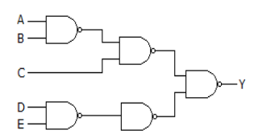

*(Descriptive question - No answer key provided in source)*

---

### Q275. Make a suitable logic expression from the given truth table and also minimize it up to a single literal remaining.

- **Marks**: 2 | **Type**: DESCRIPTIVE | **Page**: 8

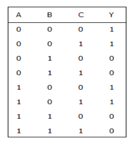

*(Descriptive question - No answer key provided in source)*

---

### Q276. NAND gates required to implement the function : _______ 𝐹= ( 𝑋ത+ 𝑌ത)(𝑍+ 𝑊)

- **Marks**: 3 | **Type**: DESCRIPTIVE | **Page**: 8

*(Descriptive question - No answer key provided in source)*

---

### Q277. The boolean expression for the given circuit is _______

- **Marks**: 1 | **Type**: MCQ | **Page**: 8

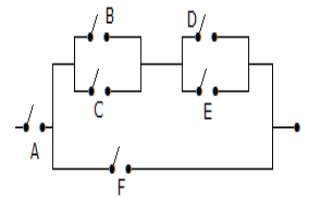

- **(A)** A {F + (B + C) (D + E)} *(Correct)*
- **(B)** A [F + (B + C) (DE)]
- **(C)** A + F + [(B + C) (D + E)]
- **(D)** A [F + (BC) (DE)]

> **Answer**: **A** (A {F + (B + C) (D + E)})

---

### Q278. DeMorgan's first theorem shows the equivalence of _______

- **Marks**: 1 | **Type**: MCQ | **Page**: 8

- **(A)** OR gate and Exclusive OR gate
- **(B)** NOR gate and Bubbled AND gate *(Correct)*
- **(C)** NOR gate and NAND gate
- **(D)** NAND gate and NOT gate

> **Answer**: **B** (NOR gate and Bubbled AND gate)

---

### Q279. ((AB)'+(AC)')' = _______

- **Marks**: 1 | **Type**: MCQ | **Page**: 8

- **(A)** A+B+C
- **(B)** ABC *(Correct)*
- **(C)** A'BC
- **(D)** (A+B+C)'

> **Answer**: **B** (ABC)

---

### Q280. Consider four distinct input boolean variables, in which first two and last two variables are ANDed. Then after output of both operation is Ored together. Implement the circuit based on the given information and also find its boolean expression.

- **Marks**: 2 | **Type**: DESCRIPTIVE | **Page**: 8

*(Descriptive question - No answer key provided in source)*

---

### Q281. What is the boolean expression for Y in above circuit ?

- **Marks**: 2 | **Type**: DESCRIPTIVE | **Page**: 8

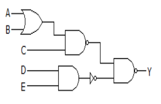

*(Descriptive question - No answer key provided in source)*

---

### Q282. Find out the simplified boolean equation for the given logic circuit.

- **Marks**: 1 | **Type**: MCQ | **Page**: 8

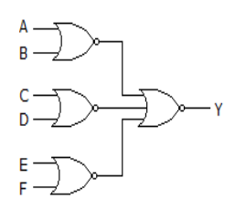

- **(A)** (A + B) (C + D) (E + F) *(Correct)*
- **(B)** A+B+C+D+E+F
- **(C)** ABCDEF
- **(D)** ABC + DEF

> **Answer**: **A** ((A + B) (C + D) (E + F))

---

### Q283. Four inputs A, B, C, D are fed to a NOR gate. The output of NOR gate is fed to the two successive inverter. The final output is given by - _______

- **Marks**: 1 | **Type**: MCQ | **Page**: 8

- **(A)** A+B+C+D
- **(B)** (A+B+C+D)' *(Correct)*
- **(C)** ABCD
- **(D)** (ABCD)'

> **Answer**: **B** ((A+B+C+D)')

---

### Q284. For the logic circuit of the given figure, the minimized expression is -

- **Marks**: 3 | **Type**: MCQ | **Page**: 8

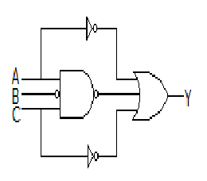

- **(A)** Y = (AB'C)' *(Correct)*
- **(B)** Y = A+B+C
- **(C)** Y = A + B
- **(D)** Y = ABC

> **Answer**: **A** (Y = (AB'C)')

---

### Q285. Choose the correct statement for 'literal' - (I) Literal is a primed variable only. (II) The minimization of the number of literals and the number of terms results in a circuit with less equipment (III) We can not reduce the number of literals in any given Boolean function. (IV) In the Boolean equation y=a' b+b' c+c'd, the terms a'b , b'c and c'd are known as literals.

- **Marks**: 1 | **Type**: MCQ | **Page**: 8

- **(A)** Only I and III
- **(B)** Only II *(Correct)*
- **(C)** Only II and IV
- **(D)** All are correct

> **Answer**: **B** (Only II)

---

### Q286. Simplify the boolean expression to a minimum number of literals: y(wz'+wz)+xy

- **Marks**: 2 | **Type**: DESCRIPTIVE | **Page**: 8

*(Descriptive question - No answer key provided in source)*

---

### Q287. Reduce the following boolean function upto minimum five literals (including primed and unprimed variables): 𝐴𝐵𝐶+ 𝐴′𝐵′𝐶+ 𝐴′𝐵𝐶+ 𝐴𝐵𝐶′ + 𝐴′𝐵′𝐶′

- **Marks**: 2 | **Type**: DESCRIPTIVE | **Page**: 8

*(Descriptive question - No answer key provided in source)*

---

### Q288. Reduce the following boolean function upto minimum four literals (including primed and unprimed variables): 𝑋= 𝐵ത𝐷+𝐴ҧ𝐵𝐶ҧ+ 𝐴𝐶𝐷+𝐴ҧ𝐵𝐶

- **Marks**: 2 | **Type**: DESCRIPTIVE | **Page**: 8

*(Descriptive question - No answer key provided in source)*

---

### Q289. Find the complement of F = x +yz, then show that F∙F' = 0 and F+F' = 1

- **Marks**: 2 | **Type**: DESCRIPTIVE | **Page**: 9

*(Descriptive question - No answer key provided in source)*

---

### Q290. Find the complement of the following Boolean functions and reduce them to a minimum number of literals: (𝐴′ + 𝐶)(𝐴′ + 𝐶′)(𝐴+ 𝐵+ 𝐶′𝐷)′

- **Marks**: 3 | **Type**: DESCRIPTIVE | **Page**: 9

*(Descriptive question - No answer key provided in source)*

---

### Q291. Write the Boolean expression for output X for the logic circuit shown in figure. Also show the ouput of each stage of logic gates:

- **Marks**: 3 | **Type**: DESCRIPTIVE | **Page**: 9

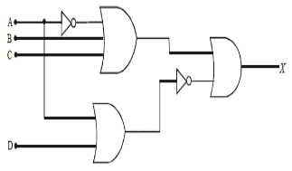

*(Descriptive question - No answer key provided in source)*

---

### Q292. Write the Boolean expression for output X for the logic circuit shown in figure. Also show the ouput of each stage of logic gates:

- **Marks**: 3 | **Type**: DESCRIPTIVE | **Page**: 9

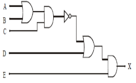

*(Descriptive question - No answer key provided in source)*

---

### Q293. Construct a logic circuit using INVERTER, AND and OR gates for the Boolean expression

- **Marks**: 3 | **Type**: DESCRIPTIVE | **Page**: 9

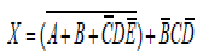

*(Descriptive question - No answer key provided in source)*

---

### Q294. A network of cascaded inverters shown in fig. If a logic 1 is applied to A, Determine the logic levels from point B through F.

- **Marks**: 2 | **Type**: DESCRIPTIVE | **Page**: 9

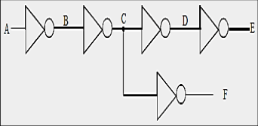

*(Descriptive question - No answer key provided in source)*

---

### Q295. Using boolean laws and rules, simplify the expression: Z = A'BC + AB'C' + A'B'C' + AB'C + ABC

- **Marks**: 3 | **Type**: DESCRIPTIVE | **Page**: 9

*(Descriptive question - No answer key provided in source)*

---

### Q296. Using boolean laws and rules, simplify the expression: Z = (AB+AC)' + A'B'C and prove that Z = A' + B'C'

- **Marks**: 3 | **Type**: DESCRIPTIVE | **Page**: 9

*(Descriptive question - No answer key provided in source)*

---

### Q297. Demorganize the expression: 𝐴+ 𝐵 𝐶ഥ𝐷ഥ+ (𝐸+ 𝐹ത)

- **Marks**: 2 | **Type**: DESCRIPTIVE | **Page**: 9

*(Descriptive question - No answer key provided in source)*

---

### Q298. Simplify the boolean expression: T[x,y,z] = (x+y) (x'(y'+z'))'+x'y'+x'z'.

- **Marks**: 3 | **Type**: DESCRIPTIVE | **Page**: 9

*(Descriptive question - No answer key provided in source)*

---

### Q299. The circuit shown in Fig. is used to implement the function Z = f (A, B) = A + B. What values should be selected for I and J ?

- **Marks**: 3 | **Type**: DESCRIPTIVE | **Page**: 9

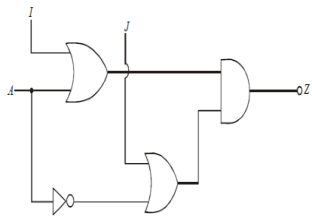

*(Descriptive question - No answer key provided in source)*

---

### Q300. Determine the logic function realized by the circuit shown in Fig. Also minimize the output function f using laws boolean algebra.

- **Marks**: 3 | **Type**: DESCRIPTIVE | **Page**: 9

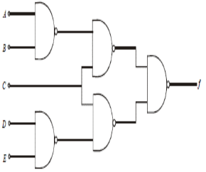

*(Descriptive question - No answer key provided in source)*

---

### Q301. Determine by means of truth table, the validity of De Morgan's theorem for three variables: (ABC)' = A' + B' + C'

- **Marks**: 3 | **Type**: DESCRIPTIVE | **Page**: 9

*(Descriptive question - No answer key provided in source)*

---

### Q302. A switch board contains four electrical switches which are connected in a sequence in a room: 1st switch as main power supply switch of the room, 2nd switch belongs to a fan, 3rd switch belongs to a TV and 4th switch belongs to 0 W bulb. The main power supply switch is also directly connected to the 0W bulb. Design the boolean expression of the switch board of the room such that user can operate switch board as per his requirement. Also show how the boolean expression can be minimized.

- **Marks**: 3 | **Type**: DESCRIPTIVE | **Page**: 9

*(Descriptive question - No answer key provided in source)*

---

### Q303. Boolean arithmetic is a :

- **Marks**: 1 | **Type**: MCQ | **Page**: 9

- **(A)** way to express logic statements in a traditional mathematical equation format *(Correct)*
- **(B)** terrible fraud perpetrated by philosophers to disprove things they don't agree with
- **(C)** very difficult calculation used in astronomy
- **(D)** fast way to solve problems around the house

> **Answer**: **A** (way to express logic statements in a traditional mathematical equation format)

---

### Q304. Determine and minimize the Boolean expression for the output, X of a logic circuit shown in figure. Also give your comment on the minimized output. Which logic gate is represented by simplified output?

- **Marks**: 3 | **Type**: SHORT_ANSWER | **Page**: 9

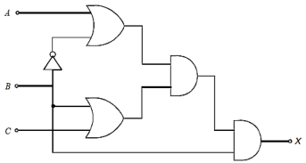

> **Solution / Key**: `AND gate`

---

### Q305. Simplify the following boolean expression using laws of Boolean algebra. f(w,x,y,z)=x+x'yz+x'yz+wx+w'x+x'y Y=AB'+ABC'+ABCD+ABCD'

- **Marks**: 3 | **Type**: DESCRIPTIVE | **Page**: 10

*(Descriptive question - No answer key provided in source)*

---

### Q306. As per theorem, PQ+P'R+QR = _______ _______

- **Marks**: 1 | **Type**: MCQ | **Page**: 10

- **(A)** Transposition, PQ+QR
- **(B)** Absorption, PQ+P'R
- **(C)** Consensus, PQ+P'R *(Correct)*
- **(D)** Consensus, PQ+PR'

> **Answer**: **C** (Consensus, PQ+P'R)

---

### Q307. Which of the following statements are true? 1. An XOR gate produces an output 1 only when the inputs are not equal.
2. An XNOR gate produces an output 1 only when the inputs are equal.
3. An XOR is also called anti-coincidence gate.
4. An XNOR is also called coincidence gate.

- **Marks**: 1 | **Type**: MCQ | **Page**: 10

- **(A)** Both 1 and 2
- **(B)** Both 3 and 4
- **(C)** Both 2 and 3
- **(D)** All are true *(Correct)*

> **Answer**: **D** (All are true)

---

### Q308. Evaluate which one is correct?

- **Marks**: 1 | **Type**: MCQ | **Page**: 10

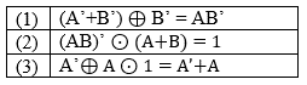

- **(A)** Only 1
- **(B)** Only 2
- **(C)** Only 3 *(Correct)*
- **(D)** Only 4

> **Answer**: **C** (Only 3)

---

### Q309. If a 3-input NAND gate has eight input possibilities, how many of those possibilities will result in a LOW output?

- **Marks**: 1 | **Type**: MCQ | **Page**: 10

- **(A)** 1 *(Correct)*
- **(B)** 7
- **(C)** 5
- **(D)** 6

> **Answer**: **A** (1)

---

### Q310. The given logic diagram describes the process of an industrial operation that depends on distinct values of A, B and C. Find the boolean expressions of each level (Level 1 to level 7) also define following logic diagram belongs to which equivalent logic gate?

- **Marks**: 4 | **Type**: DESCRIPTIVE | **Page**: 10

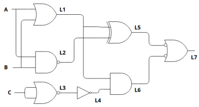

*(Descriptive question - No answer key provided in source)*

---

### Q311. Consider the following boolean expressions and Check whether the given statement/s is/are Correct or not. I: MN' + M' + M'N' = (MN)' II: Q' (P' + Q') (P + P'Q) = PQ' III: AB (A + B') + A (B + B') = A IV: A' + A'B + A'BC + A'BCD + A'BCDE + …. = A'B

- **Marks**: 1 | **Type**: MCQ | **Page**: 10

- **(A)** Only II and IV are correct
- **(B)** Only III is correct
- **(C)** Only I, II and III are correct *(Correct)*
- **(D)** All are correct

> **Answer**: **C** (Only I, II and III are correct)

---

### Q312. The circuit shown in Fig. is used to implement the function Z = f (A, B) = (AB)'. What values should be selected for I and J ?

- **Marks**: 1 | **Type**: MCQ | **Page**: 10

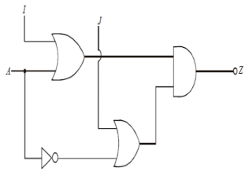

- **(A)** I= A' AND J= B'
- **(B)** I= 1 AND J=B'
- **(C)** I=A AND J= B
- **(D)** I= B' AND J= A'

> **Answer**: **** (Both A & B)

---

### Q313. Given W = [(A XOR B) XNOR 1], X= [(A XOR B') XOR 0], Y= [(A XNOR B) XOR 1] and Z= [(A' XOR B) XNOR 0]. Find Output Function = W OR X OR Y OR Z as per data and simplify it using basic theorems and construct simplified function with basic logic gates.

- **Marks**: 2 | **Type**: DESCRIPTIVE | **Page**: 10

*(Descriptive question - No answer key provided in source)*

---

### Q314. Determine the output F of a logic circuit shown in figure with truth table and logical expression. Simplify the output expression using boolean laws and theorems. Redraw the logic circuit of simplified expression with two gates only.

- **Marks**: 3 | **Type**: DESCRIPTIVE | **Page**: 10

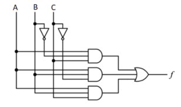

*(Descriptive question - No answer key provided in source)*

---

### Q315. If a signal passing through a gate is inhibited by sending a LOW into one of the inputs, and the output is HIGH, the gate is a(n):

- **Marks**: 1 | **Type**: MCQ | **Page**: 10

- **(A)** a) AND
- **(B)** b) NAND *(Correct)*
- **(C)** c) OR
- **(D)** d) NOR

> **Answer**: **B** (b) NAND)

---

### Q316. Choose correct statement/s from following i) an inverter performs complementation operation ii) process performed by inverter is known as inversion iii) an inverter contains two or more input terminal and one output terminal.

- **Marks**: 1 | **Type**: MCQ | **Page**: 10

- **(A)** a) Only I & II *(Correct)*
- **(B)** b) Only I & III
- **(C)** c) Only II & III
- **(D)** d)All of the above

> **Answer**: **A** (a) Only I & II)

---

### Q317. if the boolean expression P'Q + QR + PR is minimized , the expression becomes

- **Marks**: 1 | **Type**: MCQ | **Page**: 10

- **(A)** a) P'Q + QR
- **(B)** b) P'Q + PR *(Correct)*
- **(C)** c) QR + PR
- **(D)** d) P'Q+ QR + PR

> **Answer**: **B** (b) P'Q + PR)

---

### Q318. A + AB = A ; A(A+B) = A represents which law ?

- **Marks**: 1 | **Type**: MCQ | **Page**: 10

- **(A)** a) commutative
- **(B)** b) Absorption *(Correct)*
- **(C)** c) Consensus
- **(D)** d) Transposition

> **Answer**: **B** (b) Absorption)

---

### Q319. Exclusive-OR (XOR) logic gates can be constructed from ………..logic gates

- **Marks**: 1 | **Type**: MCQ | **Page**: 10

- **(A)** a)AND, OR, NOT
- **(B)** b)OR Gate & NOT gate
- **(C)** c)NOR & NOT Gate
- **(D)** d) a & c both *(Correct)*

> **Answer**: **D** (d) a & c both)

---

### Q320. The circuit shown below generates the function of F= _______

- **Marks**: 1 | **Type**: MCQ | **Page**: 10

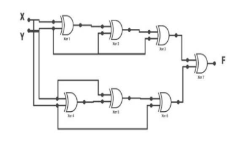

- **(A)** a) x⊕y *(Correct)*
- **(B)** b) 0
- **(C)** c) xȳ + yx + ȳx
- **(D)** d) x + y

> **Answer**: **A** (a) x⊕y)

---

### Q321. Transmitter transmit 8 bit of information in form of data packet D0 (LSB) to D7 (MSB) where D0 Defines EVEN PARITY BIT, D1 as start bit '1' , D2 to D5 as data bits (E)16 number & D6 & D7 as stop bit '10' respectively in transreceiver digital communication system. evalue the D0 = _______

- **Marks**: 1 | **Type**: MCQ | **Page**: 11

- **(A)** a) 1 *(Correct)*
- **(B)** b) 11
- **(C)** c) 10
- **(D)** d) 0

> **Answer**: **A** (a) 1)

---

### Q322. In the figure shown, the output Y is required to be Y = A.B + C'.D' .The gates G1 and G2 must be respectively

- **Marks**: 1 | **Type**: MCQ | **Page**: 11

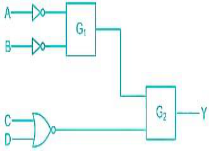

- **(A)** a) AND & OR
- **(B)** b) OR & NAND
- **(C)** c) NAND & OR
- **(D)** d) NOR & OR *(Correct)*

> **Answer**: **D** (d) NOR & OR)

---

### Q323. Draw the logic diagram of boolean expression (A+B)(CD)'(E+F)' G' & its complement seperately using only two input basic logic gates ( do not use NAND , NOR , X-OR , X-NOR logic gates )

- **Marks**: 3 | **Type**: DESCRIPTIVE | **Page**: 11

*(Descriptive question - No answer key provided in source)*

---

### Q324. Which of the following is true?
1. (A+B). (AB)' = A XOR B
2. AB+(A+B)' = A XNOR B
3. A XOR B' = A XNOR B

- **Marks**: 1 | **Type**: MCQ | **Page**: 11

- **(A)** Both 1 and 2
- **(B)** Both 1 and 3
- **(C)** Both 2 and 3
- **(D)** All are true *(Correct)*

> **Answer**: **D** (All are true)

---

### Q325. Simplify the Boolean expression. AB+(AC)'+AB'C(AB+C)

- **Marks**: 2 | **Type**: DESCRIPTIVE | **Page**: 11

*(Descriptive question - No answer key provided in source)*

---

### Q326. The given logic diagram depends on values of A & B. Find the Boolean expressions of each level till output Y and also define following logic diagram belongs to which equivalent gate?

- **Marks**: 4 | **Type**: DESCRIPTIVE | **Page**: 11

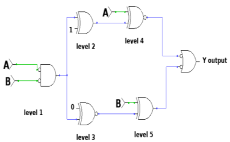

*(Descriptive question - No answer key provided in source)*

---

### Q327. Match the following 1) A+A' P. 0 2) A⊕ A Q. 1 3) 0 ⊕ A R. A 4) A'A' S. A'

- **Marks**: 1 | **Type**: MCQ | **Page**: 11

- **(A)** a) 1-P, 2-Q, 3-R, 4-S
- **(B)** b) 1-Q, 2-P, 3-R, 4-S *(Correct)*
- **(C)** c) 1-S, 2-R, 3-P, 4-Q
- **(D)** d) 1-Q, 2-P, 3-S, 4-R

> **Answer**: **B** (b) 1-Q, 2-P, 3-R, 4-S)

---

### Q328. MN(M + N') + M(N + N') = _______

- **Marks**: 1 | **Type**: MCQ | **Page**: 11

- **(A)** a) M *(Correct)*
- **(B)** b) N
- **(C)** c) M'
- **(D)** d) N'

> **Answer**: **A** (a) M)

---

### Q329. Find out the Boolean Expression for Logic Diagram given below and simplify the output in the minimal expression, also implement the simplified expression using the AOI logic.

- **Marks**: 4 | **Type**: DESCRIPTIVE | **Page**: 11

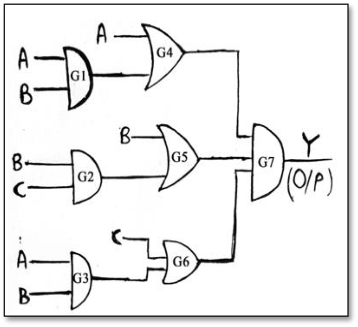

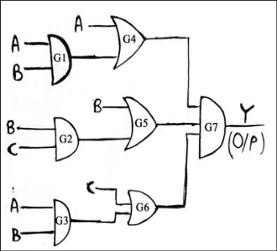

*(Descriptive question - No answer key provided in source)*

---

### Q330. Match the following with correct logic expression: Column A Column B
1. A' ʘ A ⊕ A' w. 1
2. A' ⊕ 0 ⊕ A x. A'
3. A ⊕ A' ʘ A y. 0
4. A' ʘ 1 ʘ A z. A

- **Marks**: 1 | **Type**: MCQ | **Page**: 11

- **(A)** 1-x, 2-z, 3-w, 4-y
- **(B)** 1-x, 2-w, 3-z, 4-y *(Correct)*
- **(C)** 1-w, 2-z, 3-x, 4-y
- **(D)** 1-y, 2-w, 3-z, 4-x

> **Answer**: **B** (1-x, 2-w, 3-z, 4-y)

---

## Unit-4

*Total Questions in Chapter: 128*

### Q331. The Sum of all Minterm is _______

- **Marks**: 1 | **Type**: MCQ | **Page**: 11

- **(A)** 0
- **(B)** 1 *(Correct)*
- **(C)** 2
- **(D)** 4

> **Answer**: **B** (1)

---

### Q332. The Product of all Maxterm is _______

- **Marks**: 1 | **Type**: MCQ | **Page**: 11

- **(A)** 0 *(Correct)*
- **(B)** 1
- **(C)** 2
- **(D)** 4

> **Answer**: **A** (0)

---

### Q333. The minterm related to F(w,x,y,z)= m6 is

- **Marks**: 1 | **Type**: MCQ | **Page**: 11

- **(A)** w'xyz' *(Correct)*
- **(B)** wxyz
- **(C)** wx'y'z
- **(D)** wx'yz

> **Answer**: **A** (w'xyz')

---

### Q334. The Maxterm related to F(w,x,y,z)= M7 is

- **Marks**: 1 | **Type**: MCQ | **Page**: 11

- **(A)** w+x'+y'+z' *(Correct)*
- **(B)** w'+x+y+z
- **(C)** w+x+y+z
- **(D)** w'+x+y'+z

> **Answer**: **A** (w+x'+y'+z')

---

### Q335. Convert SOP into POS : F(A,B,C)= ∑m( 1,3,7)

- **Marks**: 1 | **Type**: MCQ | **Page**: 11

- **(A)** π M(0,2,4,6)
- **(B)** π M(2,4,5,6)
- **(C)** π M(0,2,4)
- **(D)** π M(0,2,4,5,6) *(Correct)*

> **Answer**: **D** (π M(0,2,4,5,6))

---

### Q336. Convert POS into SOP: F(w,x,y,z) = πM( 0,1,2,6,10,12,14,15)

- **Marks**: 1 | **Type**: MCQ | **Page**: 11

- **(A)** ∑m( 3,4,5,7,8,9,11,13,16)
- **(B)** ∑m( 0,3,4,5,7,8,9,11,13)
- **(C)** ∑m( 3,4,5,7,8,9,11,13) *(Correct)*
- **(D)** ∑m( 3,4,5,8,9,11,13)

> **Answer**: **C** (∑m( 3,4,5,7,8,9,11,13))

---

### Q337. Express the boolean function F= A + B'C in sum of minterm

- **Marks**: 2 | **Type**: DESCRIPTIVE | **Page**: 11

*(Descriptive question - No answer key provided in source)*

---

### Q338. Express the Boolean function F = AB + A'C in a product of maxterm.

- **Marks**: 2 | **Type**: DESCRIPTIVE | **Page**: 11

*(Descriptive question - No answer key provided in source)*

---

### Q339. Convert into Product-of-Maxterms: A(A'+B)(C')

- **Marks**: 2 | **Type**: DESCRIPTIVE | **Page**: 11

*(Descriptive question - No answer key provided in source)*

---

### Q340. Convert into Sum-of-Minterms: A' + B + CA

- **Marks**: 2 | **Type**: DESCRIPTIVE | **Page**: 11

*(Descriptive question - No answer key provided in source)*

---

### Q341. Express Function in Product of Maxterms F(x,y,z) = ( xy + z ) ( y + xz )

- **Marks**: 2 | **Type**: DESCRIPTIVE | **Page**: 11

*(Descriptive question - No answer key provided in source)*

---

### Q342. Express the Boolean function in sum of minterms F (A,B,C)=(A'+B)(B'+C)

- **Marks**: 2 | **Type**: DESCRIPTIVE | **Page**: 11

*(Descriptive question - No answer key provided in source)*

---

### Q343. Express the Boolean function in sum of minterms F (A,B,C,D)= D(A'+B)+B'D

- **Marks**: 2 | **Type**: DESCRIPTIVE | **Page**: 11

*(Descriptive question - No answer key provided in source)*

---

### Q344. Express the Boolean function in sum of minterms and product of max terms. F (A,B,C,D)= (A+B'+C)(A+B')(A+C'+D')(A'+B+C+D')(B+C'+D')

- **Marks**: 3 | **Type**: DESCRIPTIVE | **Page**: 11

*(Descriptive question - No answer key provided in source)*

---

### Q345. Express the Boolean function in sum of minterms and product of max terms. F (X,Y,Z) = (XY+Z)(Y+XZ)

- **Marks**: 3 | **Type**: DESCRIPTIVE | **Page**: 11

*(Descriptive question - No answer key provided in source)*

---

### Q346. Express the Boolean function in sum of minterms and product of max terms. F (X,Y,Z) = 1

- **Marks**: 3 | **Type**: DESCRIPTIVE | **Page**: 11

*(Descriptive question - No answer key provided in source)*

---

### Q347. Express the Boolean function in sum of minterms and product of max terms. F (W,X,Y,Z) = Y'Z+WXY'+WXZ'+ W'X'Z

- **Marks**: 3 | **Type**: DESCRIPTIVE | **Page**: 11

*(Descriptive question - No answer key provided in source)*

---

### Q348. Expand A'+ B' to minterm and maxterm

- **Marks**: 2 | **Type**: DESCRIPTIVE | **Page**: 11

*(Descriptive question - No answer key provided in source)*

---

### Q349. Expand A+BC'+ABD'+ABCD to minterm and maxterm

- **Marks**: 2 | **Type**: DESCRIPTIVE | **Page**: 11

*(Descriptive question - No answer key provided in source)*

---

### Q350. Convert the following Boolean function in product of maxterms and sum of minterms: F(m,n,o,p) = n'o'p+nop+mop'+m'n'o+m'no'p

- **Marks**: 3 | **Type**: DESCRIPTIVE | **Page**: 11

*(Descriptive question - No answer key provided in source)*

---

### Q351. Expand A(A'+B)(A'+B+C') to minterm and maxterm

- **Marks**: 2 | **Type**: DESCRIPTIVE | **Page**: 12

*(Descriptive question - No answer key provided in source)*

---

### Q352. Convert the following to other canonical form F( x,y,z) = ∑( 1,3,7)

- **Marks**: 2 | **Type**: DESCRIPTIVE | **Page**: 12

*(Descriptive question - No answer key provided in source)*

---

### Q353. Convert the following to other canonical form F( A,B,C,D) = ∑( 0,2,6,11,13,14)

- **Marks**: 2 | **Type**: DESCRIPTIVE | **Page**: 12

*(Descriptive question - No answer key provided in source)*

---

### Q354. Convert the following to other canonical form F( X,Y,Z) = π (0,3,6,7)

- **Marks**: 2 | **Type**: DESCRIPTIVE | **Page**: 12

*(Descriptive question - No answer key provided in source)*

---

### Q355. Convert the following to other canonical form F( A,B,C,D) = π (0,1,2,3,4,6,12)

- **Marks**: 2 | **Type**: DESCRIPTIVE | **Page**: 12

*(Descriptive question - No answer key provided in source)*

---

### Q356. A Karnaugh map is an abstract form of diagram organized as a _______ matrix of squares

- **Marks**: 1 | **Type**: MCQ | **Page**: 12

- **(A)** Venn *(Correct)*
- **(B)** Cycle
- **(C)** Point
- **(D)** Block

> **Answer**: **A** (Venn)

---

### Q357. Which of the following code is employed by K-Map for simplification of Boolean Expression?

- **Marks**: 1 | **Type**: MCQ | **Page**: 12

- **(A)** XS-3
- **(B)** Gray *(Correct)*
- **(C)** BCD
- **(D)** Parity

> **Answer**: **B** (Gray)

---

### Q358. The 3-variable Karnaugh Map (K-Map) has cells for min or max _______ terms

- **Marks**: 1 | **Type**: MCQ | **Page**: 12

- **(A)** 3
- **(B)** 6
- **(C)** 8 *(Correct)*
- **(D)** 2

> **Answer**: **C** (8)

---

### Q359. Which of the following is NOT considered for forming groups in K-map?

- **Marks**: 1 | **Type**: MCQ | **Page**: 12

- **(A)** Diagonal *(Correct)*
- **(B)** Rolling
- **(C)** Vertical
- **(D)** Horizontal

> **Answer**: **A** (Diagonal)

---

### Q360. There are 3 Variable in the boolean function and the value of the function is
1. Find the number of cells in the K-Map which will contain a 1 when SOP expression is used

- **Marks**: 1 | **Type**: MCQ | **Page**: 12

- **(A)** 3
- **(B)** 8 *(Correct)*
- **(C)** 1
- **(D)** 0

> **Answer**: **B** (8)

---

### Q361. There are 3 Variable in the boolean function and the value of the function is
1. Find the number of cells in the K-Map which will contain a 0 when SOP expression is used _______

- **Marks**: 1 | **Type**: MCQ | **Page**: 12

- **(A)** 3
- **(B)** 8
- **(C)** 1
- **(D)** 0 *(Correct)*

> **Answer**: **D** (0)

---

### Q362. Given F(A, B, C, D) = ∑ m(0, 1, 2, 6, 8, 9, 10, 11) + ∑ d(3, 7, 14, 15) is a Boolean function, where m represents min-terms and d represents don't cares. The minimized logical fuction F is _______

- **Marks**: 1 | **Type**: MCQ | **Page**: 12

- **(A)** Independent of variables
- **(B)** Depedent on 2 variable *(Correct)*
- **(C)** Depedent on 3 variable
- **(D)** Depedent on 4 variable

> **Answer**: **B** (Depedent on 2 variable)

---

### Q363. In simplification of a Boolean function of n variables, a group of 2^m adjacent 1s leads to a term with

- **Marks**: 1 | **Type**: MCQ | **Page**: 12

- **(A)** m – 1 literals less than the total number of variables
- **(B)** m + 1 literals less than the total number of variables
- **(C)** n + m literals
- **(D)** n – m literals *(Correct)*

> **Answer**: **D** (n – m literals)

---

### Q364. Looping on a K-map always results in the elimination of _______

- **Marks**: 1 | **Type**: MCQ | **Page**: 12

- **(A)** Variables within the loop that appear only in their complemented form
- **(B)** Variables that remain unchanged within the loop
- **(C)** Variables within the loop that appear in both complemented and uncomplemented form *(Correct)*
- **(D)** Variables within the loop that appear only in their uncomplemented form

> **Answer**: **C** (Variables within the loop that appear in both complemented and uncomplemented form)

---

### Q365. Digital input signals A, B, C with A as the MSB and C as the LSB are used to realize the Boolean function F = m0 + m2 + m3 + m5 + m7, where mi denotes the ith minterm. In addition, F has a don't care for m1 + m4 + m6. The simplified expression for F is given by:

- **Marks**: 1 | **Type**: MCQ | **Page**: 12

- **(A)** 1 *(Correct)*
- **(B)** (A + C) (A' +C')
- **(C)** A'C' + AC
- **(D)** A'C + AC'

> **Answer**: **A** (1)

---

### Q366. Simplify the Boolean function using K-Map: F(w,x,y,z) = Σ (0,1,2,4,5,6,8,9,12,13,14)

- **Marks**: 3 | **Type**: DESCRIPTIVE | **Page**: 12

*(Descriptive question - No answer key provided in source)*

---

### Q367. Simplify the Boolean function using K-Map: F(w,x,y) = Σ (0,1,3,4,5,7)

- **Marks**: 2 | **Type**: DESCRIPTIVE | **Page**: 12

*(Descriptive question - No answer key provided in source)*

---

### Q368. Obtain the simplified expression using K-Map in sum of product for the Boolean functions F= Σ(0,1,4,5,10,11,12,14).

- **Marks**: 3 | **Type**: DESCRIPTIVE | **Page**: 12

*(Descriptive question - No answer key provided in source)*

---

### Q369. Simplify the Boolean function F(x,y,z)= ∑m(0,1,2,3,4,5,6) using K- map. Explain groups

- **Marks**: 3 | **Type**: DESCRIPTIVE | **Page**: 12

*(Descriptive question - No answer key provided in source)*

---

### Q370. Simplify the following Boolean function using K-map F( w,x,y,z) = Σ( 1, 3, 7 , 11 , 15 )

- **Marks**: 3 | **Type**: DESCRIPTIVE | **Page**: 12

*(Descriptive question - No answer key provided in source)*

---

### Q371. Simplify the following Boolean function using K-Map. F=A′B′C′+B′CD′+A′BCD′+AB′C.

- **Marks**: 4 | **Type**: DESCRIPTIVE | **Page**: 12

*(Descriptive question - No answer key provided in source)*

---

### Q372. Obtain the simplified expressions in sum of products using K-map: x'z + w'xy' + w(x'y + xy')

- **Marks**: 4 | **Type**: DESCRIPTIVE | **Page**: 12

*(Descriptive question - No answer key provided in source)*

---

### Q373. Simplify following boolean function using K-Map: Y = Σm(1, 5, 7, 9, 11, 13, 15)

- **Marks**: 3 | **Type**: DESCRIPTIVE | **Page**: 12

*(Descriptive question - No answer key provided in source)*

---

### Q374. Simplify following boolean function using K-Map: Y = Σm(0, 2, 3, 5)

- **Marks**: 2 | **Type**: DESCRIPTIVE | **Page**: 12

*(Descriptive question - No answer key provided in source)*

---

### Q375. Simplify following boolean function using K-Map: Y = Σm(1, 3, 5, 9, 11,13)

- **Marks**: 3 | **Type**: DESCRIPTIVE | **Page**: 12

*(Descriptive question - No answer key provided in source)*

---

### Q376. Simplify following boolean function using K-Map: Y = Σm(0, 2, 5, 6, 7, 8, 10, 13, 15)

- **Marks**: 3 | **Type**: DESCRIPTIVE | **Page**: 12

*(Descriptive question - No answer key provided in source)*

---

### Q377. Simplify following boolean function using K-Map: Y = Σm(1, 5, 6, 7, 11, 12, 13, 15)

- **Marks**: 3 | **Type**: DESCRIPTIVE | **Page**: 12

*(Descriptive question - No answer key provided in source)*

---

### Q378. Simplify following boolean function using K-Map: Y = Σm(1, 3, 4, 5, 7, 9, 11, 13, 15)

- **Marks**: 3 | **Type**: DESCRIPTIVE | **Page**: 12

*(Descriptive question - No answer key provided in source)*

---

### Q379. Simplify Boolean function using K-Map: F( w,x,y,z) = ∑( 1,3,5,8,9,11,15)

- **Marks**: 3 | **Type**: DESCRIPTIVE | **Page**: 12

*(Descriptive question - No answer key provided in source)*

---

### Q380. Simplify the Boolean Function with Karnaugh map: F(w,x,y,z) = Σ(0,1,2,4,5,6,8,9,12,13,14,15)

- **Marks**: 3 | **Type**: DESCRIPTIVE | **Page**: 12

*(Descriptive question - No answer key provided in source)*

---

### Q381. Simplify the Boolean Function with Karnaugh map: F = A'B'C'+B'CD'+A'BCD'+AB'C'

- **Marks**: 4 | **Type**: DESCRIPTIVE | **Page**: 12

*(Descriptive question - No answer key provided in source)*

---

### Q382. Simplify the Boolean function F(x,y,z)= Σ (0,2,4,5,6) using K- map.Explain groups.

- **Marks**: 2 | **Type**: DESCRIPTIVE | **Page**: 12

*(Descriptive question - No answer key provided in source)*

---

### Q383. Simplify following boolean function using K-Map: Y = AB'C'D' + AB'C'D + AB'CD + AB'CD'

- **Marks**: 4 | **Type**: DESCRIPTIVE | **Page**: 12

*(Descriptive question - No answer key provided in source)*

---

### Q384. Simplify using K-map F= AB'C + AB'C'D + ABC'D + ABC

- **Marks**: 4 | **Type**: DESCRIPTIVE | **Page**: 12

*(Descriptive question - No answer key provided in source)*

---

### Q385. Simplify using K-map F= A'B'C + A'BC + ABC + ABC'

- **Marks**: 3 | **Type**: DESCRIPTIVE | **Page**: 12

*(Descriptive question - No answer key provided in source)*

---

### Q386. Minimize following Boolean function using K-map: X(A,B,C,D) = Σ m(0, 1, 2, 3, 5, 7, 8, 9, 11, 15)

- **Marks**: 3 | **Type**: DESCRIPTIVE | **Page**: 12

*(Descriptive question - No answer key provided in source)*

---

### Q387. Simplify the Boolean function, F=Σm(0,1,2,5,8,9,10)

- **Marks**: 3 | **Type**: DESCRIPTIVE | **Page**: 12

*(Descriptive question - No answer key provided in source)*

---

### Q388. Minimize following Boolean function using K-map F = Σ m(1, 2, 4, 6, 7, 11, 15) + Σ d(0, 3)

- **Marks**: 4 | **Type**: DESCRIPTIVE | **Page**: 12

*(Descriptive question - No answer key provided in source)*

---

### Q389. Minimize the following function using K-Map F = Σm(0,2,6,10,11,12,13) + d(3,4,5,14,15)

- **Marks**: 4 | **Type**: DESCRIPTIVE | **Page**: 12

*(Descriptive question - No answer key provided in source)*

---

### Q390. Simply the Boolean Function using K-map : F(W,X,Y,Z) = ∑(1, 3, 7, 11, 15) with don't care conditions d(W,X,Y,Z) = ∑(0, 2, 5)

- **Marks**: 4 | **Type**: DESCRIPTIVE | **Page**: 12

*(Descriptive question - No answer key provided in source)*

---

### Q391. Reduce the given function using K-map F(A,B,C,D ) = Σm (0,1,3,7,11,15) + Σd ( 2,4)

- **Marks**: 4 | **Type**: DESCRIPTIVE | **Page**: 12

*(Descriptive question - No answer key provided in source)*

---

### Q392. Minimize the following logic function using K-maps F(A,B,C,D) =∑m(1,3,5,8,9,11,15) + d(2,13)

- **Marks**: 4 | **Type**: DESCRIPTIVE | **Page**: 12

*(Descriptive question - No answer key provided in source)*

---

### Q393. Minimize the following function using K-map F (w,x,y,z) = Σm (0,1,2,3,6,7,13,14) + Σd (8,9,10,12)

- **Marks**: 4 | **Type**: DESCRIPTIVE | **Page**: 12

*(Descriptive question - No answer key provided in source)*

---

### Q394. Minimize the following functions using K Map F =ΠM(0,4,9,10,11,14,15)

- **Marks**: 3 | **Type**: DESCRIPTIVE | **Page**: 12

*(Descriptive question - No answer key provided in source)*

---

### Q395. Minimize the logic function F (A,B,C,D) = π M (1, 2, 3, 8, 9, 10, 11, 14) . d (7, 15) Use Karnaugh map. Draw the logic circuit for simplified function using NOR gates only.

- **Marks**: 4 | **Type**: DESCRIPTIVE | **Page**: 12

*(Descriptive question - No answer key provided in source)*

---

### Q396. Simplify Boolean function F (w,x,y,z ) = Σ (0,1,2,4,5,6,8,9,12,13,14 ) using K-map and Implement it using NAND gates only

- **Marks**: 4 | **Type**: DESCRIPTIVE | **Page**: 12

*(Descriptive question - No answer key provided in source)*

---

### Q397. Solve the following Boolean functions by using K-Map. Implement the simplified function by using logic gates F =(w,x,y,z) =∑(0,1,4,5,6,8,9,10,12,13,14)

- **Marks**: 4 | **Type**: DESCRIPTIVE | **Page**: 12

*(Descriptive question - No answer key provided in source)*

---

### Q398. Reduce the expression F = ∑m(0,2,3,4,5,6) using K-map and implement using NAND gates only.

- **Marks**: 4 | **Type**: DESCRIPTIVE | **Page**: 13

*(Descriptive question - No answer key provided in source)*

---

### Q399. Implement the function F=∑(0,6) with NAND gates only.

- **Marks**: 3 | **Type**: DESCRIPTIVE | **Page**: 13

*(Descriptive question - No answer key provided in source)*

---

### Q400. Implement the function F=∑(0,6) with NOR gates only

- **Marks**: 3 | **Type**: DESCRIPTIVE | **Page**: 13

*(Descriptive question - No answer key provided in source)*

---

### Q401. Obtain the simplified expressions in SOP for the following Boolean function using K-Map method. And implement it using NAND gate. F(A,B,C,D) = ABC+AB'C+BCD'+A'CD

- **Marks**: 4 | **Type**: DESCRIPTIVE | **Page**: 13

*(Descriptive question - No answer key provided in source)*

---

### Q402. Reduce using mapping the expression ∑m(0, 1, 2, 3, 5, 7, 8, 9, 10, 12. 13) and implement it with any universal logic.

- **Marks**: 4 | **Type**: DESCRIPTIVE | **Page**: 13

*(Descriptive question - No answer key provided in source)*

---

### Q403. Reduce using mapping the expression πM(2, 8, 9, 10, 1, 12, 14) and implement it with any universal logic

- **Marks**: 4 | **Type**: DESCRIPTIVE | **Page**: 13

*(Descriptive question - No answer key provided in source)*

---

### Q404. Reduce using mapping the expression ∑m(1, 5, 6, 12,13, 14)+ d(2,4) and implement it in universal logic.

- **Marks**: 4 | **Type**: DESCRIPTIVE | **Page**: 13

*(Descriptive question - No answer key provided in source)*

---

### Q405. Reduce using mapping the expression ∑m(0,1, 3, 5, 6, 12,13, 14)+ d(2,7,8,15) and implement it in universal logic.

- **Marks**: 4 | **Type**: DESCRIPTIVE | **Page**: 13

*(Descriptive question - No answer key provided in source)*

---

### Q406. Reduce using mapping the expression ∑m(0, 1, 4, 7, 13, 14) + d(5, 8, 15) and implement it in universal logic.

- **Marks**: 4 | **Type**: DESCRIPTIVE | **Page**: 13

*(Descriptive question - No answer key provided in source)*

---

### Q407. Reduce using mapping the expression πM(0,1 ,3 4, 5, 7, 10, 13, 14, 15)and implement it in universal logic.

- **Marks**: 4 | **Type**: DESCRIPTIVE | **Page**: 13

*(Descriptive question - No answer key provided in source)*

---

### Q408. Reduce using mapping the expression πM(2, 4, 6, 8, 10, 12, 15) and implement it in universal logic.

- **Marks**: 4 | **Type**: DESCRIPTIVE | **Page**: 13

*(Descriptive question - No answer key provided in source)*

---

### Q409. Reduce using mapping the expression πM(0, 1, 4, 6, 8, 9, 11) and d(2, 7, 13) and implement it in universal logic.

- **Marks**: 4 | **Type**: DESCRIPTIVE | **Page**: 13

*(Descriptive question - No answer key provided in source)*

---

### Q410. Reduce using mapping the expression πM(2, ,4 ,5 7, 9, 12) and d(0, 1, 6) and implement it in universal logic.

- **Marks**: 4 | **Type**: DESCRIPTIVE | **Page**: 13

*(Descriptive question - No answer key provided in source)*

---

### Q411. The inputs to a computer circuit are the 4 bits of the binary number A3A2A1A0 The circuit is required to produce a 1 if any of the following conditions hold.
1. The MSB is 1 and all other bits are 0.
2. A2 is a 1 and the all other bits are 0.
3. All of the 4 bits are 0.
4. A1 and A0 is 1 and other bits are 0 Obtain a minimal expression using K-map and implement it with NAND gate

- **Marks**: 5 | **Type**: DESCRIPTIVE | **Page**: 13

*(Descriptive question - No answer key provided in source)*

---

### Q412. A8A4A2A1 is an Binary input to a logic circuit whose output is a 1 when A8=0, A4=0 and A2=1,or when A8=0 and A4=1.Design the simplest possible logic circuit with NAND gate only using K-map in SOP form.

- **Marks**: 5 | **Type**: DESCRIPTIVE | **Page**: 13

*(Descriptive question - No answer key provided in source)*

---

### Q413. The is a very useful and convenient tool for simplification of _______ Boolean functions for large numbers of variables.

- **Marks**: 1 | **Type**: MCQ | **Page**: 13

- **(A)** Quine McCluskey tabulation method *(Correct)*
- **(B)** K-map
- **(C)** SOP K-map
- **(D)** POS k-map

> **Answer**: **A** (Quine McCluskey tabulation method)

---

### Q414. The implicants which will definitely occur in the final expression are called

- **Marks**: 1 | **Type**: MCQ | **Page**: 13

- **(A)** Prime implicant
- **(B)** Non-prime implicant
- **(C)** Essential Prime implicant *(Correct)*
- **(D)** implicant

> **Answer**: **C** (Essential Prime implicant)

---

### Q415. is a group of minterms which can't be combined with any other _______ groups.

- **Marks**: 1 | **Type**: MCQ | **Page**: 13

- **(A)** Odd implicant
- **(B)** Even implicant
- **(C)** Prime implicant *(Correct)*
- **(D)** Non-prime implicant

> **Answer**: **C** (Prime implicant)

---

### Q416. In the Quine-McClusky method of minimization of the function f(A, B, C, D) the PI corresponding to -1 1- is

- **Marks**: 1 | **Type**: MCQ | **Page**: 13

- **(A)** BC *(Correct)*
- **(B)** AD
- **(C)** B'C'
- **(D)** A'D'

> **Answer**: **A** (BC)

---

### Q417. In the Quine-McClusky method of minimization of the function f(A, B, C, D) the PI corresponding to -1 -0 is

- **Marks**: 1 | **Type**: MCQ | **Page**: 13

- **(A)** BD' *(Correct)*
- **(B)** B'D
- **(C)** AC
- **(D)** A'C'

> **Answer**: **A** (BD')

---

### Q418. Unchecked terms in the PI table forms are called _______

- **Marks**: 1 | **Type**: MCQ | **Page**: 13

- **(A)** Prime implicant *(Correct)*
- **(B)** Non-prime implicant
- **(C)** Essential Prime implicant
- **(D)** implicant

> **Answer**: **A** (Prime implicant)

---

### Q419. Simplify following Boolean function by using the tabulation method F=∑( 0,1,3,7,8,9,11,15 )

- **Marks**: 5 | **Type**: DESCRIPTIVE | **Page**: 13

*(Descriptive question - No answer key provided in source)*

---

### Q420. Simplify the following Boolean expression by means of the Tabulation method. F(A,B,C,D) = ∑m (1,2,3,5,6,7,8,9,12,13,15).

- **Marks**: 5 | **Type**: DESCRIPTIVE | **Page**: 13

*(Descriptive question - No answer key provided in source)*

---

### Q421. Simplify the following boolean function using tabulation method and draw logic diagram using AND-OR-NOT gates. F(w, x, y, z) = Σ(0, 1, 2, 8, 10, 11, 14, 15)

- **Marks**: 5 | **Type**: DESCRIPTIVE | **Page**: 13

*(Descriptive question - No answer key provided in source)*

---

### Q422. Obtain the set of prime implicants for Σ m (0, 1, 6, 7, 8, 9, 13, 14, 15)

- **Marks**: 5 | **Type**: DESCRIPTIVE | **Page**: 13

*(Descriptive question - No answer key provided in source)*

---

### Q423. Obtain the set of prime implicants for Σ m (0,1 ,3, 4, 5, 7, 10, 11, 13, 14, 15)

- **Marks**: 5 | **Type**: DESCRIPTIVE | **Page**: 13

*(Descriptive question - No answer key provided in source)*

---

### Q424. Obtain the set of prime implicants for Σ m (0,1, 2 ,3 6, 7, 8, 10, 11, 12, 15)

- **Marks**: 5 | **Type**: DESCRIPTIVE | **Page**: 13

*(Descriptive question - No answer key provided in source)*

---

### Q425. Obtain the set of prime implicants for Σ m(5, 6, 12, 13, 14)

- **Marks**: 4 | **Type**: DESCRIPTIVE | **Page**: 13

*(Descriptive question - No answer key provided in source)*

---

### Q426. Simplify Boolean function by using the tabulation method F = ∑m( 1,2 ,5 6, 8, 9, 10,11,12,15)

- **Marks**: 5 | **Type**: DESCRIPTIVE | **Page**: 13

*(Descriptive question - No answer key provided in source)*

---

### Q427. Simplify Boolean function by using the tabulation method F = ∑m( 0, 1, 2,4, 6,7, 8, 9, 11,13)

- **Marks**: 5 | **Type**: DESCRIPTIVE | **Page**: 13

*(Descriptive question - No answer key provided in source)*

---

### Q428. Simplify Boolean function by using the tabulation method F = ∑m(0,1,2,4,5,6, 7,9,12)

- **Marks**: 5 | **Type**: DESCRIPTIVE | **Page**: 13

*(Descriptive question - No answer key provided in source)*

---

### Q429. Find Essential Prime Implicants of F = ∑m(1,2,3,5,7,10,11,14,15)

- **Marks**: 5 | **Type**: DESCRIPTIVE | **Page**: 13

*(Descriptive question - No answer key provided in source)*

---

### Q430. Design Prime Implicant chart and calculate essential Prime Implicants for the function F = ∑m(0,1,4,5,7,8,13,14,15)

- **Marks**: 5 | **Type**: DESCRIPTIVE | **Page**: 13

*(Descriptive question - No answer key provided in source)*

---

### Q431. Calculate number of essential prime implicants for F = ∑m(3,4,5,9,10,11,14)

- **Marks**: 4 | **Type**: DESCRIPTIVE | **Page**: 13

*(Descriptive question - No answer key provided in source)*

---

### Q432. Simplify the following Boolean function F(W,X,Y,Z)=∑m(2,6,8,9,10,11,14,15) using Quine-McClukey tabular method.

- **Marks**: 5 | **Type**: DESCRIPTIVE | **Page**: 13

*(Descriptive question - No answer key provided in source)*

---

### Q433. Using the tabular method of simplification, find all equally minimal solutions for the function F(A,B,C,D) = (1,4,5,10,12,14)

- **Marks**: 5 | **Type**: DESCRIPTIVE | **Page**: 13

*(Descriptive question - No answer key provided in source)*

---

### Q434. Consider the function f(A, B, C, D) = (0,1,2,3,5,7,8,10,12,13,15) and its prime implicants are A'B' from pair (0,1,2,3) , B'D' from (0,2,8,10) , A'D from (1,3,5,7) , BD from (5,7,13,15) , AC'D' from (8,12) and ABC' from (12,13). Design Prime implicant chart and find out essential prime implicants.

- **Marks**: 3 | **Type**: DESCRIPTIVE | **Page**: 13

*(Descriptive question - No answer key provided in source)*

---

### Q435. Calculate essential prime implicants using Prime implicant chart and also obtain simplified logical expression for F= (3,4,5,6,7,10,11,12,13,15)

- **Marks**: 4 | **Type**: DESCRIPTIVE | **Page**: 13

*(Descriptive question - No answer key provided in source)*

---

### Q436. Simplify the following boolean function F(w, x, y, z) = ∑m(6, 7, 8, 9, 10, 11, 12, 13, 14, 15) using Quine-McCluskey method.

- **Marks**: 4 | **Type**: DESCRIPTIVE | **Page**: 13

*(Descriptive question - No answer key provided in source)*

---

### Q437. Which Boolean function the following Karnaugh map represent?

- **Marks**: 1 | **Type**: MCQ | **Page**: 13

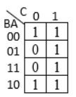

- **(A)** A + C
- **(B)** A' + C *(Correct)*
- **(C)** A + C'
- **(D)** A + CA'

> **Answer**: **B** (A' + C)

---

### Q438. 𝐴 ҧ𝐵 + 𝐶 𝐷 is the simplified version of the Boolean expression F only if there were a 'don't care' entry. What is that don't care term ? F = 𝐴𝐵𝐶𝐷+ 𝐴ҧ𝐵ത𝐶𝐷+ 𝐴ҧ𝐵

- **Marks**: 1 | **Type**: MCQ | **Page**: 13

- **(A)** AB'CD *(Correct)*
- **(B)** AB'C'D
- **(C)** A'BCD
- **(D)** A'BC'D

> **Answer**: **A** (AB'CD)

---

### Q439. There are 4 variables P, Q, R and S in Boolean function and the value of the function is 0. Find the number of cells in the K-map which will contain 0 when POS expression is used.

- **Marks**: 1 | **Type**: MCQ | **Page**: 13

- **(A)** 15
- **(B)** 1
- **(C)** 0
- **(D)** 16 *(Correct)*

> **Answer**: **D** (16)

---

### Q440. Convert the following Boolean function in product of max terms and sum of minterms: F(p,q,r,s) = (p' + q + r) (q' + r + s) (p + s')

- **Marks**: 2 | **Type**: DESCRIPTIVE | **Page**: 14

*(Descriptive question - No answer key provided in source)*

---

### Q441. Obtain the simplified Boolean expression for the following Boolean function with don't care condition and implement the simplified function with NOR gates only. F (w, x, y, z) = w'y'x'z' + w'x'yz' + x'yz'w + yzwx' + wy'z'x + wzxy' + ywxz' + wxyz d (w, x, y, z) = w'x'yz + zw'xy + y'z'wx' + y'zwx'

- **Marks**: 5 | **Type**: DESCRIPTIVE | **Page**: 14

*(Descriptive question - No answer key provided in source)*

---

### Q442. Obtain the simplified boolean expression for the following boolean function with don't care condition and implement the simplified function with two input NAND gates only. F(w,x,y,z) = w′ x z + w′ y z + x′ z′ y + w y′ x z d = w y z

- **Marks**: 5 | **Type**: DESCRIPTIVE | **Page**: 14

*(Descriptive question - No answer key provided in source)*

---

### Q443. Simplify Boolean function F (W, X, Y, Z) = Σ (0, 1, 2, 4, 5, 6, 8, 9, 10, 12,13) using K-map and implement it using NAND gates only.

- **Marks**: 3 | **Type**: DESCRIPTIVE | **Page**: 14

*(Descriptive question - No answer key provided in source)*

---

### Q444. Simplify Boolean function using the tabulation method F (A, B, C, D) = ∑m (0, 1, 2, 3, 5, 6, 8, 9, 10, 12, 13, 14, 15)

- **Marks**: 5 | **Type**: DESCRIPTIVE | **Page**: 14

*(Descriptive question - No answer key provided in source)*

---

### Q445. Express the Boolean function F (X, Y) = 1 in canonical form.

- **Marks**: 1 | **Type**: MCQ | **Page**: 14

- **(A)** x'y' + x'y + xy' + xy *(Correct)*
- **(B)** xy
- **(C)** x + y
- **(D)** X'Y' + XY + XY' + XY

> **Answer**: **A** (x'y' + x'y + xy' + xy)

---

### Q446. Given F(A, B, C, D) = ∑ m(2, 6, 8, 9, 10, 11) + ∑ d(3, 7, 14, 15) is a Boolean function, where m represents min-terms and d represents don't cares. The minimized logical function F is

- **Marks**: 1 | **Type**: DESCRIPTIVE | **Page**: 14

*(Descriptive question - No answer key provided in source)*

---

### Q447. Express the Boolean function in sum of minterms and product of max terms. F (W,X,Y,Z) = YZ+WXY+WXZ+ WXZ

- **Marks**: 3 | **Type**: DESCRIPTIVE | **Page**: 14

*(Descriptive question - No answer key provided in source)*

---

### Q448. Minimize the logic function F(A,B,C,D) = πM(1, 2, 3, 8, 9, 10, 11, 14).d (7, 15) Use Karnaugh map. Draw the logic circuit for simplified function using NOR gates only.

- **Marks**: 4 | **Type**: DESCRIPTIVE | **Page**: 14

*(Descriptive question - No answer key provided in source)*

---

### Q449. Simplify Boolean function by using the tabulation method F(A,B,C,D)=∑m(2,3,6,7,8,9,10,11,12,13,14,15)

- **Marks**: 5 | **Type**: DESCRIPTIVE | **Page**: 14

*(Descriptive question - No answer key provided in source)*

---

### Q450. F=∑ m (1,3,4,5,7,9,13) is a simplified version of the Boolean expression D+A'.B only if there were a 'don't care' entry. What is that don't care term?

- **Marks**: 1 | **Type**: MCQ | **Page**: 14

- **(A)** 6,11,15 *(Correct)*
- **(B)** 6,11,14
- **(C)** 6,10,15
- **(D)** 7,9,15

> **Answer**: **A** (6,11,15)

---

### Q451. Which Boolean function does the following k-map represent?

- **Marks**: 1 | **Type**: MCQ | **Page**: 14

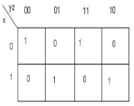

- **(A)** XNOR *(Correct)*
- **(B)** AND
- **(C)** OR
- **(D)** NAND

> **Answer**: **A** (XNOR)

---

### Q452. Implement the following functions using the don't-care conditions. F = A′B′C′ + AB′D + A′B′CD′ d = ABC + AB′D′ Also implement the simplified expression using NAND gates only.

- **Marks**: 4 | **Type**: DESCRIPTIVE | **Page**: 14

*(Descriptive question - No answer key provided in source)*

---

### Q453. Implement the following functions using the don't-care conditions. F = A′B′C′ + AB′D + A′CD′ d = ABC + AB′D′ Also implement the simplified expression using NOR gates only.

- **Marks**: 3 | **Type**: DESCRIPTIVE | **Page**: 14

*(Descriptive question - No answer key provided in source)*

---

### Q454. Given the Boolean function F in three variables R, S and T as F=R'ST'+RS'T+RST
(a) Express F in the minimum product-of-sums form.
(b) Assuming that both true and complement forms of the input variables are available, draw a circuit to implement F using the minimum number of 2 input NOR gates only

- **Marks**: 2 | **Type**: DESCRIPTIVE | **Page**: 14

*(Descriptive question - No answer key provided in source)*

---

### Q455. Simplify the following function using Tabulation method: Show all steps along with PI chart and EPI terms. F(W,X,Y,Z)=∑m( 0, 2, 3, 6, 7, 8, 9, 10, 11, 12, 13, 14, 15)

- **Marks**: 1 | **Type**: DESCRIPTIVE | **Page**: 14

*(Descriptive question - No answer key provided in source)*

---

### Q456. Simplify the following function using Tabulation method: F(W,X,Y,Z)=∑m( 0,1,2,5,6,7,8,9,10,14)

- **Marks**: 5 | **Type**: DESCRIPTIVE | **Page**: 14

*(Descriptive question - No answer key provided in source)*

---

### Q457. Express Function in Maxterms and Minterms: F(x,y,z) = ( xy + z ) ( y + xz )

- **Marks**: 3 | **Type**: DESCRIPTIVE | **Page**: 14

*(Descriptive question - No answer key provided in source)*

---

### Q458. In certain application, four inputs A, B, C, D (both true and complement forms available) are fed to logic circuit, producing an output F which operates a relay. The relay turns on when F(ABCD)=1 for the following states of the inputs (ABCD):'0000','0010' ,'0101','0110','1101' and '1110'. States '1000' and '1001' do not occur, and for the remaining states, the relay is off. Remaining states, the relay is off. Minimize F with the help of a Karnaugh map and realize it using a minimum number of 3- input NAND gates.

- **Marks**: 3 | **Type**: DESCRIPTIVE | **Page**: 14

*(Descriptive question - No answer key provided in source)*

---

## Unit-5

*Total Questions in Chapter: 79*

### Q459. A digital system consists of types of circuits _______

- **Marks**: 1 | **Type**: MCQ | **Page**: 14

- **(A)** 2 *(Correct)*
- **(B)** 3
- **(C)** 4
- **(D)** 5

> **Answer**: **A** (2)

---

### Q460. Half-adders have a major limitation in that they cannot _______

- **Marks**: 1 | **Type**: MCQ | **Page**: 14

- **(A)** Accept a carry bit from a present stage
- **(B)** Accept a carry bit from a next stage
- **(C)** Accept a carry bit from a previous stage *(Correct)*
- **(D)** Accept a carry bit from the following stages

> **Answer**: **C** (Accept a carry bit from a previous stage)

---

### Q461. If A, B and C are the inputs of a full adder then the carry is given by _______

- **Marks**: 1 | **Type**: MCQ | **Page**: 14

- **(A)** A AND B OR (A OR B) AND C
- **(B)** A AND B OR (A XOR B) AND C *(Correct)*
- **(C)** (A AND B) OR (A AND B)C
- **(D)** A XOR B XOR (A XOR B) AND C

> **Answer**: **B** (A AND B OR (A XOR B) AND C)

---

### Q462. How many minimum AND, OR and EXOR gates are required for the basic configuration of full adder?

- **Marks**: 1 | **Type**: MCQ | **Page**: 14

- **(A)** 1, 2, 2
- **(B)** 2, 1, 2 *(Correct)*
- **(C)** 3, 1, 2
- **(D)** 4, 0, 1

> **Answer**: **B** (2, 1, 2)

---

### Q463. In a combinational circuit, the output at any time depends only on the at that time. _______

- **Marks**: 1 | **Type**: MCQ | **Page**: 14

- **(A)** Voltage
- **(B)** Intermediate values
- **(C)** Input values *(Correct)*
- **(D)** Clock pulses

> **Answer**: **C** (Input values)

---

### Q464. Procedure for the design of combinational circuits are: A. From the word description of the problem, identify the inputs and outputs and draw a block diagram. B. Draw the truth table such that it completely describes the operation of the circuit for different combinations of inputs. C. Simplify the switching expression(s) for the output(s). D. Implement the simplified expression using logic gates. E. Write down the switching expression(s) for the output(s).

- **Marks**: 1 | **Type**: MCQ | **Page**: 14

- **(A)** B, C, D, E, A
- **(B)** A, D, E, B, C
- **(C)** A, B, E, C, D *(Correct)*
- **(D)** B, A, E, C, D

> **Answer**: **C** (A, B, E, C, D)

---

### Q465. Implement a combinational circuit of half adder using AOI gate.

- **Marks**: 3 | **Type**: DESCRIPTIVE | **Page**: 14

*(Descriptive question - No answer key provided in source)*

---

### Q466. Implement a combinational circuit of half adder using NAND logic gates.

- **Marks**: 3 | **Type**: DESCRIPTIVE | **Page**: 14

*(Descriptive question - No answer key provided in source)*

---

### Q467. Implement a combinational circuit of half adder using NOR logic gates.

- **Marks**: 3 | **Type**: DESCRIPTIVE | **Page**: 14

*(Descriptive question - No answer key provided in source)*

---

### Q468. Implement a combinational circuit of full adder using only 2- input NAND logic gates.

- **Marks**: 4 | **Type**: DESCRIPTIVE | **Page**: 14

*(Descriptive question - No answer key provided in source)*

---

### Q469. Implement a combinational circuit of full adder using only 2- input NOR logic gates.

- **Marks**: 4 | **Type**: DESCRIPTIVE | **Page**: 15

*(Descriptive question - No answer key provided in source)*

---

### Q470. Implement a combinational circuit of full adder using AOI gates.

- **Marks**: 3 | **Type**: DESCRIPTIVE | **Page**: 15

*(Descriptive question - No answer key provided in source)*

---

### Q471. Implement a combinational circuit of half subtractor.

- **Marks**: 3 | **Type**: DESCRIPTIVE | **Page**: 15

*(Descriptive question - No answer key provided in source)*

---

### Q472. Implement a combinational circuit of half subtractor using NAND logic gates.

- **Marks**: 3 | **Type**: DESCRIPTIVE | **Page**: 15

*(Descriptive question - No answer key provided in source)*

---

### Q473. Implement a combinational circuit of half subtractor using NOR logic gates.

- **Marks**: 3 | **Type**: DESCRIPTIVE | **Page**: 15

*(Descriptive question - No answer key provided in source)*

---

### Q474. Implement a combinational circuit of full subtractor using only 2- input NAND logic gates.

- **Marks**: 4 | **Type**: DESCRIPTIVE | **Page**: 15

*(Descriptive question - No answer key provided in source)*

---

### Q475. Implement a combinational circuit of full subtractor using only 2- input NOR logic gates.

- **Marks**: 4 | **Type**: DESCRIPTIVE | **Page**: 15

*(Descriptive question - No answer key provided in source)*

---

### Q476. Implement a combinational circuit of full subtractor using AOI gates.

- **Marks**: 3 | **Type**: DESCRIPTIVE | **Page**: 15

*(Descriptive question - No answer key provided in source)*

---

### Q477. Show how a full-adder can be converted to a full-subtractor with the addition of inverter circuit.

- **Marks**: 5 | **Type**: DESCRIPTIVE | **Page**: 15

*(Descriptive question - No answer key provided in source)*

---

### Q478. With logic circuit describe the function of: Full adder,write the simplified Boolean functions for its outputs.

- **Marks**: 5 | **Type**: DESCRIPTIVE | **Page**: 15

*(Descriptive question - No answer key provided in source)*

---

### Q479. Design the truth table of full adder and implement using minimum number of logic gates.

- **Marks**: 4 | **Type**: DESCRIPTIVE | **Page**: 15

*(Descriptive question - No answer key provided in source)*

---

### Q480. Design the truth table of full subtractor and implement using minimum number of logic gates.

- **Marks**: 4 | **Type**: DESCRIPTIVE | **Page**: 15

*(Descriptive question - No answer key provided in source)*

---

### Q481. Design a full adder circuit using two half adders and gates.

- **Marks**: 4 | **Type**: DESCRIPTIVE | **Page**: 15

*(Descriptive question - No answer key provided in source)*

---

### Q482. Differentiate between serial and parallel adders.

- **Marks**: 3 | **Type**: DESCRIPTIVE | **Page**: 15

*(Descriptive question - No answer key provided in source)*

---

### Q483. In a half-subtractor circuit with X and Y as inputs, the Borrow (M) and Difference (N = X - Y) are given by

- **Marks**: 1 | **Type**: MCQ | **Page**: 15

- **(A)** M=X⨁Y,N=XY
- **(B)** M=XY,N=X⨁Y
- **(C)** M=X'Y,N=X⨁Y
- **(D)** M=X'Y,N=(X⨁Y)'

> **Answer**: **** (M=X'Y,N=X⨁Y)

---

### Q484. A combinational logic circuit has memory characteristics that "remember" the inputs after they have been removed.

- **Marks**: 1 | **Type**: SHORT_ANSWER | **Page**: 15

> **Solution / Key**: `False`

---

### Q485. To implement the full-adder sum functions, two exclusive-OR gates can be used.

- **Marks**: 1 | **Type**: SHORT_ANSWER | **Page**: 15

> **Solution / Key**: `True`

---

### Q486. A half-adder does not have . _______

- **Marks**: 1 | **Type**: MCQ | **Page**: 15

- **(A)** carry in *(Correct)*
- **(B)** carry out
- **(C)** two inputs
- **(D)** all of the above

> **Answer**: **A** (carry in)

---

### Q487. Which of the statements below best describes the given figure?

- **Marks**: 1 | **Type**: MCQ | **Page**: 15

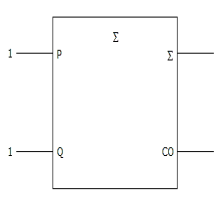

- **(A)** Half-carry adder; Sum = 0, Carry = 1 *(Correct)*
- **(B)** Half-carry adder; Sum = 1, Carry = 0
- **(C)** Full-carry adder; Sum = 1, Carry = 0
- **(D)** Full-carry adder; Sum = 1, Carry = 1

> **Answer**: **A** (Half-carry adder; Sum = 0, Carry = 1)

---

### Q488. A full-adder adds . _______

- **Marks**: 1 | **Type**: MCQ | **Page**: 15

- **(A)** two single bits and one carry bit *(Correct)*
- **(B)** two 2-bit binary numbers
- **(C)** two 4-bit binary numbers
- **(D)** two 2-bit numbers and one carry bit

> **Answer**: **A** (two single bits and one carry bit)

---

### Q489. The carry propagation delay in 4-bit full-adder circuits:

- **Marks**: 1 | **Type**: MCQ | **Page**: 15

- **(A)** is cumulative for each stage and limits the speed at which arithmetic operations are performed *(Correct)*
- **(B)** is normally not a consideration because the delays are usually in the nanosecond range
- **(C)** decreases in direct ratio to the total number of full-adder stages
- **(D)** increases in direct ratio to the total number of full-adder stages, but is not a factor in limiting the speed of arithmetic operations

> **Answer**: **A** (is cumulative for each stage and limits the speed at which arithmetic operations are performed)

---

### Q490. Two 4-bit binary numbers (1011 and 1111) are applied to a 4-bit parallel adder. The carry input is 1. What are the values for the sum and carry output?

- **Marks**: 1 | **Type**: MCQ | **Page**: 15

- **(A)** ∑4 ∑3 ∑2 ∑1=0111, C = 0 out
- **(B)** ∑4 ∑3 ∑2 ∑1 = 1111, C = 1 out
- **(C)** ∑4 ∑3 ∑2 ∑1= 1011, C = 1 out *(Correct)*
- **(D)** ∑4 ∑3 ∑2 ∑1= 1100, C = 1 out

> **Answer**: **C** (∑4 ∑3 ∑2 ∑1= 1011, C = 1 out)

---

### Q491. A full-adder has a C = 0. What are the sum 0 and the carry (C ) when A = in out 1 and B = 1?

- **Marks**: 1 | **Type**: MCQ | **Page**: 15

- **(A)** ∑= 0, C = 0 out
- **(B)** ∑ = 0, C = 1 out *(Correct)*
- **(C)** ∑= 1, C = 0 out
- **(D)** ∑= 1, C = 1 out

> **Answer**: **B** (∑ = 0, C = 1 out)

---

### Q492. An adder in which bits of the operand are added one after another

- **Marks**: 1 | **Type**: MCQ | **Page**: 15

- **(A)** Half adder
- **(B)** Half subtractor
- **(C)** Serial Adder *(Correct)*
- **(D)** parallel Adder

> **Answer**: **C** (Serial Adder)

---

### Q493. What is the major difference between half-adders and full-adders?

- **Marks**: 1 | **Type**: MCQ | **Page**: 15

- **(A)** Full-adders are made up of two half-adders
- **(B)** Full adders can handle double-digit numbers
- **(C)** Full adders have a carry input capability *(Correct)*
- **(D)** Half adders can handle only single- digit numbers

> **Answer**: **C** (Full adders have a carry input capability)

---

### Q494. A combinational circuit calculates the arithmetic sum in a parallel way. What is the name of the adder?

- **Marks**: 1 | **Type**: MCQ | **Page**: 15

- **(A)** Sequential Adder
- **(B)** Parallel Adder *(Correct)*
- **(C)** Serial Adder
- **(D)** Both 1) & 2)

> **Answer**: **B** (Parallel Adder)

---

### Q495. To implement a half adder and half subtractor ,the no. of basic(AND,OR,NOT) gates required is and respectively. _______ _______

- **Marks**: 1 | **Type**: SHORT_ANSWER | **Page**: 15

> **Solution / Key**: `6,5`

---

### Q496. A binary half-subtractor having two inputs A and B, the correct set of logical outputs D(=A minus B) and X(=borrow) are
1.The difference output D=A'B+AB'
2.The borrow output B=AB' Which of the above is/are correct?

- **Marks**: 1 | **Type**: MCQ | **Page**: 15

- **(A)** 1 Only *(Correct)*
- **(B)** 2 Only
- **(C)** none
- **(D)** Both 1 and 2

> **Answer**: **A** (1 Only)

---

### Q497. The number of full and half-adders required to add 16-bit numbers is

- **Marks**: 1 | **Type**: MCQ | **Page**: 15

- **(A)** 8half-adders, 8 full- adders
- **(B)** 1 half-adder,15 full- adders *(Correct)*
- **(C)** 16 half-adders, 0 full-adders
- **(D)** 4 half-adders, 12 full- adder

> **Answer**: **B** (1 half-adder,15 full- adders)

---

### Q498. How Serial Adder differ from Parallel Adders?

- **Marks**: 1 | **Type**: DESCRIPTIVE | **Page**: 15

*(Descriptive question - No answer key provided in source)*

---

### Q499. The half-adder can be implemented from which of the following equation?

- **Marks**: 1 | **Type**: MCQ | **Page**: 15

- **(A)** S = xy′ + x′y C = xy
- **(B)** S = (x + y) (x′ + y′) C = x y
- **(C)** S = (C + x′y′)′ C = xy
- **(D)** All of above *(Correct)*

> **Answer**: **D** (All of above)

---

### Q500. Full adder has _______

- **Marks**: 1 | **Type**: MCQ | **Page**: 15

- **(A)** 3 inputs *(Correct)*
- **(B)** 8 inputs
- **(C)** 4 inputs
- **(D)** 10 inputs

> **Answer**: **A** (3 inputs)

---

### Q501. half adder is an example of-

- **Marks**: 1 | **Type**: MCQ | **Page**: 15

- **(A)** Combinational circuit *(Correct)*
- **(B)** Sequential circuit
- **(C)** Asynchronous circuit
- **(D)** None of these

> **Answer**: **A** (Combinational circuit)

---

### Q502. How many full adders are needed to add two 4-bit numbers with a parallel adders?

- **Marks**: 1 | **Type**: MCQ | **Page**: 15

- **(A)** 2
- **(B)** 4 *(Correct)*
- **(C)** 16
- **(D)** 8

> **Answer**: **B** (4)

---

### Q503. The logic diagram shown in the figure performs the function of building block

- **Marks**: 1 | **Type**: MCQ | **Page**: 15

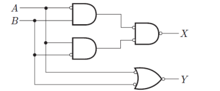

- **(A)** Half adder *(Correct)*
- **(B)** Full adder
- **(C)** Half substractor
- **(D)** Multiplier

> **Answer**: **A** (Half adder)

---

### Q504. Two binary digits are applied to input of two input Ex-or gate. The output of the logic can generate

- **Marks**: 1 | **Type**: MCQ | **Page**: 15

- **(A)** Sum output
- **(B)** Difference output
- **(C)** Either sum or difference output *(Correct)*
- **(D)** Carry output of a half adder

> **Answer**: **C** (Either sum or difference output)

---

### Q505. Two binary digits are applied to the input of two input AND gate. The output of the logic can generate

- **Marks**: 1 | **Type**: MCQ | **Page**: 15

- **(A)** Borrow out of half substractor
- **(B)** Carry out of half adder *(Correct)*
- **(C)** Sum output of half adder
- **(D)** Difference output of half adder

> **Answer**: **B** (Carry out of half adder)

---

### Q506. Number of half and full adder required to construct a sixty four bit binary adder would be

- **Marks**: 1 | **Type**: MCQ | **Page**: 15

- **(A)** One half adder and 63 full adders *(Correct)*
- **(B)** 64 full adders
- **(C)** 64 half adders
- **(D)** one full adder and 63 half adder

> **Answer**: **A** (One half adder and 63 full adders)

---

### Q507. A full substractor can be constructed from two half substractor and one

- **Marks**: 1 | **Type**: MCQ | **Page**: 15

- **(A)** Two input OR gate *(Correct)*
- **(B)** Two input AND gate
- **(C)** Two input Ex-or gate
- **(D)** Three input OR gate

> **Answer**: **A** (Two input OR gate)

---

### Q508. A full adder can be constructed from two half adder and one

- **Marks**: 1 | **Type**: MCQ | **Page**: 15

- **(A)** Two input OR gate *(Correct)*
- **(B)** Two input AND gate
- **(C)** Two input Ex-or gate
- **(D)** Three input OR gate

> **Answer**: **A** (Two input OR gate)

---

### Q509. A 4 ×1 MUX is shown in the figure below, the output Z is _______ (Where S1 is MSB and S2 is LSB)

- **Marks**: 1 | **Type**: MCQ | **Page**: 16

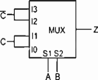

- **(A)** F(A,B,C) = A ⊕ C
- **(B)** F(A,B,C) = A⊙C
- **(C)** F(A,B,C) = (A⊙C)'
- **(D)** Both 1 and 3 *(Correct)*

> **Answer**: **D** (Both 1 and 3)

---

### Q510. A, B and Cin are the three inputs of a full adder circuit and D0, D1, ..., D7 are the inputs of 8×1 multiplexer. S2 (MSB), S1 and S0 (LSB) are the selection lines of the multiplexer. To implement the expression of sum of full adder circuit using this multiplexer, the connections of the input ports and selection lines are

- **Marks**: 1 | **Type**: MCQ | **Page**: 16

- **(A)** D0=D3=D5=D6=0,D 1=D2=D4=D7=1, S2=A,S1=B and S0=Cin *(Correct)*
- **(B)** D0=D3=D5=D6=1,D 1=D2=D4=D7=0,S2 =Cin,S1=B and S0=A
- **(C)** D0=D2=D3=D6=0,D1=D4 =D5=D7=1,S2=A,S1=B and S0=Cin
- **(D)** D0=D1=D5=D7=1, D2=D3=D4=D6=0, S2=Cin,S1=B and S0=A

> **Answer**: **A** (D0=D3=D5=D6=0,D 1=D2=D4=D7=1, S2=A,S1=B and S0=Cin)

---

### Q511. There are eight news channels are connected at 8:1 MUX with the selection line of S2, S1, S0: if Ch-1 as "AAJ TAK", Ch-2 as "NDTV", Ch-3 as "24x7", Ch-4 as "ZEE NEWS", Ch-5 as "INDIA TV", Ch-6 as "BBC NEWS", Ch-7 as "TV18", Ch-8 as "DD NEWS" and Selection lines are S2, S1, S0 as 101 so which channel would be selected:

- **Marks**: 1 | **Type**: MCQ | **Page**: 16

- **(A)** AAJ TAK
- **(B)** NDTV
- **(C)** BBC NEWS *(Correct)*
- **(D)** TV18

> **Answer**: **C** (BBC NEWS)

---

### Q512. What are the advantages of parallel adders over serial adders? Two 4-bit binary numbers (1011 and 1111) are applied to a 4-bit parallel adder. The carry input is 1. What are the values for the sum and carry output?

- **Marks**: 4 | **Type**: DESCRIPTIVE | **Page**: 16

*(Descriptive question - No answer key provided in source)*

---

### Q513. Design Truth Table and give Boolean function for Full-Subtractor circuit and implement it using half subtractor and gates.

- **Marks**: 4 | **Type**: DESCRIPTIVE | **Page**: 16

*(Descriptive question - No answer key provided in source)*

---

### Q514. Which of the following statements is/are not correct? 1) A half-adder is an arithmetic circuit that adds two binary digits. 2) A half-subtractor is an arithmetic circuit that subtracts two binary digits. 3) A full-subtractor is an arithmetic circuit that subtracts two binary digits along with borrow bit. 4) A full-adder is an arithmetic circuit that adds one binary digit and carry bit.

- **Marks**: 1 | **Type**: MCQ | **Page**: 16

- **(A)** Only 1
- **(B)** Only 4 *(Correct)*
- **(C)** Only 3
- **(D)** Only 2

> **Answer**: **B** (Only 4)

---

### Q515. Which of the following is correct Boolean function of sum and carry of Full adder, the inputs are A, B and C (internal carry)?

- **Marks**: 1 | **Type**: MCQ | **Page**: 16

- **(A)** S = A xor B xor C, Cout = AB + BC' +AC
- **(B)** S = A xnor B xor C, Cout = AB + BC +AC
- **(C)** S = A xor B xor C, Cout = AB + (A xor B).C *(Correct)*
- **(D)** S = A xor B xor C, Cout = AB + (A xor B').C

> **Answer**: **C** (S = A xor B xor C, Cout = AB + (A xor B).C)

---

### Q516. Which of the following Boolean function of difference and borrow out (Bout) of full subtractor circuit, if the inputs are A, B and C (previous borrow)?

- **Marks**: 1 | **Type**: MCQ | **Page**: 16

- **(A)** D = A XOR B XOR C, Bout = A'B + AC + B'C'
- **(B)** D = A XOR B XOR C, Bout = A'B + A'C + BC *(Correct)*
- **(C)** D = A XOR B XOR C, Bout = A'B + A'C + B'C
- **(D)** D = A XOR B XOR C, Bout = AB + AC + BC

> **Answer**: **B** (D = A XOR B XOR C, Bout = A'B + A'C + BC)

---

### Q517. The logic diagram shown in the following figure performs the function of a very common arithmetic building block. Identify the logic function.

- **Marks**: 1 | **Type**: MCQ | **Page**: 16

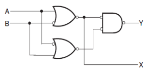

- **(A)** Half subtractor *(Correct)*
- **(B)** Full adder
- **(C)** Full subtractor
- **(D)** Half adder

> **Answer**: **A** (Half subtractor)

---

### Q518. In BCD addition, 0110 is required to be added to the sum for getting the correct result, if -

- **Marks**: 1 | **Type**: MCQ | **Page**: 16

- **(A)** The sum of two BCD numbers is not a valid BCD number
- **(B)** The sum of two BCD number is greater than (1010)BCD only
- **(C)** a carry is produced
- **(D)** Both A and C *(Correct)*

> **Answer**: **D** (Both A and C)

---

### Q519. Design the digital circuit that adds (8) with (7) in parallel and BCD BCD produces a sum digit also in BCD format. Show the appropriate circuit diagram and steps that describe the BCD addition process.

- **Marks**: 4 | **Type**: DESCRIPTIVE | **Page**: 16

*(Descriptive question - No answer key provided in source)*

---

### Q520. Design Binary Parallel Adder for addition of two binary numbers A= 1010 and B= 1110

- **Marks**: 2 | **Type**: DESCRIPTIVE | **Page**: 16

*(Descriptive question - No answer key provided in source)*

---

### Q521. Design 4-Bit BCD adder which perform BCD addition of two decimal number 5 and 7.

- **Marks**: 3 | **Type**: DESCRIPTIVE | **Page**: 16

*(Descriptive question - No answer key provided in source)*

---

### Q522. Design Logic diagram of Full adder and Full Subtractor with the help of truth table and logical equation.

- **Marks**: 4 | **Type**: DESCRIPTIVE | **Page**: 16

*(Descriptive question - No answer key provided in source)*

---

### Q523. How many full adders are needed to add 4-bit numbers A and B with a Serial adder?

- **Marks**: 1 | **Type**: MCQ | **Page**: 16

- **(A)** 1 *(Correct)*
- **(B)** 8
- **(C)** 16
- **(D)** 4

> **Answer**: **A** (1)

---

### Q524. which of the following statement/s are true , I) In combinational circuits, memory are used for store the previous input so output of combinational circuits is depends on present as well as previous inputs. II) for n bit additions of binary number, number of full adder required for these is (n-1)n III) In full adder & full subtractor , there is similarity of sum bit (s) in case of full adder & borrow bit (bin) in case of full subtractor. IV) In output of BCD adder has range for sum output in 00000 to 10001.

- **Marks**: 1 | **Type**: MCQ | **Page**: 16

- **(A)** a) i, ii, iii, iv
- **(B)** b) i, ii, iii
- **(C)** c)i, iii, iv
- **(D)** d) none of the above *(Correct)*

> **Answer**: **D** (d) none of the above)

---

### Q525. Illustrate the adder circuit which adds two 4 bit numbers which are (3)BCD & (9)BCD through BCD addition & obtain the answer in BCD form.

- **Marks**: 5 | **Type**: DESCRIPTIVE | **Page**: 16

*(Descriptive question - No answer key provided in source)*

---

### Q526. Illustrate the Addition of (15)10 & (7)10 By using binary adders of which requires an n-full adder for n-bit addition. (with logic diagram)

- **Marks**: 3 | **Type**: DESCRIPTIVE | **Page**: 16

*(Descriptive question - No answer key provided in source)*

---

### Q527. Illustrate the combinational circuits that subtracts one bit from another one bit, when already there is a borrow from this column for subtraction in preceding column, and outputs the difference bit and borrow bit along with truth table, Boolean function & logic circuit diagram.

- **Marks**: 3 | **Type**: DESCRIPTIVE | **Page**: 16

*(Descriptive question - No answer key provided in source)*

---

### Q528. Which statement/s is/are true? 1) A half adder is also known as XNOR gate because XNOR is applied to both inputs to produce the sum. 2) Half adder can add only two bits (A and B) and has nothing to do with the carry. 3) If the input to a half adder has a carry, then it will neglect it and adds only the A and B bits that means the binary addition process is not complete and that's way it is called a half adder. 4) A half adder is a two input and two output combinational circuit.

- **Marks**: 1 | **Type**: MCQ | **Page**: 16

- **(A)** both 1 and 2
- **(B)** Three 2, 3 and 4 *(Correct)*
- **(C)** Three 1,3 and 4
- **(D)** All of the above

> **Answer**: **B** (Three 2, 3 and 4)

---

### Q529. Design the digital circuit that adds (8)BCD digit with (5)BCD digit in parallel and produces a sum digit also in BCD.

- **Marks**: 4 | **Type**: DESCRIPTIVE | **Page**: 16

*(Descriptive question - No answer key provided in source)*

---

### Q530. Design a 4-bit parallel adder to find the sum and output carry for the addition of the following two 4-bit numbers which are A0A1A2A3 = 1011 and B0B1B2B3 = 1111 and the input carry (C0) is 0. List bitwise sum and output carry for the 4-bit parallel adder.

- **Marks**: 2 | **Type**: DESCRIPTIVE | **Page**: 17

*(Descriptive question - No answer key provided in source)*

---

### Q531. Design the digital circuit that adds (7)BCD with (9)BCD in parallel and produces a sum digit also in BCD format. Show the appropriate circuit diagram and steps that describe the BCD addition process.

- **Marks**: 4 | **Type**: DESCRIPTIVE | **Page**: 17

*(Descriptive question - No answer key provided in source)*

---

### Q532. Design a combinational circuit that generates BCD sum of (3)BCD and (9)BCD number with necessary equations and truth table.

- **Marks**: 3 | **Type**: DESCRIPTIVE | **Page**: 17

*(Descriptive question - No answer key provided in source)*

---

### Q533. Design a combinational circuit that add (9) and (8) number with BCD BCD necessary equations.

- **Marks**: 4 | **Type**: DESCRIPTIVE | **Page**: 17

*(Descriptive question - No answer key provided in source)*

---

### Q534. Implement F (P,Q,R) =PR′+P′QR′+Q′R+P′ by using 3x8 line decoder.

- **Marks**: 2 | **Type**: DESCRIPTIVE | **Page**: 17

*(Descriptive question - No answer key provided in source)*

---

### Q535. Illustrate the comparison circuit of two numbers A & B having the bit value is 3 bits as A2A1A0 and B2B1B0, using suitable comparator with block diagram and logic diagram.

- **Marks**: 3 | **Type**: DESCRIPTIVE | **Page**: 17

*(Descriptive question - No answer key provided in source)*

---

### Q536. п Implement F (W, X, Y, Z) = M (1,4,7,10,12) using 8x1 MUX having Y as input to MUX and W, X and Z as selection lines of MUX.

- **Marks**: 3 | **Type**: DESCRIPTIVE | **Page**: 17

*(Descriptive question - No answer key provided in source)*

---

### Q537. Prove that a full adder can be obtained by two half adder and an OR gate.

- **Marks**: 3 | **Type**: DESCRIPTIVE | **Page**: 17

*(Descriptive question - No answer key provided in source)*

---

## Unit-6

*Total Questions in Chapter: 99*

### Q538. _______ is the example of multiplexer.

- **Marks**: 1 | **Type**: MCQ | **Page**: 17

- **(A)** 2 x 1
- **(B)** 1 x 2
- **(C)** 4 x 1
- **(D)** both (a) & (c) *(Correct)*

> **Answer**: **D** (both (a) & (c))

---

### Q539. is used for connecting two or more sources to a single destination _______ among computer units.

- **Marks**: 1 | **Type**: MCQ | **Page**: 17

- **(A)** De-multiplexer
- **(B)** Multiplexer *(Correct)*
- **(C)** encoder
- **(D)** decoder

> **Answer**: **B** (Multiplexer)

---

### Q540. A multiplxer is also called as _______

- **Marks**: 1 | **Type**: MCQ | **Page**: 17

- **(A)** data collector
- **(B)** data distributor
- **(C)** data selector *(Correct)*
- **(D)** data controller

> **Answer**: **C** (data selector)

---

### Q541. 2 to 1 line multiplexer can be realized using _______

- **Marks**: 1 | **Type**: MCQ | **Page**: 17

- **(A)** 1 AND, 2 OR & 1 NOT gates
- **(B)** 2 AND, 2 OR & 1 NOT gates
- **(C)** 2 AND, 1 OR & 2 NOT gates
- **(D)** 2 AND, 1 OR & 1 NOT gates *(Correct)*

> **Answer**: **D** (2 AND, 1 OR & 1 NOT gates)

---

### Q542. is the major functioning responsibility of the multiplexing _______ combinational circuit?

- **Marks**: 1 | **Type**: MCQ | **Page**: 17

- **(A)** Decoding the binary information
- **(B)** Generation of all minterms in an output function with OR-gate
- **(C)** Generation of selected path between multiple sources and a single destination *(Correct)*
- **(D)** Encoding of binary information

> **Answer**: **C** (Generation of selected path between multiple sources and a single destination)

---

### Q543. logic inputs should be given to the input lines Io, I1, I2 and I3, if _______ the MUX is to behave as two input XNOR gate?

- **Marks**: 1 | **Type**: MCQ | **Page**: 17

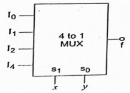

- **(A)** 110
- **(B)** 1001 *(Correct)*
- **(C)** 1010
- **(D)** 1111

> **Answer**: **B** (1001)

---

### Q544. _______ is the function of an enable input on a multiplexer chip?

- **Marks**: 1 | **Type**: MCQ | **Page**: 17

- **(A)** To apply Vcc
- **(B)** To connect ground
- **(C)** To active the entire chip *(Correct)*
- **(D)** To active one half of the chip

> **Answer**: **C** (To active the entire chip)

---

### Q545. A 4 ×1 MUX is used to implement a 3 - input boolean function as shown in figure. The boolean function F(A,B,C) implement is _______

- **Marks**: 1 | **Type**: MCQ | **Page**: 17

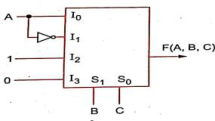

- **(A)** F(A,B,C) = Σ(1,2,4,6) *(Correct)*
- **(B)** F(A,B,C) = Σ(1,2,6)
- **(C)** F(A,B,C) = Σ(2,4,5,6)
- **(D)** F(A,B,C) = Σ(1,5,6)

> **Answer**: **A** (F(A,B,C) = Σ(1,2,4,6))

---

### Q546. In a multiplexer, the selection of a particular input line is controlled by _______

- **Marks**: 1 | **Type**: MCQ | **Page**: 17

- **(A)** Data controller
- **(B)** Selection lines *(Correct)*
- **(C)** Logic gates
- **(D)** Both data controller and selected lines

> **Answer**: **B** (Selection lines)

---

### Q547. select lines would be required for an 8-line-to-1-line multiplexer. _______

- **Marks**: 1 | **Type**: MCQ | **Page**: 17

- **(A)** 2
- **(B)** 4
- **(C)** 8
- **(D)** 3 *(Correct)*

> **Answer**: **D** (3)

---

### Q548. NOT gates are required for the construction of a 4-to-1 _______ multiplexer.

- **Marks**: 1 | **Type**: MCQ | **Page**: 17

- **(A)** 2 *(Correct)*
- **(B)** 5
- **(C)** 3
- **(D)** 4

> **Answer**: **A** (2)

---

### Q549. The output of the 4 to 1 MUX shown in figure is:

- **Marks**: 1 | **Type**: MCQ | **Page**: 17

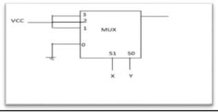

- **(A)** x' + y'
- **(B)** x + y *(Correct)*
- **(C)** xy + x'
- **(D)** (xy)' + x

> **Answer**: **B** (x + y)

---

### Q550. _______ is the output of design.

- **Marks**: 1 | **Type**: MCQ | **Page**: 17

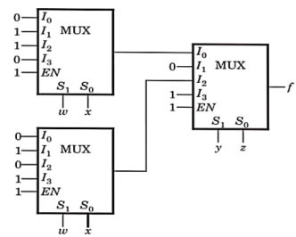

- **(A)** w'xy'z' + wx'y'z' + xy + yz *(Correct)*
- **(B)** wx'yz + w'xyz + x'y' + y'z'
- **(C)** w'xy'z' + w'x'y'z + yz' + zx
- **(D)** w'xyz + wxyz' + gz + z'x'

> **Answer**: **A** (w'xy'z' + wx'y'z' + xy + yz)

---

### Q551. Design and elaborate 2 x 1 multiplexer.

- **Marks**: 4 | **Type**: DESCRIPTIVE | **Page**: 17

*(Descriptive question - No answer key provided in source)*

---

### Q552. Implement and elaborate 4 x 1 multiplexer.

- **Marks**: 4 | **Type**: DESCRIPTIVE | **Page**: 17

*(Descriptive question - No answer key provided in source)*

---

### Q553. Construct and elaborate 8 x 1 multiplexer.

- **Marks**: 4 | **Type**: DESCRIPTIVE | **Page**: 17

*(Descriptive question - No answer key provided in source)*

---

### Q554. Realize the following function of three variables with 8:1 MUX. F ( A, B, C ) = Σ ( 0, 1, 3, 4, 7 )

- **Marks**: 4 | **Type**: DESCRIPTIVE | **Page**: 17

*(Descriptive question - No answer key provided in source)*

---

### Q555. Obtain an 8 to 1 multiplexer with a dual 4 to 1 line multiplexers having separate enable inputs but common selection lines. Use a block diagram construction.

- **Marks**: 5 | **Type**: DESCRIPTIVE | **Page**: 17

*(Descriptive question - No answer key provided in source)*

---

### Q556. Implement the following function with a multiplexer: F ( A, B, C, D ) = Σ ( 0, 1, 3, 4, 8, 9, 15 )

- **Marks**: 4 | **Type**: DESCRIPTIVE | **Page**: 17

*(Descriptive question - No answer key provided in source)*

---

### Q557. _______ is the example of Demultiplexer.

- **Marks**: 1 | **Type**: MCQ | **Page**: 17

- **(A)** 2 x 1
- **(B)** 1 x 2 *(Correct)*
- **(C)** 4 x 1
- **(D)** both (a) & (c)

> **Answer**: **B** (1 x 2)

---

### Q558. How many selector lines required in a single input n- output demultiplexer ?

- **Marks**: 1 | **Type**: MCQ | **Page**: 17

- **(A)** 2
- **(B)** n
- **(C)** 2^n
- **(D)** log n(base 2) *(Correct)*

> **Answer**: **D** (log n(base 2))

---

### Q559. The word demultiplex means _______

- **Marks**: 1 | **Type**: MCQ | **Page**: 17

- **(A)** One into many
- **(B)** Many into one
- **(C)** Distributor
- **(D)** One into many as well as Distributor *(Correct)*

> **Answer**: **D** (One into many as well as Distributor)

---

### Q560. In 1-to-4 demultiplexer, select lines are required _______

- **Marks**: 1 | **Type**: MCQ | **Page**: 17

- **(A)** 2 *(Correct)*
- **(B)** 3
- **(C)** 4
- **(D)** 5

> **Answer**: **A** (2)

---

### Q561. Most demultiplexers facilitate type of conversion _______

- **Marks**: 1 | **Type**: MCQ | **Page**: 17

- **(A)** Decimal-to- hexadecimal
- **(B)** Single input, multiple outputs *(Correct)*
- **(C)** AC to DC
- **(D)** Odd parity to even parity

> **Answer**: **B** (Single input, multiple outputs)

---

### Q562. Design and elaborate 1 x 2 demultiplexer.

- **Marks**: 4 | **Type**: DESCRIPTIVE | **Page**: 17

*(Descriptive question - No answer key provided in source)*

---

### Q563. Implement and elaborate 1 x 4 demultiplexer.

- **Marks**: 4 | **Type**: DESCRIPTIVE | **Page**: 17

*(Descriptive question - No answer key provided in source)*

---

### Q564. Construct and elaborate 1 x 8 demultiplexer.

- **Marks**: 4 | **Type**: DESCRIPTIVE | **Page**: 17

*(Descriptive question - No answer key provided in source)*

---

### Q565. converts binary coded information to unique outputs such as _______ decimal, octal digitals etc.

- **Marks**: 1 | **Type**: MCQ | **Page**: 18

- **(A)** decoder *(Correct)*
- **(B)** demultiplexing
- **(C)** multiplexing
- **(D)** encoder

> **Answer**: **A** (decoder)

---

### Q566. In a decoder, if the input lines are 4 then number of maximum _______ output lines .

- **Marks**: 1 | **Type**: MCQ | **Page**: 18

- **(A)** 2
- **(B)** 16 *(Correct)*
- **(C)** 4
- **(D)** 8

> **Answer**: **B** (16)

---

### Q567. _______ can be represented for decoder.

- **Marks**: 1 | **Type**: MCQ | **Page**: 18

- **(A)** Sequential circuit
- **(B)** Combinational circuit *(Correct)*
- **(C)** Logical circuit
- **(D)** None of the mentioned

> **Answer**: **B** (Combinational circuit)

---

### Q568. BCD to seven segment conversion is a _______

- **Marks**: 1 | **Type**: MCQ | **Page**: 18

- **(A)** Decoding process *(Correct)*
- **(B)** Encoding process
- **(C)** Comparing process
- **(D)** None of these

> **Answer**: **A** (Decoding process)

---

### Q569. With which decoder it is possible to obtain many code convertions?

- **Marks**: 1 | **Type**: MCQ | **Page**: 18

- **(A)** 2 line to 4 line
- **(B)** 3 to 8 line
- **(C)** not possible with any decoder
- **(D)** 4 to 16 line *(Correct)*

> **Answer**: **D** (4 to 16 line)

---

### Q570. A device which converts BCD to seven segment is called as . _______

- **Marks**: 1 | **Type**: MCQ | **Page**: 18

- **(A)** multiplexer
- **(B)** encoder
- **(C)** decoder *(Correct)*
- **(D)** inverter

> **Answer**: **C** (decoder)

---

### Q571. For design 3 to 8 decoder 2 to 4 decoder is required. _______

- **Marks**: 1 | **Type**: MCQ | **Page**: 18

- **(A)** 3
- **(B)** 5
- **(C)** 4
- **(D)** 2 *(Correct)*

> **Answer**: **D** (2)

---

### Q572. When the outputs either don't change or they are invalid in _______ SR latch.

- **Marks**: 1 | **Type**: MCQ | **Page**: 18

- **(A)** S=R=0
- **(B)** S=R=1
- **(C)** Both A & B *(Correct)*
- **(D)** S=0, R=1

> **Answer**: **C** (Both A & B)

---

### Q573. Decoder is constructed from . _______

- **Marks**: 1 | **Type**: MCQ | **Page**: 18

- **(A)** Inverters
- **(B)** AND gates
- **(C)** Inverters and AND gates *(Correct)*
- **(D)** None of the mentioned

> **Answer**: **C** (Inverters and AND gates)

---

### Q574. Design and elaborate 3 to 8 line decoder.

- **Marks**: 5 | **Type**: DESCRIPTIVE | **Page**: 18

*(Descriptive question - No answer key provided in source)*

---

### Q575. Implement half adder using 2 × 4 line decoder.

- **Marks**: 2 | **Type**: DESCRIPTIVE | **Page**: 18

*(Descriptive question - No answer key provided in source)*

---

### Q576. Implement full adder circuit using 3 × 8 line decoder

- **Marks**: 4 | **Type**: DESCRIPTIVE | **Page**: 18

*(Descriptive question - No answer key provided in source)*

---

### Q577. Design and elaborate 2 to 4 line decoder.

- **Marks**: 5 | **Type**: DESCRIPTIVE | **Page**: 18

*(Descriptive question - No answer key provided in source)*

---

### Q578. Consider the logic circuit given below. The minimized expression for F is _______

- **Marks**: 1 | **Type**: MCQ | **Page**: 18

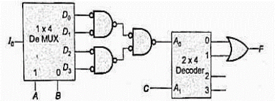

- **(A)** C' *(Correct)*
- **(B)** Io
- **(C)** C
- **(D)** Io'

> **Answer**: **A** (C')

---

### Q579. Implement A + B'C' by using 3 × 8 line decoder.

- **Marks**: 3 | **Type**: DESCRIPTIVE | **Page**: 18

*(Descriptive question - No answer key provided in source)*

---

### Q580. Construct binary to octal decoder and justify with block diagram.

- **Marks**: 4 | **Type**: DESCRIPTIVE | **Page**: 18

*(Descriptive question - No answer key provided in source)*

---

### Q581. For 8-bit input encoder combinations are possible _______

- **Marks**: 1 | **Type**: MCQ | **Page**: 18

- **(A)** 8
- **(B)** 2^8 *(Correct)*
- **(C)** 4
- **(D)** 2^4

> **Answer**: **B** (2^8)

---

### Q582. Design Octal to Binary encoder.

- **Marks**: 4 | **Type**: DESCRIPTIVE | **Page**: 18

*(Descriptive question - No answer key provided in source)*

---

### Q583. Design 4 × 2 encoder logic diagram with truth table.

- **Marks**: 5 | **Type**: DESCRIPTIVE | **Page**: 18

*(Descriptive question - No answer key provided in source)*

---

### Q584. Implement 8 × 3 encoder logic circuit along with truth table.

- **Marks**: 5 | **Type**: DESCRIPTIVE | **Page**: 18

*(Descriptive question - No answer key provided in source)*

---

### Q585. _______ is the 4 bit gray code of binary number 1010 .

- **Marks**: 1 | **Type**: MCQ | **Page**: 18

- **(A)** 1110
- **(B)** 1111 *(Correct)*
- **(C)** 1101
- **(D)** 1011

> **Answer**: **B** (1111)

---

### Q586. _______ is the binary number of 1110 gray code.

- **Marks**: 1 | **Type**: MCQ | **Page**: 18

- **(A)** 1011 *(Correct)*
- **(B)** 1101
- **(C)** 1010
- **(D)** 110

> **Answer**: **A** (1011)

---

### Q587. Design and implement a 4 bit binary to gray code converter

- **Marks**: 5 | **Type**: DESCRIPTIVE | **Page**: 18

*(Descriptive question - No answer key provided in source)*

---

### Q588. Design and implement a 4 bit gray to binary code converter

- **Marks**: 5 | **Type**: DESCRIPTIVE | **Page**: 18

*(Descriptive question - No answer key provided in source)*

---

### Q589. Design and implement a BCD to seven segment code converter

- **Marks**: 4 | **Type**: DESCRIPTIVE | **Page**: 18

*(Descriptive question - No answer key provided in source)*

---

### Q590. If A & B is 1 and 0 respectively then will be output. _______

- **Marks**: 1 | **Type**: MCQ | **Page**: 18

- **(A)** A = B
- **(B)** A > B *(Correct)*
- **(C)** A < B
- **(D)** A'B

> **Answer**: **B** (A > B)

---

### Q591. gate is basic comparator. _______

- **Marks**: 1 | **Type**: MCQ | **Page**: 18

- **(A)** NOR
- **(B)** NAND
- **(C)** XNOR *(Correct)*
- **(D)** NOT

> **Answer**: **C** (XNOR)

---

### Q592. Two inputs are 𝐴 𝐴 𝐴 𝐴 and 𝐵 𝐵 𝐵 𝐵 gives 4-bit equality 3 2 1 0 3 2 1 0 condition then will be implementation. _______

- **Marks**: 1 | **Type**: MCQ | **Page**: 18

- **(A)** A . B
- **(B)** A ⊙ B *(Correct)*
- **(C)** A + B
- **(D)** A > B

> **Answer**: **B** (A ⊙ B)

---

### Q593. When in comparator A & B is coincide then is the output. _______

- **Marks**: 1 | **Type**: MCQ | **Page**: 18

- **(A)** A > B
- **(B)** A < B
- **(C)** A = B *(Correct)*
- **(D)** A.B

> **Answer**: **C** (A = B)

---

### Q594. Implement 1- bit magnitude comparator with logic diagram.

- **Marks**: 4 | **Type**: DESCRIPTIVE | **Page**: 18

*(Descriptive question - No answer key provided in source)*

---

### Q595. Design 2- bit comparator with logic diagram.

- **Marks**: 5 | **Type**: DESCRIPTIVE | **Page**: 18

*(Descriptive question - No answer key provided in source)*

---

### Q596. number of x-or gates used in 3 bit even parity generator. _______

- **Marks**: 1 | **Type**: MCQ | **Page**: 18

- **(A)** 3
- **(B)** 4
- **(C)** 5
- **(D)** 2 *(Correct)*

> **Answer**: **D** (2)

---

### Q597. Design an SOP circuit that will generate an odd parity bit for 3-bit input.

- **Marks**: 5 | **Type**: DESCRIPTIVE | **Page**: 18

*(Descriptive question - No answer key provided in source)*

---

### Q598. Implement logic circuit for the 3-bit even parity generator along with k-map.

- **Marks**: 5 | **Type**: DESCRIPTIVE | **Page**: 18

*(Descriptive question - No answer key provided in source)*

---

### Q599. Design for P = Σm(0, 3, 5, 6) parity generator with logic diagram.

- **Marks**: 5 | **Type**: DESCRIPTIVE | **Page**: 18

*(Descriptive question - No answer key provided in source)*

---

### Q600. variables required for 4 bit even parity checker. _______

- **Marks**: 1 | **Type**: MCQ | **Page**: 18

- **(A)** 1
- **(B)** 2
- **(C)** 3
- **(D)** 4 *(Correct)*

> **Answer**: **D** (4)

---

### Q601. times 1's possible in 4-bit even parity checker. _______

- **Marks**: 1 | **Type**: MCQ | **Page**: 18

- **(A)** 8 *(Correct)*
- **(B)** 7
- **(C)** 6
- **(D)** 9

> **Answer**: **A** (8)

---

### Q602. For error detection and correction codes , functions are very _______ useful in the system.

- **Marks**: 1 | **Type**: MCQ | **Page**: 18

- **(A)** NAND
- **(B)** NOR
- **(C)** EX-OR *(Correct)*
- **(D)** OR

> **Answer**: **C** (EX-OR)

---

### Q603. number of x-or gates required in 4 bit even parity checker. _______

- **Marks**: 1 | **Type**: MCQ | **Page**: 18

- **(A)** 2
- **(B)** 3 *(Correct)*
- **(C)** 4
- **(D)** 5

> **Answer**: **B** (3)

---

### Q604. Design k- map for 4- bit odd parity checker.

- **Marks**: 4 | **Type**: DESCRIPTIVE | **Page**: 18

*(Descriptive question - No answer key provided in source)*

---

### Q605. Design SOP expression of P = Σm (0, 3, 5, 6, 9, 10, 12, 15) parity checker with k-map and logic diagram.

- **Marks**: 6 | **Type**: DESCRIPTIVE | **Page**: 18

*(Descriptive question - No answer key provided in source)*

---

### Q606. Design a combinational circuit and evaluate expression for binary to gray code converter for given binary input B3B2B1B0 and gray output G3G2G1G0.

- **Marks**: 4 | **Type**: DESCRIPTIVE | **Page**: 18

*(Descriptive question - No answer key provided in source)*

---

### Q607. Design full subtractor logic circuit using 3x8 decoder and OR gates. Use X, Y and Z as input variables and D & B as output variables

- **Marks**: 3 | **Type**: DESCRIPTIVE | **Page**: 18

*(Descriptive question - No answer key provided in source)*

---

### Q608. Which logic gate is generated for multiplexer inputs B' (MSB) and 1 (LSB) having selection line A?

- **Marks**: 1 | **Type**: MCQ | **Page**: 18

- **(A)** NAND *(Correct)*
- **(B)** OR
- **(C)** NOR
- **(D)** XNOR

> **Answer**: **A** (NAND)

---

### Q609. How many 2x1 multiplexers are required for implementing 16x1 multiplexer?

- **Marks**: 1 | **Type**: MCQ | **Page**: 18

- **(A)** 12
- **(B)** 11
- **(C)** 15 *(Correct)*
- **(D)** 16

> **Answer**: **C** (15)

---

### Q610. Find F for given circuit. D0 D1 X0 D2 F 3 to 8 D3 X1 Decoder D4 X2 D5 D6 D7

- **Marks**: 1 | **Type**: DESCRIPTIVE | **Page**: 18

*(Descriptive question - No answer key provided in source)*

---

### Q611. If the number of n generated output lines is equal to 2^m in demultiplexer then it requires selection lines. _______

- **Marks**: 1 | **Type**: DESCRIPTIVE | **Page**: 18

*(Descriptive question - No answer key provided in source)*

---

### Q612. In the circuit shown, W and Y are MSB's of select inputs. The output function F is given by -

- **Marks**: 1 | **Type**: DESCRIPTIVE | **Page**: 18

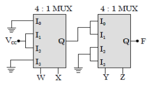

*(Descriptive question - No answer key provided in source)*

---

### Q613. Which of the above statement/s is/are correct?
1. A 8-to-3 line decoder is also called as binary to octal decoder.
2. A DEMUX circuit is also known as data selector circuit.
3. A 8-to-1 MUX routes the desired data input to the output is controlled by 2 select lines.
4. For an n:1 multiplexer the number of select lines are given by log ⁡2 n

- **Marks**: 1 | **Type**: MCQ | **Page**: 19

- **(A)** Both 1 and 2
- **(B)** Both 1 and 4
- **(C)** only 3
- **(D)** None of the given *(Correct)*

> **Answer**: **D** (None of the given)

---

### Q614. Design two input NOR gate and XNOR gate using 2-to-1 line Multiplexer.

- **Marks**: 2 | **Type**: DESCRIPTIVE | **Page**: 19

*(Descriptive question - No answer key provided in source)*

---

### Q615. Implement the function F(A,B,C,D) = A'B+CD'+AC' using MUX with 3 select lines. Use B, C, and D as select lines.

- **Marks**: 3 | **Type**: DESCRIPTIVE | **Page**: 19

*(Descriptive question - No answer key provided in source)*

---

### Q616. The Combinational Logic Circuit with the function of P (A, B, C) = Σm(1, 2, 4, 7) is parity generator with expression _______ _______

- **Marks**: 1 | **Type**: MCQ | **Page**: 19

- **(A)** Even Parity, A XOR B XOR C *(Correct)*
- **(B)** Odd Parity, A XOR B XOR C
- **(C)** Even Parity, A XNOR B XOR C
- **(D)** Odd Parity, A XOR B XNOR C

> **Answer**: **A** (Even Parity, A XOR B XOR C)

---

### Q617. Design a Combination Logic Circuit which accepts 3-Bit gray number and provide its binary equivalent as output.

- **Marks**: 3 | **Type**: DESCRIPTIVE | **Page**: 19

*(Descriptive question - No answer key provided in source)*

---

### Q618. Construct Binary to Octal Decoder along with truth-table and equation. Also Implement Full adder using decoder.

- **Marks**: 3 | **Type**: DESCRIPTIVE | **Page**: 19

*(Descriptive question - No answer key provided in source)*

---

### Q619. Design a combinational logic circuit that compare single bit binary numbers A and B to check if they are equal, greater or less.

- **Marks**: 3 | **Type**: DESCRIPTIVE | **Page**: 19

*(Descriptive question - No answer key provided in source)*

---

### Q620. A MUX network is shown in fig. What is the value of output Z1 = ?

- **Marks**: 1 | **Type**: DESCRIPTIVE | **Page**: 19

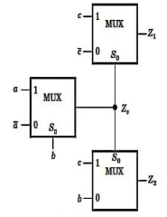

*(Descriptive question - No answer key provided in source)*

---

### Q621. A logic circuit of 2 x 4 decoder shown in figure , output of decoder are as follow : D0 = A'0 A'1 , D1 = A'0 A1, D2 = A0 A'1 , D3= A0 A1. Then value of f(x,y,z) =…………

- **Marks**: 1 | **Type**: MCQ | **Page**: 19

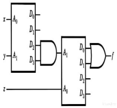

- **(A)** a) 0
- **(B)** b) z
- **(C)** c) z' *(Correct)*
- **(D)** d)1

> **Answer**: **C** (c) z')

---

### Q622. The output Y of a 2-bit comparator is logic 1 whenever the 2- bit input A is greater than the 2-bit input B. The number of combination for which the output is logic is 1 is __

- **Marks**: 1 | **Type**: MCQ | **Page**: 19

- **(A)** a) 4
- **(B)** b) 6 *(Correct)*
- **(C)** c) 8
- **(D)** d)10

> **Answer**: **B** (b) 6)

---

### Q623. During the design of BCD to 7 segment decoder (or converter) , what value is initialized to display 9 ? (options are in decimal equivalent of outputs of decoder)

- **Marks**: 1 | **Type**: MCQ | **Page**: 19

- **(A)** a) 126
- **(B)** b) 123 *(Correct)*
- **(C)** c)127
- **(D)** d)115

> **Answer**: **B** (b) 123)

---

### Q624. Design NAND logic gate & NOR logic gate using 2x1 multiplexer.

- **Marks**: 3 | **Type**: DESCRIPTIVE | **Page**: 19

*(Descriptive question - No answer key provided in source)*

---

### Q625. The logic function F(A,B,C,D) =AC+ ABD + ACD is to be realised using 8x1 mux using the variable B,C,D as control input.

- **Marks**: 3 | **Type**: DESCRIPTIVE | **Page**: 19

*(Descriptive question - No answer key provided in source)*

---

### Q626. Illustrate the comparison circuit of two numbers A & B having the bit value is 1 nibble to each numbers, using suitable comparator with block diagram and logic diagram.

- **Marks**: 5 | **Type**: DESCRIPTIVE | **Page**: 19

*(Descriptive question - No answer key provided in source)*

---

### Q627. The Boolean function realized by the logic circuit shown is

- **Marks**: 1 | **Type**: MCQ | **Page**: 19

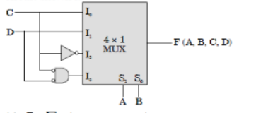

- **(A)** F=∑m(2,3,5,7,8,9,12) *(Correct)*
- **(B)** F=∑m(2,3,4,,5,7,8,9, 12)
- **(C)** F=∑m(2,3,5,8,9,12)
- **(D)** F=∑m(2,3,5,7,8,9,11)

> **Answer**: **A** (F=∑m(2,3,5,7,8,9,12))

---

### Q628. Find F for given circuit.

- **Marks**: 1 | **Type**: MCQ | **Page**: 19

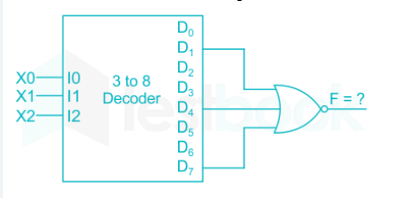

- **(A)** F=∑m(1,4,7)
- **(B)** F=∑m(1,2,4,7)
- **(C)** F=∑m(1,2,4,5,6)
- **(D)** F=∑m(0,2,3,5,6) *(Correct)*

> **Answer**: **D** (F=∑m(0,2,3,5,6))

---

### Q629. Identify that this K-Map belongs to which digital circuit?

- **Marks**: 1 | **Type**: MCQ | **Page**: 19

- **(A)** Odd parity generator
- **(B)** Odd parity checker
- **(C)** Even parity checker *(Correct)*
- **(D)** Even parity generator

> **Answer**: **C** (Even parity checker)

---

### Q630. Design a combinational circuit with three inputs x,y, and z and three outputs A,B, and C. when the binary input is 0,1,2 or 3, the binary output is one greater than the input. When the binary input is 4,5,6 or 7, the binary output is one less than the input.

- **Marks**: 4 | **Type**: DESCRIPTIVE | **Page**: 19

*(Descriptive question - No answer key provided in source)*

---

### Q631. Implement the function F(W, X, Y, Z) =WX + WYZ + XYZ using MUX with 3 select lines. Use W, Y, and Z as select lines and X as a Data input.

- **Marks**: 4 | **Type**: DESCRIPTIVE | **Page**: 19

*(Descriptive question - No answer key provided in source)*

---

### Q632. Design a combinational logic circuit which converts 4-bit Gray input (G3G2G1G0) to binary output (B3B2B1B0) with necessary equations.

- **Marks**: 4 | **Type**: DESCRIPTIVE | **Page**: 20

*(Descriptive question - No answer key provided in source)*

---

### Q633. Design a full subtractor circuit using 3*8 decoder with its diagram.

- **Marks**: 3 | **Type**: DESCRIPTIVE | **Page**: 20

*(Descriptive question - No answer key provided in source)*

---

### Q634. A magnitude comparator is a digital comparator which has _______ output terminals.

- **Marks**: 1 | **Type**: MCQ | **Page**: 20

- **(A)** 1
- **(B)** 2
- **(C)** 3 *(Correct)*
- **(D)** 4

> **Answer**: **C** (3)

---

### Q635. A logic circuit takes 4-BCD inputs {A, B, C and D) to give an output F. Output F is '1' if the input is an invalid BCD-code. The minimized Boolean equation is

- **Marks**: 1 | **Type**: MCQ | **Page**: 20

- **(A)** AC+BD
- **(B)** AB+AC *(Correct)*
- **(C)** B'C+AD'
- **(D)** A'B+A'C

> **Answer**: **B** (AB+AC)

---

### Q636. The network shown in given figure is _______

- **Marks**: 1 | **Type**: MCQ | **Page**: 20

- **(A)** OR gate
- **(B)** NAND gate *(Correct)*
- **(C)** XOR gate
- **(D)** NOR gate

> **Answer**: **B** (NAND gate)

---

## Unit-7

*Total Questions in Chapter: 70*

### Q637. Which of the following flip-flops is free from the race around problem?

- **Marks**: 1 | **Type**: MCQ | **Page**: 20

- **(A)** T flip-flop
- **(B)** SR flip-flop
- **(C)** Master-Slave Flip-flop *(Correct)*
- **(D)** D flip-flop

> **Answer**: **C** (Master-Slave Flip-flop)

---

### Q638. The characteristic equation of S-R latch is _______

- **Marks**: 1 | **Type**: MCQ | **Page**: 20

- **(A)** Q(n+1) = S + Q(n)R' *(Correct)*
- **(B)** Q(n+1) = SR + Q(n)R
- **(C)** Q(n+1) = S'R + Q(n)R
- **(D)** Q(n+1) = S'R + Q'(n)R

> **Answer**: **A** (Q(n+1) = S + Q(n)R')

---

### Q639. D flip flop can be made from a J-K flip flop by making

- **Marks**: 1 | **Type**: MCQ | **Page**: 20

- **(A)** J=K
- **(B)** J=K=1
- **(C)** J=0,K=1
- **(D)** J=K' *(Correct)*

> **Answer**: **D** (J=K')

---

### Q640. In a J-K flip flop, when Jn = 0 and Kn = 1, the output Qn+1 will have a value of:

- **Marks**: 1 | **Type**: MCQ | **Page**: 20

- **(A)** 1
- **(B)** 0 *(Correct)*
- **(C)** Qn
- **(D)** Qn+1

> **Answer**: **B** (0)

---

### Q641. In JK flip flop, which combination will toggle the output?

- **Marks**: 1 | **Type**: MCQ | **Page**: 20

- **(A)** J=0,K=0
- **(B)** J=1,K=1 *(Correct)*
- **(C)** J=1,K=0
- **(D)** J=0,K=1

> **Answer**: **B** (J=1,K=1)

---

### Q642. Master slave flip flop is also referred to as?

- **Marks**: 1 | **Type**: MCQ | **Page**: 20

- **(A)** Level triggered flip flop
- **(B)** Pulse triggered flip flop *(Correct)*
- **(C)** Edge triggered flip flop
- **(D)** Edge-Level triggered flip flop

> **Answer**: **B** (Pulse triggered flip flop)

---

### Q643. In a positive edge triggered JK flip flop, a low J and low K produces?

- **Marks**: 1 | **Type**: MCQ | **Page**: 20

- **(A)** High state
- **(B)** Low state
- **(C)** Toggle state
- **(D)** No Change State *(Correct)*

> **Answer**: **D** (No Change State)

---

### Q644. How is a J-K flip-flop made to toggle?

- **Marks**: 1 | **Type**: MCQ | **Page**: 20

- **(A)** J = 0, K = 0
- **(B)** J = 1, K = 0
- **(C)** J = 0, K = 1
- **(D)** J = 1, K = 1 *(Correct)*

> **Answer**: **D** (J = 1, K = 1)

---

### Q645. D flip-flop is a circuit having along with one _______ inverter.

- **Marks**: 1 | **Type**: MCQ | **Page**: 20

- **(A)** 2 NAND gates
- **(B)** 3 NAND gates
- **(C)** 4 NAND gates *(Correct)*
- **(D)** 5 NAND gates

> **Answer**: **C** (4 NAND gates)

---

### Q646. When is a flip-flop said to be transparent?

- **Marks**: 1 | **Type**: MCQ | **Page**: 20

- **(A)** When the Q output is opposite the input
- **(B)** When the Q output follows the input *(Correct)*
- **(C)** When you can see through the IC packaging
- **(D)** When the Q output is complementary of the input

> **Answer**: **B** (When the Q output follows the input)

---

### Q647. On a positive edge-triggered S-R flip-flop, the outputs reflect the input condition when _______

- **Marks**: 1 | **Type**: MCQ | **Page**: 20

- **(A)** The clock pulse is LOW
- **(B)** The clock pulse is HIGH
- **(C)** The clock pulse transitions from LOW to HIGH *(Correct)*
- **(D)** The clock pulse transitions from HIGH to LOW

> **Answer**: **C** (The clock pulse transitions from LOW to HIGH)

---

### Q648. The output Qn of J-K flip flop is 1. It changes to 0 when a clock pulse is applied. The inputs Jn and Kn are respectively

- **Marks**: 1 | **Type**: MCQ | **Page**: 20

- **(A)** 0 and X
- **(B)** 1 and X
- **(C)** X and 1 *(Correct)*
- **(D)** X and 0

> **Answer**: **C** (X and 1)

---

### Q649. In a J-K flip flop, when J = 1 and K = 1 then it will be considered as

- **Marks**: 1 | **Type**: MCQ | **Page**: 20

- **(A)** set conditions
- **(B)** reset conditions
- **(C)** no change
- **(D)** toggle condition *(Correct)*

> **Answer**: **D** (toggle condition)

---

### Q650. Which of the following logic circuits do not have no-change condition?

- **Marks**: 1 | **Type**: MCQ | **Page**: 20

- **(A)** JK-FF
- **(B)** SR-FF
- **(C)** T-FF
- **(D)** D-FF *(Correct)*

> **Answer**: **D** (D-FF)

---

### Q651. In J-K-M-S flip flop comprises followed by _______ _______ configuration?

- **Marks**: 1 | **Type**: MCQ | **Page**: 20

- **(A)** S-R flip-flop, S-R flip flop
- **(B)** S-R flip-flop, J-K flip flop
- **(C)** J-K flip-flop, J-K flip flop
- **(D)** J-K flip-flop, S-R flip flop *(Correct)*

> **Answer**: **D** (J-K flip-flop, S-R flip flop)

---

### Q652. Which flip flop can be obtained from an S-R flip flop by just putting one Inverter between S and R?

- **Marks**: 1 | **Type**: MCQ | **Page**: 20

- **(A)** T
- **(B)** D *(Correct)*
- **(C)** J-K
- **(D)** latch

> **Answer**: **B** (D)

---

### Q653. If a JK FF toggles more than once during one clock cycle it is called

- **Marks**: 1 | **Type**: MCQ | **Page**: 20

- **(A)** racing *(Correct)*
- **(B)** pinging
- **(C)** spiking
- **(D)** bouncing

> **Answer**: **A** (racing)

---

### Q654. In a D flip flop the output state Q is related with D input in what way?

- **Marks**: 1 | **Type**: MCQ | **Page**: 20

- **(A)** Q is same as D *(Correct)*
- **(B)** Q is complement of D
- **(C)** Q is independent of D
- **(D)** Q is dependent of D

> **Answer**: **A** (Q is same as D)

---

### Q655. In a J K flip-flop, we have J= Q' and K=1 (see figure). Assuming the flip- _ flop was intially cleared and then clocked for 6 pulses, the sequence at the Q output will be

- **Marks**: 1 | **Type**: MCQ | **Page**: 20

- **(A)** 010000
- **(B)** 011001
- **(C)** 010010
- **(D)** 010101 *(Correct)*

> **Answer**: **D** (010101)

---

### Q656. In figure, A = 1 and B = 1. The input B is now replaced by a sequence 101010 , the outputs x and y will be _______

- **Marks**: 1 | **Type**: MCQ | **Page**: 20

- **(A)** fixed at 0 and 1, respectively *(Correct)*
- **(B)** x = 1010…. While y = 0101….
- **(C)** x = 1010…. While y = 10101….
- **(D)** fixed at 1 and 0, respectively

> **Answer**: **A** (fixed at 0 and 1, respectively)

---

### Q657. A sequential circuit using D flip-flop and logic gates is shown in the figure, where X and Y are the inputs and Z is the output. The circuit is

- **Marks**: 1 | **Type**: MCQ | **Page**: 20

- **(A)** S-R Flip flop with inputs X = R and Y = S
- **(B)** S-R Flip flop with inputs X = S and Y = R
- **(C)** J-K Flip flop with inputs X = J and Y = K
- **(D)** J-K Flip flop with inputs X = K and Y = J *(Correct)*

> **Answer**: **D** (J-K Flip flop with inputs X = K and Y = J)

---

### Q658. In a master-slave flip-flop, when is the master enabled?

- **Marks**: 1 | **Type**: MCQ | **Page**: 20

- **(A)** when the gate is LOW
- **(B)** when the gate is HIGH *(Correct)*
- **(C)** both of the above
- **(D)** neither of the above

> **Answer**: **B** (when the gate is HIGH)

---

### Q659. Consider the given circuit. In this circuit, the race around

- **Marks**: 1 | **Type**: MCQ | **Page**: 20

- **(A)** Does not occur *(Correct)*
- **(B)** occurs when CLK = 0
- **(C)** occurs when CLK = 1 and A=B =1
- **(D)** occurs when CLK = 1 and A=B =0

> **Answer**: **A** (Does not occur)

---

### Q660. Master slave configuration is used in flip flop to

- **Marks**: 1 | **Type**: MCQ | **Page**: 20

- **(A)** increase its clocking rate
- **(B)** reduces power dissipation
- **(C)** eliminates race around condition *(Correct)*
- **(D)** improve its reliability

> **Answer**: **C** (eliminates race around condition)

---

### Q661. Initial state: Q = 0 The output sequence Q of the circuit shown above is–

- **Marks**: 1 | **Type**: MCQ | **Page**: 20

- **(A)** 0000 …….
- **(B)** 0001110…
- **(C)** 11001100 ……
- **(D)** 11111 ……. *(Correct)*

> **Answer**: **D** (11111 …….)

---

### Q662. In T flip-flop the output frequency is—

- **Marks**: 1 | **Type**: MCQ | **Page**: 20

- **(A)** Same as the input frequency
- **(B)** Double of its input frequency
- **(C)** One-half its input frequency *(Correct)*
- **(D)** None of these

> **Answer**: **C** (One-half its input frequency)

---

### Q663. A 2MHz clock is applied to J=K=1. What is the frequency of flip flop O/P signal?

- **Marks**: 1 | **Type**: MCQ | **Page**: 20

- **(A)** 2MHz
- **(B)** 1MHz *(Correct)*
- **(C)** 500 Hz
- **(D)** 0

> **Answer**: **B** (1MHz)

---

### Q664. The output Qn+1 of a J-K flip-flop for the input J =1, K=1 is

- **Marks**: 1 | **Type**: MCQ | **Page**: 20

- **(A)** 0
- **(B)** 1
- **(C)** Qn
- **(D)** Qn' *(Correct)*

> **Answer**: **D** (Qn')

---

### Q665. The characteristic equation of J-K flip-flop is _______

- **Marks**: 1 | **Type**: MCQ | **Page**: 20

- **(A)** Q(n+1)=JQ(n)+K'Q( n)
- **(B)** Q(n+1)=JQ'(n)+KQ'( n)
- **(C)** Q(n+1)=JQ'(n)+KQ(n)
- **(D)** Q(n+1)=JQ'(n)+K'Q( n) *(Correct)*

> **Answer**: **D** (Q(n+1)=JQ'(n)+K'Q( n))

---

### Q666. Find Excitation table of JK,D,T,SR flop flop from their truth table.

- **Marks**: 4 | **Type**: DESCRIPTIVE | **Page**: 21

*(Descriptive question - No answer key provided in source)*

---

### Q667. Convert JK flip flop to T flip flop.

- **Marks**: 4 | **Type**: DESCRIPTIVE | **Page**: 21

*(Descriptive question - No answer key provided in source)*

---

### Q668. Design master slave JK flipflop.

- **Marks**: 4 | **Type**: DESCRIPTIVE | **Page**: 21

*(Descriptive question - No answer key provided in source)*

---

### Q669. Convert T Flipflop in to D flipflop.

- **Marks**: 4 | **Type**: DESCRIPTIVE | **Page**: 21

*(Descriptive question - No answer key provided in source)*

---

### Q670. Discuss working of clocked delay type flip-flop with characteristic table and logic diagram.

- **Marks**: 4 | **Type**: DESCRIPTIVE | **Page**: 21

*(Descriptive question - No answer key provided in source)*

---

### Q671. Distinguish between combinational and sequential logic circuits.

- **Marks**: 4 | **Type**: DESCRIPTIVE | **Page**: 21

*(Descriptive question - No answer key provided in source)*

---

### Q672. Distinguish between latch and flipflops.

- **Marks**: 2 | **Type**: DESCRIPTIVE | **Page**: 21

*(Descriptive question - No answer key provided in source)*

---

### Q673. Convert SR flip-flop into JK flip-flop.

- **Marks**: 4 | **Type**: DESCRIPTIVE | **Page**: 21

*(Descriptive question - No answer key provided in source)*

---

### Q674. Draw the circuit diagrams and Truth table of all the Flip flops (SR, D, T and JK).

- **Marks**: 4 | **Type**: DESCRIPTIVE | **Page**: 21

*(Descriptive question - No answer key provided in source)*

---

### Q675. Implement D flip flop using JK flip flop.

- **Marks**: 4 | **Type**: DESCRIPTIVE | **Page**: 21

*(Descriptive question - No answer key provided in source)*

---

### Q676. Convert JK flip flop to SR flip flop.

- **Marks**: 4 | **Type**: DESCRIPTIVE | **Page**: 21

*(Descriptive question - No answer key provided in source)*

---

### Q677. Convert D flip flop into SR flip flop.

- **Marks**: 4 | **Type**: DESCRIPTIVE | **Page**: 21

*(Descriptive question - No answer key provided in source)*

---

### Q678. Implement T flip flop using D flip flop.

- **Marks**: 4 | **Type**: DESCRIPTIVE | **Page**: 21

*(Descriptive question - No answer key provided in source)*

---

### Q679. What is race-around condition in JK flip-flop?

- **Marks**: 2 | **Type**: DESCRIPTIVE | **Page**: 21

*(Descriptive question - No answer key provided in source)*

---

### Q680. Design edge triggered flip flop in detail.

- **Marks**: 4 | **Type**: DESCRIPTIVE | **Page**: 21

*(Descriptive question - No answer key provided in source)*

---

### Q681. Design S R flip flop usingNAND and NOR gate

- **Marks**: 4 | **Type**: DESCRIPTIVE | **Page**: 21

*(Descriptive question - No answer key provided in source)*

---

### Q682. Convert D flip flop into JK flip flop.

- **Marks**: 4 | **Type**: DESCRIPTIVE | **Page**: 21

*(Descriptive question - No answer key provided in source)*

---

### Q683. Which flipflop is generated by shorting the inputs of JK flipflop? Evaluate the characteristic equation and give excitation table of generated flipflop.

- **Marks**: 4 | **Type**: DESCRIPTIVE | **Page**: 21

*(Descriptive question - No answer key provided in source)*

---

### Q684. Which of the following is/are correct for a D-type flip flop?

- **Marks**: 1 | **Type**: MCQ | **Page**: 21

- **(A)** The output toggles if one of the input is held HIGH
- **(B)** The one of the output can be invalid condition
- **(C)** The Q output is either SET or RESET as soon as the D input goes HIGH or LOW *(Correct)*
- **(D)** Both inputs are always same with each other

> **Answer**: **C** (The Q output is either SET or RESET as soon as the D input goes HIGH or LOW)

---

### Q685. The output Qn of an SR flip-flop is 1. It changes to 0 when a clock pulse is applied. The inputs S and R respectively –

- **Marks**: 1 | **Type**: MCQ | **Page**: 21

- **(A)** X and 1
- **(B)** 0 and 1 *(Correct)*
- **(C)** X and 0
- **(D)** 1 and X

> **Answer**: **B** (0 and 1)

---

### Q686. The invalid state of NAND based SR latch occurs when –

- **Marks**: 1 | **Type**: MCQ | **Page**: 21

- **(A)** S = 1, R = 1
- **(B)** S = 0, R = 0 *(Correct)*
- **(C)** S = 1, R = 0
- **(D)** S = 0, R = 1

> **Answer**: **B** (S = 0, R = 0)

---

### Q687. Consider the following statements:
1. Race-around condition occurs in a JK flip-flop when the inputs are 1, 1 and CLK = 1.
2. A flip-flop is used to store one bit of information.
3. In active-HIGH SR latch, Set = 1, Reset = 0 indicates RESET state.
4. Master-slave configuration is used in a flip-flop to store 2-bits of information. Which of the above statement/s is/are incorrect?

- **Marks**: 1 | **Type**: MCQ | **Page**: 21

- **(A)** Both 1 and 2
- **(B)** Both 3 and 4 *(Correct)*
- **(C)** Both 2 and 3
- **(D)** all are incorrect

> **Answer**: **B** (Both 3 and 4)

---

### Q688. In a JK flip-flop, output Qn = 1 and it does not change when a clock pulse is applied. What is the possible combination of inputs (Jn, Kn) in this condition?

- **Marks**: 1 | **Type**: MCQ | **Page**: 21

- **(A)** (X,0) *(Correct)*
- **(B)** (X,1)
- **(C)** (1,0)
- **(D)** (1,X)

> **Answer**: **A** ((X,0))

---

### Q689. Consider two flip flops X and Y. Flip flop X has single input in which output (Qn+1) follows the input. Flipflop Y has two inputs and output, becomes invalid when both inputs are HIGH. Convert Flip flop X into Y.

- **Marks**: 4 | **Type**: DESCRIPTIVE | **Page**: 21

*(Descriptive question - No answer key provided in source)*

---

### Q690. Consider two flip flops A and B. Flip flop A has a single input and positive edge triggered clock pulse, and has a property that output of the next state (Qn+1) is equal to the input. Flip-flop B contains 2 input terminals and positive edge triggered clock pulse. Flip-flop B toggles more than once during one clock cycle. Convert the flip-flop A into B and also show the required steps of conversion.

- **Marks**: 4 | **Type**: DESCRIPTIVE | **Page**: 21

*(Descriptive question - No answer key provided in source)*

---

### Q691. In a positive edge triggered T Flip Flop, high T produces?

- **Marks**: 1 | **Type**: MCQ | **Page**: 21

- **(A)** TOGGLE STATE *(Correct)*
- **(B)** NO CHANGE STATE
- **(C)** INVALID STATE
- **(D)** UNSTABLE STATE

> **Answer**: **A** (TOGGLE STATE)

---

### Q692. Which of the following statement/statements is/are true for Master-Slave Flip- Flop? 1) It is a pulse-triggered Flip-Flop 2) This can be used to eliminate the race-around condition. 3) Master is enabled when the clock is at a low level

- **Marks**: 1 | **Type**: MCQ | **Page**: 21

- **(A)** ONLY 1 AND 2 *(Correct)*
- **(B)** ONLY 1, 2 AND 3
- **(C)** ONLY 3
- **(D)** ONLY 2

> **Answer**: **A** (ONLY 1 AND 2)

---

### Q693. Implement SR Flip-Flop using Gated Transparent Latch

- **Marks**: 3 | **Type**: DESCRIPTIVE | **Page**: 21

*(Descriptive question - No answer key provided in source)*

---

### Q694. Design two input SET-RESET Flip-Flop which eliminates invalid state and formulate its characteristic equation with the help of truth table.

- **Marks**: 3 | **Type**: DESCRIPTIVE | **Page**: 21

*(Descriptive question - No answer key provided in source)*

---

### Q695. Choose the correct statement/s from following . 1) In SR-latch using NAND gates, set & reset input are normally in low state & one of them will be pulsed high whenever we want to change latch output. 2) In SR-lath using NOR gates, set & reset input are normally in high state & one of them will be pulsed low whenever we want to change latch output. 3) Race around condition can be avoided by using level triggered JK flipflop.

- **Marks**: 1 | **Type**: MCQ | **Page**: 21

- **(A)** a) 1,2,3
- **(B)** b) 2 & 3
- **(C)** c)1 & 3
- **(D)** d) none of above *(Correct)*

> **Answer**: **D** (d) none of above)

---

### Q696. Illustrate the SR-latch using active high input with its logic diagram and truthtable & state that how flip flop is differed from the latch.

- **Marks**: 3 | **Type**: DESCRIPTIVE | **Page**: 21

*(Descriptive question - No answer key provided in source)*

---

### Q697. Convert JK flip flop to SR flip flop with the help of characteristics table and excitation table of flipflops & draw the equivalent of logic diagram of converted flip flop.

- **Marks**: 5 | **Type**: DESCRIPTIVE | **Page**: 21

*(Descriptive question - No answer key provided in source)*

---

### Q698. In a JK-FF, When Jn=0 and Kn=1, the output Qn+1 will have a value of

- **Marks**: 1 | **Type**: MCQ | **Page**: 21

- **(A)** 1
- **(B)** 0 *(Correct)*
- **(C)** Qn
- **(D)** Qn+1

> **Answer**: **B** (0)

---

### Q699. How JK-FF can be converted into SR-FF?

- **Marks**: 4 | **Type**: DESCRIPTIVE | **Page**: 21

*(Descriptive question - No answer key provided in source)*

---

### Q700. Which flip flop is generated by sorting the inputs of JK flipflop? Evaluate the characteristics equation and give excitation table of generated flipflop.

- **Marks**: 3 | **Type**: DESCRIPTIVE | **Page**: 21

*(Descriptive question - No answer key provided in source)*

---

### Q701. Design a pulse triggered flipflop which can eliminates race around condition.

- **Marks**: 2 | **Type**: DESCRIPTIVE | **Page**: 21

*(Descriptive question - No answer key provided in source)*

---

### Q702. Discuss how SR flipflop can be made using JK Flipflop.

- **Marks**: 3 | **Type**: DESCRIPTIVE | **Page**: 21

*(Descriptive question - No answer key provided in source)*

---

### Q703. are the applications of flipflops.

- **Marks**: 1 | **Type**: MCQ | **Page**: 21

- **(A)** Storage Devices
- **(B)** Data Transfers
- **(C)** Register
- **(D)** All of above *(Correct)*

> **Answer**: **D** (All of above)

---

### Q704. The equivalent flip – flop by the circuit shown above is

- **Marks**: 1 | **Type**: MCQ | **Page**: 21

- **(A)** JK
- **(B)** SR
- **(C)** T *(Correct)*
- **(D)** Master Slave

> **Answer**: **C** (T)

---

### Q705. Latches constructed with NOR and NAND gates tend to remain latched condition due to which configuration?

- **Marks**: 1 | **Type**: MCQ | **Page**: 21

- **(A)** Gate Impedance
- **(B)** Cross Coupling *(Correct)*
- **(C)** Synchronous operation
- **(D)** Asynchronous operation

> **Answer**: **B** (Cross Coupling)

---

### Q706. An JK flipflop can be converted to T flipflop by connecting

- **Marks**: 1 | **Type**: MCQ | **Page**: 21

- **(A)** J to Q
- **(B)** K to Q
- **(C)** K to Q'
- **(D)** J to K *(Correct)*

> **Answer**: **D** (J to K)

---

## Unit-8

*Total Questions in Chapter: 74*

### Q707. _______ Design 4-bit Universal Shift Register.

- **Marks**: 5 | **Type**: DESCRIPTIVE | **Page**: 21

*(Descriptive question - No answer key provided in source)*

---

### Q708. An 8 bit serial in/ serial out shift register is used with a clock frequency of 2MHz to achieve a time of delay of

- **Marks**: 1 | **Type**: MCQ | **Page**: 21

- **(A)** 16µs
- **(B)** 8µs
- **(C)** 4µs *(Correct)*
- **(D)** 2µs

> **Answer**: **C** (4µs)

---

### Q709. With a 200 khz clock frequency, eight bits can be serially entered into a shift register in

- **Marks**: 1 | **Type**: MCQ | **Page**: 21

- **(A)** 4 µs
- **(B)** 40µs *(Correct)*
- **(C)** 400µs
- **(D)** 40ms

> **Answer**: **B** (40µs)

---

### Q710. A serial in/parallel out initially contains all 1s. The data nibble 0111 is waiting to enter, after four clock pulses, the register contains

- **Marks**: 1 | **Type**: MCQ | **Page**: 22

- **(A)** 0000
- **(B)** 1111
- **(C)** 0111 *(Correct)*
- **(D)** 1000

> **Answer**: **C** (0111)

---

### Q711. Assume that a 4 bit serial in/ serial out shift register is initially clear. we wish to store the nibble 1100. what will be the 4 bit pattern after the second clock pulse ?

- **Marks**: 1 | **Type**: MCQ | **Page**: 22

- **(A)** 1100
- **(B)** 0011
- **(C)** 0000 *(Correct)*
- **(D)** 1111

> **Answer**: **C** (0000)

---

### Q712. SIPO is a abbreviation of

- **Marks**: 1 | **Type**: MCQ | **Page**: 22

- **(A)** serial in parallel out *(Correct)*
- **(B)** parallel in serial out
- **(C)** serial in serial out
- **(D)** serial in peripheral out

> **Answer**: **A** (serial in parallel out)

---

### Q713. A function of register is

- **Marks**: 1 | **Type**: MCQ | **Page**: 22

- **(A)** Store data *(Correct)*
- **(B)** multiplex a data
- **(C)** demultiplex a data
- **(D)** decode a data

> **Answer**: **A** (Store data)

---

### Q714. Design 4-bit bidirectional shift register with Parallel load.

- **Marks**: 4 | **Type**: DESCRIPTIVE | **Page**: 22

*(Descriptive question - No answer key provided in source)*

---

### Q715. A bidirectional 4 bit nibble is storing the nibble 1110. its input is low. the nibble 0111 is waiting to be entered on the seriall data input line. after two clock pulse the shift register is storing

- **Marks**: 1 | **Type**: MCQ | **Page**: 22

- **(A)** 1110
- **(B)** 0111
- **(C)** 1000
- **(D)** 1001 *(Correct)*

> **Answer**: **D** (1001)

---

### Q716. The group of bits 10110111 is serially shifted( right most bit first) into an 8bit parallel output shift register with an initial state 11110000. After two clock pulses, the register contains

- **Marks**: 1 | **Type**: MCQ | **Page**: 22

- **(A)** 10111000
- **(B)** 10110111
- **(C)** 11110000
- **(D)** 11111100 *(Correct)*

> **Answer**: **D** (11111100)

---

### Q717. Show the working of Universal Shift Register using symbol, block diagram and truth table

- **Marks**: 5 | **Type**: DESCRIPTIVE | **Page**: 22

*(Descriptive question - No answer key provided in source)*

---

### Q718. Design a circuit for 4-bits parallel register with load with D Flip-Flops. Load input decides whether to load new input or to apply no change conditions.

- **Marks**: 5 | **Type**: DESCRIPTIVE | **Page**: 22

*(Descriptive question - No answer key provided in source)*

---

### Q719. True or False. Data can be changed from special code to temporal code by using Counter.

- **Marks**: 1 | **Type**: MCQ | **Page**: 22

- **(A)** TRUE
- **(B)** FALSE
- **(C)** 
- **(D)** 

> **Answer**: **** (False ( Using Shift register))

---

### Q720. True or False. A universal shift register has both serial and parallel input and output capacity.

- **Marks**: 1 | **Type**: MCQ | **Page**: 22

- **(A)** TRUE
- **(B)** FALSE
- **(C)** 
- **(D)** 

> **Answer**: **** (True)

---

### Q721. The shift register is initially loaded with bit pattern 1010. Shift register is clocked in which count gets shifted by one position to right with each shift. The bit at serial input is pushed to left most position(MSB). After how many clock pulse will the content of shift register will be 1010?

- **Marks**: 1 | **Type**: MCQ | **Page**: 22

- **(A)** 3
- **(B)** 7 *(Correct)*
- **(C)** 11
- **(D)** 15

> **Answer**: **B** (7)

---

### Q722. Which of the following is not the characterstic of shift register?

- **Marks**: 1 | **Type**: MCQ | **Page**: 22

- **(A)** Serial in/parallel in *(Correct)*
- **(B)** Serial out/parallel in
- **(C)** Serial in/parallel out
- **(D)** Parallel in/parallel out

> **Answer**: **A** (Serial in/parallel in)

---

### Q723. True or False. A counter has a specified sequence of states, but a shift register does not.

- **Marks**: 1 | **Type**: MCQ | **Page**: 22

- **(A)** TRUE
- **(B)** FALSE
- **(C)** 
- **(D)** 

> **Answer**: **** (True)

---

### Q724. Explain the working of 4 bit asynchronous counter.

- **Marks**: 4 | **Type**: DESCRIPTIVE | **Page**: 22

*(Descriptive question - No answer key provided in source)*

---

### Q725. Design 4-bit binary ripple counter

- **Marks**: 4 | **Type**: DESCRIPTIVE | **Page**: 22

*(Descriptive question - No answer key provided in source)*

---

### Q726. Enlist the classification of counters and Design asynchronous 4-bit binary ripple counter.

- **Marks**: 4 | **Type**: DESCRIPTIVE | **Page**: 22

*(Descriptive question - No answer key provided in source)*

---

### Q727. Design 4-bit up-down binary synchronous counter.

- **Marks**: 4 | **Type**: DESCRIPTIVE | **Page**: 22

*(Descriptive question - No answer key provided in source)*

---

### Q728. Design 3 bit binary counter with necessary diagrams.

- **Marks**: 4 | **Type**: DESCRIPTIVE | **Page**: 22

*(Descriptive question - No answer key provided in source)*

---

### Q729. Design BCD synchronous Counter.

- **Marks**: 4 | **Type**: DESCRIPTIVE | **Page**: 22

*(Descriptive question - No answer key provided in source)*

---

### Q730. Design a synchronous Counter that goes 0,2,3,7,0,2,3,…

- **Marks**: 5 | **Type**: DESCRIPTIVE | **Page**: 22

*(Descriptive question - No answer key provided in source)*

---

### Q731. Demonstrate about a synchronous counter using 3 bits.

- **Marks**: 5 | **Type**: DESCRIPTIVE | **Page**: 22

*(Descriptive question - No answer key provided in source)*

---

### Q732. Design 3-bit synchronous up counter using D flip flop.

- **Marks**: 4 | **Type**: DESCRIPTIVE | **Page**: 22

*(Descriptive question - No answer key provided in source)*

---

### Q733. Justify:- A counter works as frequency divider with suitable example.

- **Marks**: 4 | **Type**: DESCRIPTIVE | **Page**: 22

*(Descriptive question - No answer key provided in source)*

---

### Q734. Design a synchronous BCD counter with D flip flops.

- **Marks**: 4 | **Type**: DESCRIPTIVE | **Page**: 22

*(Descriptive question - No answer key provided in source)*

---

### Q735. Design a mod-12 Synchronous up counter using D-flipflop.

- **Marks**: 4 | **Type**: DESCRIPTIVE | **Page**: 22

*(Descriptive question - No answer key provided in source)*

---

### Q736. Design and implement a Modulo – 6 Asynchronous counter using JK flipflop.

- **Marks**: 4 | **Type**: DESCRIPTIVE | **Page**: 22

*(Descriptive question - No answer key provided in source)*

---

### Q737. Design and implement a Modulo – 6 Synchronous counter using JK flipflop.

- **Marks**: 4 | **Type**: DESCRIPTIVE | **Page**: 22

*(Descriptive question - No answer key provided in source)*

---

### Q738. Enlist the significant difference between synchronous and asynchronous counters.

- **Marks**: 4 | **Type**: DESCRIPTIVE | **Page**: 22

*(Descriptive question - No answer key provided in source)*

---

### Q739. Design BCD ripple counter with its operation and develop its logic diagram.

- **Marks**: 4 | **Type**: DESCRIPTIVE | **Page**: 22

*(Descriptive question - No answer key provided in source)*

---

### Q740. With logic diagram explain the operation of 4 bit binary ripple counter. Explain the count sequence. How up counter can be converted into down counter?

- **Marks**: 5 | **Type**: DESCRIPTIVE | **Page**: 22

*(Descriptive question - No answer key provided in source)*

---

### Q741. Design and explain 4 – bit Ripple UP/ DOWN counter using positive edge triggered Flip flop.

- **Marks**: 5 | **Type**: DESCRIPTIVE | **Page**: 22

*(Descriptive question - No answer key provided in source)*

---

### Q742. Design a counter to generate the repetitive sequence 0,1,2,4,3,6.

- **Marks**: 5 | **Type**: DESCRIPTIVE | **Page**: 22

*(Descriptive question - No answer key provided in source)*

---

### Q743. Design Modulo-8 counter using D flip flop.

- **Marks**: 5 | **Type**: DESCRIPTIVE | **Page**: 22

*(Descriptive question - No answer key provided in source)*

---

### Q744. Design a counter that counts the sequence as 0, 1, 2, 4, 5, 6 and rolls over to 0 again. Use +ve edge triggered D-FF or JK-FF.

- **Marks**: 5 | **Type**: DESCRIPTIVE | **Page**: 22

*(Descriptive question - No answer key provided in source)*

---

### Q745. Design and explain BCD Counter.

- **Marks**: 5 | **Type**: DESCRIPTIVE | **Page**: 22

*(Descriptive question - No answer key provided in source)*

---

### Q746. Design 4 bit ripple counter using timing diagrams.

- **Marks**: 5 | **Type**: DESCRIPTIVE | **Page**: 22

*(Descriptive question - No answer key provided in source)*

---

### Q747. Design 3-bit ripple up-counter using negative edge triggered T-FF or JK- FF . Also draw the waveforms..

- **Marks**: 5 | **Type**: DESCRIPTIVE | **Page**: 22

*(Descriptive question - No answer key provided in source)*

---

### Q748. Design a counter to generate the repetitive sequence 0, 3, 5, 7, 4 using D FF.

- **Marks**: 5 | **Type**: DESCRIPTIVE | **Page**: 22

*(Descriptive question - No answer key provided in source)*

---

### Q749. Design sequential counter for sequence 0,2,4,3,7,6,1 using JK flip-flops.

- **Marks**: 5 | **Type**: DESCRIPTIVE | **Page**: 22

*(Descriptive question - No answer key provided in source)*

---

### Q750. Design a 3-bit synchronous up counter using K-maps and positive edge- triggered JK FFs.

- **Marks**: 5 | **Type**: DESCRIPTIVE | **Page**: 22

*(Descriptive question - No answer key provided in source)*

---

### Q751. Design and explain 4-bit Ripple UP/DOWN Counter using negative edge triggered Flipflop.

- **Marks**: 5 | **Type**: DESCRIPTIVE | **Page**: 22

*(Descriptive question - No answer key provided in source)*

---

### Q752. Design and implement a Modulo-4 Asynchronous counter using T Flip flop.

- **Marks**: 5 | **Type**: DESCRIPTIVE | **Page**: 22

*(Descriptive question - No answer key provided in source)*

---

### Q753. Design and implement a Modulo-6 Asynchronous counter using T Flip flop.

- **Marks**: 5 | **Type**: DESCRIPTIVE | **Page**: 22

*(Descriptive question - No answer key provided in source)*

---

### Q754. Design 4-bit ripple counter using negative edge triggered JK flip flop.

- **Marks**: 5 | **Type**: DESCRIPTIVE | **Page**: 22

*(Descriptive question - No answer key provided in source)*

---

### Q755. What is the maximum possible range of bit-count specifically in n-bit binary counter consisting of 'n' number of flip-flops?

- **Marks**: 1 | **Type**: MCQ | **Page**: 22

- **(A)** 0 to 2n
- **(B)** 0 to 2n +1
- **(C)** 0 to 2n - 1 *(Correct)*
- **(D)** 0 to 2n+1/2 - 1

> **Answer**: **C** (0 to 2n - 1)

---

### Q756. Design a counter for following binary sequence 0-1-3-4-6-0

- **Marks**: 5 | **Type**: DESCRIPTIVE | **Page**: 22

*(Descriptive question - No answer key provided in source)*

---

### Q757. In a 4 bit johnson counter sequence, there are a total of how many states or bit patterns

- **Marks**: 1 | **Type**: MCQ | **Page**: 22

- **(A)** 1
- **(B)** 3
- **(C)** 4
- **(D)** 8 *(Correct)*

> **Answer**: **D** (8)

---

### Q758. If a 10 bit ring counter has an initial state 1101000000, what is the state after the second clock pulse?

- **Marks**: 1 | **Type**: MCQ | **Page**: 22

- **(A)** 1101000000
- **(B)** 11010000 *(Correct)*
- **(C)** 1100000000
- **(D)** 1100000011

> **Answer**: **B** (11010000)

---

### Q759. Construct a Johnson counter with Ten timing signals.

- **Marks**: 4 | **Type**: DESCRIPTIVE | **Page**: 23

*(Descriptive question - No answer key provided in source)*

---

### Q760. Implement 4-bit ring counter using D FF.

- **Marks**: 5 | **Type**: DESCRIPTIVE | **Page**: 23

*(Descriptive question - No answer key provided in source)*

---

### Q761. Design 4 bit twisted ring counter using JK Flip flop.

- **Marks**: 5 | **Type**: DESCRIPTIVE | **Page**: 23

*(Descriptive question - No answer key provided in source)*

---

### Q762. For 4 bit Johson counter, If there are four flip flop namely FF0, FF1, FF2 and FF3 the which of the following is true?

- **Marks**: 1 | **Type**: MCQ | **Page**: 23

- **(A)** output of FF3 is connected to the input of FF0 *(Correct)*
- **(B)** output of FF2 is connected to the input of FF1
- **(C)** output of FF3 is connected to the input of FF1
- **(D)** output of FF3 is connected to the output of FF0

> **Answer**: **A** (output of FF3 is connected to the input of FF0)

---

### Q763. For 4 bit Ring counter, If there are four flip flop namely FF1, FF2, FF3 and FF4 the which of the following is true?

- **Marks**: 1 | **Type**: MCQ | **Page**: 23

- **(A)** output of FF3 is connected to the input of FF1
- **(B)** output of FF4 is connected to the input of FF1 *(Correct)*
- **(C)** output of FF4 is connected to the input of FF2
- **(D)** output of FF4 is connected to the output of FF1

> **Answer**: **B** (output of FF4 is connected to the input of FF1)

---

### Q764. Design synchronous counter with the following binary sequence: 0, 4,2,1,6,7 and repeat. Use JK flip-flops.

- **Marks**: 4 | **Type**: DESCRIPTIVE | **Page**: 23

*(Descriptive question - No answer key provided in source)*

---

### Q765. A 4-bit serial in parallel out shift register is initially set to 1111. The data 1010 is applied to the input. After 3 clock cycles the output will be:

- **Marks**: 1 | **Type**: DESCRIPTIVE | **Page**: 23

*(Descriptive question - No answer key provided in source)*

---

### Q766. On the fifth clock pulse, a 4-bit Johnson sequence is Q0 = 0, Q1 = 1, Q2 = 1, and Q3 = 1. On the sixth clock pulse, the sequence is . _______

- **Marks**: 1 | **Type**: DESCRIPTIVE | **Page**: 23

*(Descriptive question - No answer key provided in source)*

---

### Q767. What is the time delay (td in µs) of an 8-bit serial-in/serial out shift register with a clock frequency of 4 MHz?

- **Marks**: 1 | **Type**: DESCRIPTIVE | **Page**: 23

*(Descriptive question - No answer key provided in source)*

---

### Q768. Consider the following statements:
1. An n-bit ring counter is a mod-2n counter whereas an n-bit twisted ring counter is a mod-n counter.
2. The maximum modulus of ripple counter with seven flip-flops is 14.
3. Series counters have high speed but have more complex circuitry than parallel counters.
4. An n-bit counter has n number of flip-flops, 2n number of states and also known as divide-by-2n counter. Which of the following statement/s is/are incorrect ?

- **Marks**: 1 | **Type**: MCQ | **Page**: 23

- **(A)** 3 and 4
- **(B)** 2, 3 and 4
- **(C)** 1, 2, and 4
- **(D)** 1, 2, 3 and 4 *(Correct)*

> **Answer**: **D** (1, 2, 3 and 4)

---

### Q769. Design a synchronous decade counter using JK-flip-flop.

- **Marks**: 5 | **Type**: DESCRIPTIVE | **Page**: 23

*(Descriptive question - No answer key provided in source)*

---

### Q770. Design synchronous counter with the following binary sequence: 0, 4,2,1,6,7 and repeat. Use positive edge triggered T flip-flops.

- **Marks**: 4 | **Type**: DESCRIPTIVE | **Page**: 23

*(Descriptive question - No answer key provided in source)*

---

### Q771. Design a synchronous counter which goes through sequence 0, 2, 4, 6, 7, 5, 3, 1, 0, … using positive edge triggered T flip-flops

- **Marks**: 3 | **Type**: DESCRIPTIVE | **Page**: 23

*(Descriptive question - No answer key provided in source)*

---

### Q772. Draw the state diagram and state table of BCD ripple counter, develop its logic diagram, and explain its operation using reset input. (No need of waveforms) Use negative edge triggered JK flip-flops.

- **Marks**: 4 | **Type**: DESCRIPTIVE | **Page**: 23

*(Descriptive question - No answer key provided in source)*

---

### Q773. Draw 4-Bit Asynchronous Ripple Up/Down Counter using Negative Edge triggered T Flip-Flop

- **Marks**: 2 | **Type**: DESCRIPTIVE | **Page**: 23

*(Descriptive question - No answer key provided in source)*

---

### Q774. The shift register shown in figure is initially loaded with the bit pattern
0011. Subsequently the shift register is clocked with each clock pulse the pattern gets shifted by one bit position to the right. With each shift, the bit at the serial input is pushed to the left most position (MSB). Clock pulses taken by the shift register to get the content 0011 again are _______

- **Marks**: 1 | **Type**: MCQ | **Page**: 23

- **(A)** A) 3rd
- **(B)** b) 4th
- **(C)** c) 5th *(Correct)*
- **(D)** d) 6th

> **Answer**: **C** (c) 5th)

---

### Q775. In a Johnson's counter, all the negative triggered J-K flip flop are used. Initially all the flip flops are in reset condition and the outputs are Q3 Q2 Q1 Q0 = 0000. What are the outputs of flip flops after the fifth negative going pulse ?

- **Marks**: 1 | **Type**: MCQ | **Page**: 23

- **(A)** 0101
- **(B)** 1000
- **(C)** 0010
- **(D)** 1110 *(Correct)*

> **Answer**: **D** (1110)

---

### Q776. Consider the partial implementation of a 2 bit counter using T-flip flop following the sequence 0-2-3-1-0, as shown below : To complete the circuit the input X should be ……

- **Marks**: 1 | **Type**: MCQ | **Page**: 23

- **(A)** a) Q'2
- **(B)** b) Q2 + Q1
- **(C)** c)Q1 XOR Q2 *(Correct)*
- **(D)** d) Q1 XNOR Q2

> **Answer**: **C** (c)Q1 XOR Q2)

---

### Q777. Design decade counter using JK-FF which is clocked such that each flip-flop in the counter is triggered at the same time.

- **Marks**: 3 | **Type**: DESCRIPTIVE | **Page**: 23

*(Descriptive question - No answer key provided in source)*

---

### Q778. How many flip flops are required to design mod-20 counter?

- **Marks**: 1 | **Type**: MCQ | **Page**: 23

- **(A)** 5 *(Correct)*
- **(B)** 6
- **(C)** 10
- **(D)** 20

> **Answer**: **A** (5)

---

### Q779. Design a shift register which gives double number of states from the number of flipflops connected with its state diagram.

- **Marks**: 4 | **Type**: DESCRIPTIVE | **Page**: 23

*(Descriptive question - No answer key provided in source)*

---

### Q780. Design a mod-11 asynchronous counter using JK FF with necessary waveforms.

- **Marks**: 5 | **Type**: DESCRIPTIVE | **Page**: 23

*(Descriptive question - No answer key provided in source)*

---

## Unit-9

*Total Questions in Chapter: 39*

### Q781. ROM is made up of _______

- **Marks**: 1 | **Type**: MCQ | **Page**: 23

- **(A)** NAND & OR gate
- **(B)** NOR & DECODER
- **(C)** DECODER & OR gate
- **(D)** NAND & DECODER

> **Answer**: **** (DECODER & OR gate)

---

### Q782. which of following is non-volatile memory ?

- **Marks**: 1 | **Type**: MCQ | **Page**: 23

- **(A)** RAM
- **(B)** DRAM
- **(C)** EEPROM
- **(D)** SRAM

> **Answer**: **** (EEPROM)

---

### Q783. ROM has the capability to perform _______

- **Marks**: 1 | **Type**: MCQ | **Page**: 23

- **(A)** write operation only
- **(B)** read operation only
- **(C)** both write & read operation
- **(D)** erase operation

> **Answer**: **** (read operation only)

---

### Q784. The ROM , which has to be custom built by factory, known as _______

- **Marks**: 1 | **Type**: MCQ | **Page**: 23

- **(A)** EEPROM
- **(B)** MASK ROM
- **(C)** EPROM
- **(D)** PROM

> **Answer**: **** (mask ROM)

---

### Q785. How does PLA differ from a ROM

- **Marks**: 2 | **Type**: DESCRIPTIVE | **Page**: 23

*(Descriptive question - No answer key provided in source)*

---

### Q786. Illustrate the mask rom and compare with it to EPROM

- **Marks**: 2 | **Type**: DESCRIPTIVE | **Page**: 23

*(Descriptive question - No answer key provided in source)*

---

### Q787. Illustrate architecture of FPGA & its Application in modern times .

- **Marks**: 2 | **Type**: DESCRIPTIVE | **Page**: 23

*(Descriptive question - No answer key provided in source)*

---

### Q788. EPROM contents can be erased by exposing it to infrared rays.

- **Marks**: 1 | **Type**: SHORT_ANSWER | **Page**: 23

> **Solution / Key**: `FALSE`

---

### Q789. Elucidate that Full subtractor can be implemented using PAL.

- **Marks**: 2 | **Type**: DESCRIPTIVE | **Page**: 23

*(Descriptive question - No answer key provided in source)*

---

### Q790. Is PROM differ from PLA & PAL ? if so, illustrate similarities & disimilarities among them.

- **Marks**: 2 | **Type**: DESCRIPTIVE | **Page**: 23

*(Descriptive question - No answer key provided in source)*

---

### Q791. Illustrate PLA & compare it with PAL

- **Marks**: 2 | **Type**: DESCRIPTIVE | **Page**: 23

*(Descriptive question - No answer key provided in source)*

---

### Q792. PLA can be used ...

- **Marks**: 1 | **Type**: MCQ | **Page**: 23

- **(A)** as a microprocessor
- **(B)** as a dynamic memory
- **(C)** to realise a sequential logic
- **(D)** to realise a combinational logic

> **Answer**: **** (to realise a combinational logic)

---

### Q793. PALs tend to execute logic _______

- **Marks**: 1 | **Type**: MCQ | **Page**: 23

- **(A)** SAP
- **(B)** SOP
- **(C)** PLA
- **(D)** SPD

> **Answer**: **** (SOP)

---

### Q794. Differentiate PAL with PLA.

- **Marks**: 1 | **Type**: MCQ | **Page**: 23

- **(A)** The PLA has a programmable OR array and a programmable AND array, while the PAL only has a programmable AND Array
- **(B)** The PAL has a programmable OR array and a programmable AND array, while the PLA only has a programmable AND array
- **(C)** The PAL has more possible product terms than the PLA.
- **(D)** PALs and PLAs are the same thing.

> **Answer**: **** (The PLA has a programmable OR array and a programmable AND array, while the PAL only has a programmable AND Array)

---

### Q795. Product terms are the outputs of which type of gate within a PLD array?

- **Marks**: 1 | **Type**: MCQ | **Page**: 24

- **(A)** OR
- **(B)** XOR
- **(C)** AND
- **(D)** FLIP FLOP

> **Answer**: **** (AND)

---

### Q796. Illustrate PLD 's with FPGA & state application of FPGA

- **Marks**: 2 | **Type**: DESCRIPTIVE | **Page**: 24

*(Descriptive question - No answer key provided in source)*

---

### Q797. Implement the following using PLA F1 = ∑(2, 4, 5, 10, 12, 13, 14) and F2 = ∑ (2, 9, 10, 11, 13, 14, 15).

- **Marks**: 4 | **Type**: DESCRIPTIVE | **Page**: 24

*(Descriptive question - No answer key provided in source)*

---

### Q798. illustrate neat diagram of an architecture of Field programming gate array & state their advantage over other Programmable logic devices

- **Marks**: 4 | **Type**: DESCRIPTIVE | **Page**: 24

*(Descriptive question - No answer key provided in source)*

---

### Q799. A combinational circuit is defined by functions. F1(A,B,C) = ∑(3, 5, 6, 7) & F2(A,B,C) = ∑(0, 2, 4, 7) Implement the circuit with PLA having three inputs, four product term and two outputs

- **Marks**: 4 | **Type**: DESCRIPTIVE | **Page**: 24

*(Descriptive question - No answer key provided in source)*

---

### Q800. Implement following functions using ROM. (Use suitable combinational circuit) F1 = Σm(1, 2, 3, 7) F2 = Σm(0, 2, 4, 6)

- **Marks**: 3 | **Type**: DESCRIPTIVE | **Page**: 24

*(Descriptive question - No answer key provided in source)*

---

### Q801. Using 8x4 ROM, realize the expressions F1 = AB'C + ABC' + A'BC, F2 = A'B'C + A'BC' + AB'C', F3 = A'B'C' + ABC. Show the contents of all locations.

- **Marks**: 4 | **Type**: DESCRIPTIVE | **Page**: 24

*(Descriptive question - No answer key provided in source)*

---

### Q802. A combinational circuit is defined by the function F1 (A, B, C) = Σ m (0,1,2,4) and F2 (A, B, C) = Σ m (0,5,6,7). Implement the circuit with a PLA having 3 inputs, 4 product term & 2 outputs.

- **Marks**: 4 | **Type**: DESCRIPTIVE | **Page**: 24

*(Descriptive question - No answer key provided in source)*

---

### Q803. A combinational circuit is defined by the function F1 (A, B, C) = Σ m (4, 5, 7) F2 (A, B, C) = Σ m (3, 5, 7) Implement the circuit with a PLA having 3 inputs, 3 product term & 2 outputs

- **Marks**: 4 | **Type**: DESCRIPTIVE | **Page**: 24

*(Descriptive question - No answer key provided in source)*

---

### Q804. Implement the following equation by using PLA. F1 = AB' +AC and F2 = AC + BC

- **Marks**: 4 | **Type**: DESCRIPTIVE | **Page**: 24

*(Descriptive question - No answer key provided in source)*

---

### Q805. Tabulate the truthtable for 8x4 ROM and implement the four boolean function listed below. Also minimize A(X,Y,Z) = Σ(1,3,5,6) , B(X,Y,Z) = Σ(0,1,6,7) , C(X,Y,Z) = Σ(3,5), D(X,Y,Z) = Σ(1,2,4,5,7).

- **Marks**: 4 | **Type**: DESCRIPTIVE | **Page**: 24

*(Descriptive question - No answer key provided in source)*

---

### Q806. Illustrate the construction in which a 3 bit adressable ROM, the following function are required. h0= Σ(0,2,5,6) h1=Σ(0,2,4,6,7) h2=Σ(0,2,7) h3=Σ(1,2,3,5,7)

- **Marks**: 4 | **Type**: DESCRIPTIVE | **Page**: 24

*(Descriptive question - No answer key provided in source)*

---

### Q807. Illustrate the following function using PROM f1=Σm(0,1,3,4,7) & f2=Σm(1,2,5,6)

- **Marks**: 4 | **Type**: DESCRIPTIVE | **Page**: 24

*(Descriptive question - No answer key provided in source)*

---

### Q808. Show the connection in PAL to yeild the following Y0= A' + BC' , Y1= A'B'CD + A'BC, Y2 =A'CD + A B, Y3 = A'B + C'D

- **Marks**: 4 | **Type**: DESCRIPTIVE | **Page**: 24

*(Descriptive question - No answer key provided in source)*

---

### Q809. The minimum number of AND and OR gates required for implementation of function using PLA is: F1= Σm(0,1,3,6,7) F2= Σm(3,5,6,7)

- **Marks**: 2 | **Type**: DESCRIPTIVE | **Page**: 24

*(Descriptive question - No answer key provided in source)*

---

### Q810. Which of the following statement is correct about differentiating PAL and PLA?
1.PALs and PLAs are the same thing
2.The PLA has a programmable OR plane and a programmable AND plane, while the PAL only has a programmable AND plane
3.The PAL has a programmable OR plane and a programmable AND plane, while the PLA only has a programmable AND plane
4.The PAL has more possible product terms than the PLA.

- **Marks**: 2 | **Type**: MCQ | **Page**: 24

- **(A)** only 2 *(Correct)*
- **(B)** only 3
- **(C)** only 4
- **(D)** only 1

> **Answer**: **A** (only 2)

---

### Q811. Consider the following statement regarding PROM & EPROM 1) erasable programmable ROM using UV erasing is known as EPROM. 2) ROM that makes use of electrical voltage for erasing is known as electrically altered ROM 3)PROM can be programmed many times after fabrication. which of the above statement/s is / are correct ?

- **Marks**: 1 | **Type**: MCQ | **Page**: 24

- **(A)** only 3
- **(B)** 1 and 2 *(Correct)*
- **(C)** 2 and 3
- **(D)** 1 and 3

> **Answer**: **B** (1 and 2)

---

### Q812. Implement the following boolean functions using suitable PAL: w (A,B,C,D) = Σm (1, 3, 4, 6, 9, 11, 12, 14) x (A,B,C,D) = Σm (1, 3, 4, 6, 9, 11, 12, 14, 15) y (A,B,C,D) = Σm (0, 2, 4, 6, 8, 12) z (A,B,C,D) = Σm (2, 3, 8, 9, 12, 13)

- **Marks**: 4 | **Type**: DESCRIPTIVE | **Page**: 24

*(Descriptive question - No answer key provided in source)*

---

### Q813. A combinational circuit is defined by functions. F1(A, B, C) = ∑ (0, 1, 2, 3, 6) and F2(A,B,C) = ∑(3, 5, 7). Implement the circuit with PLA having three inputs, three product term and two outputs

- **Marks**: 5 | **Type**: DESCRIPTIVE | **Page**: 24

*(Descriptive question - No answer key provided in source)*

---

### Q814. Implement FULL ADDER using Programmable Array Logic

- **Marks**: 3 | **Type**: DESCRIPTIVE | **Page**: 24

*(Descriptive question - No answer key provided in source)*

---

### Q815. A combinational circuit is defined by functions: X(A,B,C) = ∑m (2,3,5,7) Y(A,B,C) = ∑m (0,1,5) Z(A,B,C) = ∑m(0,2,3,5) Implement the circuit using PAL.

- **Marks**: 3 | **Type**: DESCRIPTIVE | **Page**: 24

*(Descriptive question - No answer key provided in source)*

---

### Q816. FPGA stands for _______

- **Marks**: 1 | **Type**: MCQ | **Page**: 24

- **(A)** Full Programmable Gate Array
- **(B)** Full Programmable Genuine Array
- **(C)** Field Programmable Gate Array *(Correct)*
- **(D)** Field Programmable Gate Area

> **Answer**: **C** (Field Programmable Gate Array)

---

### Q817. Determine the output of logic array given in the following figure. The X's represent connected link.

- **Marks**: 1 | **Type**: MCQ | **Page**: 24

- **(A)** AB'+A'B
- **(B)** 0 *(Correct)*
- **(C)** 1
- **(D)** A'B'+AB

> **Answer**: **B** (0)

---

### Q818. Implement the following functions using PROM: F1 = A(BC)'+ABC & F2= ABC + (AB)'+AC'.

- **Marks**: 3 | **Type**: DESCRIPTIVE | **Page**: 24

*(Descriptive question - No answer key provided in source)*

---

### Q819. Implement the following Boolean functions using PLA with 3 inputs, 3 product terms and 2 outputs. F1 = ∑m(1,3,5) and F2 = ∑m(5,6,7)

- **Marks**: 4 | **Type**: DESCRIPTIVE | **Page**: 24

*(Descriptive question - No answer key provided in source)*

---

## Unit-10

*Total Questions in Chapter: 25*

### Q820. When used with an IC, what does the term "QUAD" indicate?

- **Marks**: 1 | **Type**: MCQ | **Page**: 24

- **(A)** 2 circuits
- **(B)** 4 circuits *(Correct)*
- **(C)** 6 circuits
- **(D)** 8 circuits

> **Answer**: **B** (4 circuits)

---

### Q821. Give comparison of TTL and CMOS family

- **Marks**: 3 | **Type**: DESCRIPTIVE | **Page**: 24

*(Descriptive question - No answer key provided in source)*

---

### Q822. Compare following for CMOS and TTL : Figure of merit, Noise margin, and Power dissipation

- **Marks**: 3 | **Type**: DESCRIPTIVE | **Page**: 24

*(Descriptive question - No answer key provided in source)*

---

### Q823. Compare for CMOS and TTL: 1) Fan in 2) Noise Margin 3) Propagation Delay

- **Marks**: 3 | **Type**: DESCRIPTIVE | **Page**: 24

*(Descriptive question - No answer key provided in source)*

---

### Q824. is the measure of maximum number of inputs that a single gate _______ output can drive or accept.

- **Marks**: 1 | **Type**: SHORT_ANSWER | **Page**: 24

> **Solution / Key**: `Fan-in`

---

### Q825. means the maximum number of inputs that can be fed by a _______ single output.

- **Marks**: 1 | **Type**: SHORT_ANSWER | **Page**: 24

> **Solution / Key**: `Fan-out`

---

### Q826. Propagation delay is defined as _______

- **Marks**: 1 | **Type**: MCQ | **Page**: 25

- **(A)** the time taken for the output of a gate to change after the inputs have changed *(Correct)*
- **(B)** the time taken for the input of a gate to change after the outputs have changed
- **(C)** the time taken for the input of a gate to change after the intermediates have changed
- **(D)** the time taken for the output of a gate to change after the intermediates have changed

> **Answer**: **A** (the time taken for the output of a gate to change after the inputs have changed)

---

### Q827. CMOS refers to _______

- **Marks**: 1 | **Type**: MCQ | **Page**: 25

- **(A)** Continuous Metal Oxide Semiconductor
- **(B)** Complementary Metal Oxide Semiconductor *(Correct)*
- **(C)** Centred Metal Oxide Semiconductor
- **(D)** Concrete Metal Oxide Semiconductor

> **Answer**: **B** (Complementary Metal Oxide Semiconductor)

---

### Q828. Fan-in and Fan-out are the characteristics of _______

- **Marks**: 1 | **Type**: MCQ | **Page**: 25

- **(A)** Registers
- **(B)** Logic families *(Correct)*
- **(C)** Sequential Circuits
- **(D)** Combinational Circuits

> **Answer**: **B** (Logic families)

---

### Q829. Which logic family consumes the less power?

- **Marks**: 1 | **Type**: MCQ | **Page**: 25

- **(A)** CMOS *(Correct)*
- **(B)** TTL
- **(C)** PMOS
- **(D)** NMOS

> **Answer**: **A** (CMOS)

---

### Q830. Implement NAND gate using CMOS logic

- **Marks**: 2 | **Type**: DESCRIPTIVE | **Page**: 25

*(Descriptive question - No answer key provided in source)*

---

### Q831. Implement NOR gate using CMOS logic

- **Marks**: 2 | **Type**: DESCRIPTIVE | **Page**: 25

*(Descriptive question - No answer key provided in source)*

---

### Q832. TTL stands for _______

- **Marks**: 1 | **Type**: MCQ | **Page**: 25

- **(A)** Totempole Logic
- **(B)** Transistor transistor logic *(Correct)*
- **(C)** Transistor totempole Logic
- **(D)** None of Above

> **Answer**: **B** (Transistor transistor logic)

---

### Q833. Which of the IC families have the largest fan-out?

- **Marks**: 1 | **Type**: MCQ | **Page**: 25

- **(A)** CMOS *(Correct)*
- **(B)** NMOS
- **(C)** PMOS
- **(D)** TTL

> **Answer**: **A** (CMOS)

---

### Q834. The figure of merit of a logic family is given by the product of

- **Marks**: 1 | **Type**: MCQ | **Page**: 25

- **(A)** gain and bandwidth
- **(B)** propogation delay time and power dissipation *(Correct)*
- **(C)** fan-out and propagation delay time
- **(D)** noise margin and power dissipation

> **Answer**: **B** (propogation delay time and power dissipation)

---

### Q835. Which equation is correct?

- **Marks**: 1 | **Type**: MCQ | **Page**: 25

- **(A)** V = V (max) + NL IL V (max) OL
- **(B)** V = V (min) + NH OH V (min) IH
- **(C)** V = V (min) – V (min) NL OH IH
- **(D)** V = V (min) – NH OH V (min) IH *(Correct)*

> **Answer**: **D** (V = V (min) – NH OH V (min) IH)

---

### Q836. If a logic circuit has fan out 4 it means .

- **Marks**: 1 | **Type**: MCQ | **Page**: 25

- **(A)** It has 4 inputs
- **(B)** It has 4 outputs
- **(C)** It can drive maximum 4 inputs *(Correct)*
- **(D)** It can give 4 times the input

> **Answer**: **C** (It can drive maximum 4 inputs)

---

### Q837. Classify the logic families. Give comparison with the advantages and disadvantages of CMOS and TTL logic families.

- **Marks**: 4 | **Type**: DESCRIPTIVE | **Page**: 25

*(Descriptive question - No answer key provided in source)*

---

### Q838. The digital logic family which has minimum power dissipation is _______ .

- **Marks**: 1 | **Type**: SHORT_ANSWER | **Page**: 25

> **Solution / Key**: `CMOS`

---

### Q839. Compare CMOS and TTL in terms of Power dissipation, Fan-out, Noise margin and Propagation delay. Also implement NAND gate using TTL and CMOS logic.

- **Marks**: 5 | **Type**: DESCRIPTIVE | **Page**: 25

*(Descriptive question - No answer key provided in source)*

---

### Q840. Implement NAND gate using logic family which has very low power dissipation per gate compare to other logic families.

- **Marks**: 2 | **Type**: DESCRIPTIVE | **Page**: 25

*(Descriptive question - No answer key provided in source)*

---

### Q841. Design NOR gate using CMOS logic with its working principle and compare TTL and CMOS logic families, highlighting their unique features and characteristics.

- **Marks**: 3 | **Type**: DESCRIPTIVE | **Page**: 25

*(Descriptive question - No answer key provided in source)*

---

### Q842. Implement 2 input NAND Gate using TTL Logic

- **Marks**: 2 | **Type**: DESCRIPTIVE | **Page**: 25

*(Descriptive question - No answer key provided in source)*

---

### Q843. Compare CMOS over TTL logic families & illustrate NAND & NOT logic gates using CMOS.

- **Marks**: 3 | **Type**: DESCRIPTIVE | **Page**: 25

*(Descriptive question - No answer key provided in source)*

---

### Q844. Define following terms: 1) Fan Out 2) Noise margin

- **Marks**: 2 | **Type**: DESCRIPTIVE | **Page**: 25

*(Descriptive question - No answer key provided in source)*

---

